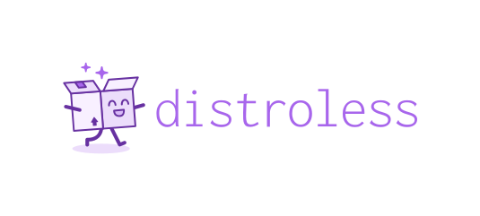
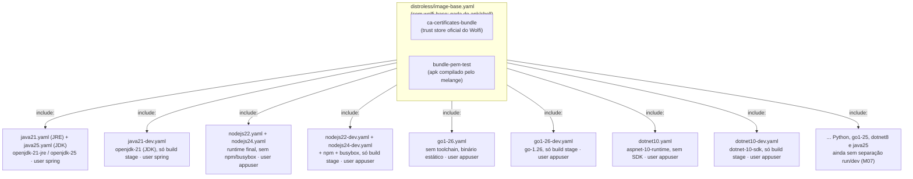
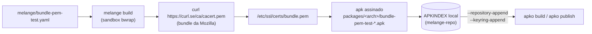
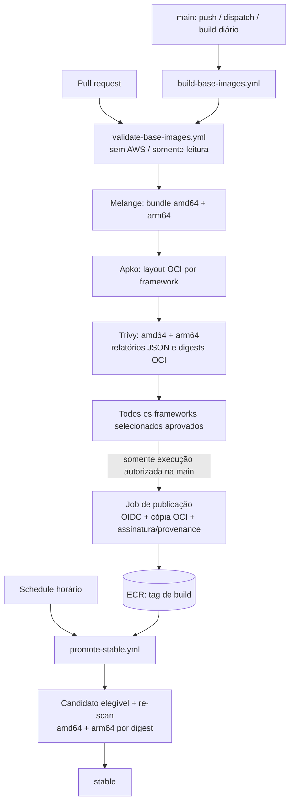

# image-base

Imagens base **distroless multi-arquitetura** (`amd64`/`arm64`) para **Java, Python, Go, Node.js e .NET** — cada linguagem com **duas versões estáveis/LTS** publicadas em paralelo. Construídas com [apko](https://github.com/chainguard-dev/apko) + [melange](https://github.com/chainguard-dev/melange) (pacotes [Wolfi](https://github.com/wolfi-dev), sem Dockerfile), escaneadas com [Trivy](https://github.com/aquasecurity/trivy) e publicadas no **Amazon ECR** via workflows reusáveis do GitHub Actions, com autenticação por OIDC (sem chave de acesso estática).

## Índice

- [image-base](#image-base)
  - [Índice](#índice)
  - [O que é uma imagem Distroless?](#o-que-é-uma-imagem-distroless)
  - [Imagens disponíveis](#imagens-disponíveis)
  - [Pré-requisitos](#pré-requisitos)
  - [Como usar](#como-usar)
  - [Estrutura do repositório](#estrutura-do-repositório)
  - [Como as imagens são compostas](#como-as-imagens-são-compostas)
  - [O pacote `bundle-pem-test` (melange)](#o-pacote-bundle-pem-test-melange)
  - [Pipeline de CI/CD (GitHub Actions)](#pipeline-de-cicd-github-actions)
  - [Checks obrigatórios, revisão e endurecimento (M12/M16)](#checks-obrigatórios-revisão-e-endurecimento-m12m16)
  - [Gate de promoção para stable (canário de soak)](#gate-de-promoção-para-stable-canário-de-soak)
  - [Recuperação de stable (runbook, M15)](#recuperação-de-stable-runbook-m15)
  - [Verificação: assinatura e build provenance](#verificação-assinatura-e-build-provenance)
  - [Configuração dos workflows reusáveis](#configuração-dos-workflows-reusáveis)
  - [Build local](#build-local)
  - [Conclusão](#conclusão)

## O que é uma imagem Distroless?

<p align="center">
  
</p>

Imagens "Distroless" contêm apenas o aplicativo e suas dependências de tempo de execução — sem gerenciador de pacotes, shell ou qualquer outra ferramenta que normalmente vem junto de uma distribuição Linux padrão. Restringir o container de produção precisamente ao que a aplicação precisa reduz a superfície de ataque e é uma prática recomendada, principalmente em ambientes produtivos.

> Como não há shell nem ferramentas de troubleshooting na imagem, depurar um pod rodando distroless exige um mecanismo de debug fora da imagem da aplicação (ex.: um [Container Efêmero](https://kubernetes.io/docs/tasks/debug/debug-application/debug-running-pod/#ephemeral-container) anexado ao pod). Esse toolkit é mantido fora deste repositório — no ambiente do Itaú, existe um pod de troubleshooting corporativo próprio para isso.

Neste repositório isso se traduz em quatro garantias concretas, já padronizadas em todas as imagens:

- **Camada única (single layer):** o `apko` não empilha `RUN` como um Dockerfile faz — ele resolve o grafo de dependências dos pacotes Wolfi e escreve o resultado final numa única camada, sem cache de gerenciador de pacotes, arquivo temporário ou camada intermediária "fantasma" sobrando na imagem publicada.
- **Superfície de ataque mínima:** `distroless/image-base.yaml` (herdado por todo `frameworks/<nome>.yaml`) só traz `ca-certificates-bundle` + `bundle-pem-test` — **sem `wolfi-base`**, que traria `apk-tools` e `busybox` (shell) de brinde via dependência transitiva. Cada `frameworks/<nome>.yaml` só declara o runtime que precisa (ex.: `openjdk-21`) em cima disso — sem shell, gerenciador de pacotes, compilador ou ferramentas de rede além do estritamente necessário, para todas as linguagens. Todas as imagens rodam como usuário non-root por padrão (`spring` ou `appuser`, uid/gid 10000). Node.js é o único runtime que depende de um gerenciador de pacotes (`npm`) para instalar dependências — por isso ele é o único com duas variantes: `nodejsNN` (runtime final, sem `npm`/`busybox`/shell) e `nodejsNN-dev` (com `npm`/`busybox`, usada só no estágio de build). A imagem que efetivamente vai pra produção nunca tem shell nem `apk`.
- **Cadeia de suprimentos (supply chain) rastreável:** os pacotes vêm do repositório rolling-release do [Wolfi](https://github.com/wolfi-dev) (assinado e mantido pela Chainguard); o único pacote que não vem de lá (`bundle-pem-test`) é compilado neste próprio repositório via melange, com índice assinado por uma chave efêmera gerada a cada build. Não existe imagem base de terceiros nem `FROM` de uma tag de procedência desconhecida.
- **SBOM e scan em todo build:** o `apko` gera um SBOM (SPDX) a cada build, e o [Trivy](#pipeline-de-cicd-github-actions) escaneia a imagem localmente antes de qualquer push — uma CVE `CRITICAL`/`HIGH`/`MEDIUM`/`LOW` **com correção disponível** falha o pipeline e impede o job de publicação daquele run (veja [`ignore-unfixed`](#pipeline-de-cicd-github-actions)).

## Imagens disponíveis

| Linguagem | Versão | Pacote(s) Wolfi | Imagem (repositório ECR) | Usuário | Uso |
|---|---|---|---|---|---|
| Java | 21 (LTS) | `openjdk-21-jre` | `image-base-java21` | `spring` | runtime final (sem `javac`/jmods/shell) |
| Java | 21 (LTS) | `openjdk-21`, `busybox` | `image-base-java21-dev` | `spring` | build stage (JDK completo + shell p/ mvnw/gradlew) |
| Java | 25 (LTS) | `openjdk-25` | `image-base-java25` | `spring` | runtime final (JDK completo — ainda não separado, ver M07) |
| Python | 3.13 | `python-3.13` | `image-base-python3-13` | `appuser` | runtime final |
| Python | 3.14 | `python-3.14` | `image-base-python3-14` | `appuser` | runtime final |
| Go | 1.25 | `go-1.25` | `image-base-go1-25` | `appuser` | runtime final (toolchain completo — ainda não separado, ver M07) |
| Go | 1.26 | *(nenhum — só a base distroless)* | `image-base-go1-26` | `appuser` | runtime final (binário estático, sem toolchain/shell) |
| Go | 1.26 | `go-1.26`, `busybox` | `image-base-go1-26-dev` | `appuser` | build stage (toolchain completo + shell) |
| Node.js | 22 (LTS) | `nodejs-22` | `image-base-nodejs22` | `appuser` | runtime final (sem npm/shell) |
| Node.js | 22 (LTS) | `nodejs-22`, `npm`, `busybox` | `image-base-nodejs22-dev` | `appuser` | build stage (tem npm e shell) |
| Node.js | 24 (LTS) | `nodejs-24` | `image-base-nodejs24` | `appuser` | runtime final (sem npm/shell) |
| Node.js | 24 (LTS) | `nodejs-24`, `npm`, `busybox` | `image-base-nodejs24-dev` | `appuser` | build stage (tem npm e shell) |
| .NET | 8 (LTS) | `dotnet-8-sdk` | `image-base-dotnet8` | `appuser` | runtime final (SDK completo — ainda não separado, ver M07) |
| .NET | 10 (LTS) | `aspnet-10-runtime` | `image-base-dotnet10` | `appuser` | runtime final (ASP.NET Core + .NET runtime, sem SDK/shell) |
| .NET | 10 (LTS) | `dotnet-10-sdk`, `busybox` | `image-base-dotnet10-dev` | `appuser` | build stage (SDK completo + shell, para `dotnet publish`) |

**⚠️ Migração (09/09/2026):** `image-base-go1-26`, `image-base-dotnet10` e `image-base-java21` deixaram de conter o toolchain de build (Go, SDK do .NET, JDK) e passaram a ser runtime-only, seguindo o mesmo padrão que `image-base-nodejs22`/`nodejs24` já usavam. Quem consumia essas três tags para **compilar** (não só rodar) precisa migrar para as novas tags `-dev` (`image-base-go1-26-dev`, `image-base-dotnet10-dev`, `image-base-java21-dev`), que mantêm o toolchain completo — veja os exemplos de Dockerfile multi-stage abaixo. `go1-25`, `dotnet8` e `java25` ainda não passaram por essa separação (continuam com o toolchain completo na tag única).

Referência completa de uma imagem: `<registro-ecr>/image-base-<framework>:<tag>`, onde `<registro-ecr>` é `<conta-aws>.dkr.ecr.<região>.amazonaws.com`.

Cada imagem publicada tem duas tags: **`stable`** (só avança depois que um build imutável sobrevive à janela de soak sem novas CVEs — veja [Gate de promoção](#gate-de-promoção-para-stable-canário-de-soak)) e **`<ddmmaa>-<hhmm>-r<run_id>-a<tentativa>`** (identificador único por execução/tentativa; as tags históricas `ddmmaa-hhmm` continuam reconhecidas pelo seletor).

## Pré-requisitos

- **Consumir as imagens:** um cliente OCI (`docker`, `podman`, `nerdctl`...) autenticado no ECR (`aws ecr get-login-password`).
- **Build/CI local:** Docker Engine com suporte a `--privileged` (usado pelo melange) — nada de `apko`/`melange` instalado à parte, o [`Makefile`](Makefile) roda os dois via `docker run`. Não precisa de credencial AWS para build local (`apko publish --local` não toca em nenhum registry).
- **CI (push real):** uma role AWS com permissão de `ecr:*` no(s) repositório(s) alvo, assumível via OIDC pelo GitHub Actions (sem access key de longa duração) — veja [Configuração dos workflows reusáveis](#configuração-dos-workflows-reusáveis).

## Como usar

```bash
aws ecr get-login-password --region <região> | docker login --username AWS --password-stdin <registro-ecr>
docker pull <registro-ecr>/image-base-nodejs24:stable
```

Todas as imagens já vêm com `work-dir: /app` e rodando como usuário non-root (`spring` para Java, `appuser` para as demais). Runtimes cujo artefato final já vem pronto de outro lugar (ex.: um binário Go compilado localmente) podem copiar direto:

```Dockerfile
FROM <registro-ecr>/image-base-go1-26:stable
COPY --chown=appuser:appuser ./app /app/app
CMD ["/app/app"]
```

Para Go, .NET e Java, o normal é compilar dentro do próprio pipeline — use a variante `-dev` só no estágio de build (tem o toolchain e `busybox`, para os wrappers tipo `mvnw`/`gradlew` funcionarem) e a variante final (sem toolchain/shell) no estágio de runtime:

```Dockerfile
# Go: binário estático, sem toolchain no runtime
FROM <registro-ecr>/image-base-go1-26-dev:stable AS build
WORKDIR /app
COPY --chown=appuser:appuser . .
RUN go build -o server .

FROM <registro-ecr>/image-base-go1-26:stable
COPY --chown=appuser:appuser --from=build /app/server /app/server
CMD ["/app/server"]
```

```Dockerfile
# .NET: publica no estágio SDK, roda no runtime ASP.NET (sem SDK)
FROM <registro-ecr>/image-base-dotnet10-dev:stable AS build
WORKDIR /app
COPY --chown=appuser:appuser . .
RUN dotnet publish -c Release -o /app/out --self-contained false

FROM <registro-ecr>/image-base-dotnet10:stable
COPY --chown=appuser:appuser --from=build /app/out /app
CMD ["/usr/bin/dotnet", "/app/app.dll"]
```

```Dockerfile
# Java: compila com javac/Maven/Gradle no JDK, roda no JRE (sem javac)
FROM <registro-ecr>/image-base-java21-dev:stable AS build
WORKDIR /app
COPY --chown=spring:spring . .
RUN javac -d out Main.java

FROM <registro-ecr>/image-base-java21:stable
COPY --chown=spring:spring --from=build /app/out /app
CMD ["java", "-cp", "/app", "Main"]
```

Para Node.js, use a variante `-dev` só no estágio de build (onde `npm install` precisa rodar) e a variante final (sem `npm`/shell) no estágio de runtime — a imagem que vai pra produção nunca tem `npm` nem shell:

```Dockerfile
FROM <registro-ecr>/image-base-nodejs24-dev:stable AS build
COPY package*.json ./
RUN npm ci --omit=dev
COPY . .

FROM <registro-ecr>/image-base-nodejs24:stable
COPY --chown=appuser:appuser --from=build /app .
CMD ["node", "server.js"]
```

Para fixar num build reprodutível (ex.: pipeline de deploy), use a tag imutável em vez de `stable`:

```Dockerfile
FROM <registro-ecr>/image-base-python3-14:010726-0152
```

## Estrutura do repositório

Cada pasta tem uma responsabilidade única: `distroless/` define a base comum, `frameworks/` só adiciona o runtime de cada linguagem em cima dela (Node.js tem duas variantes — `run` e `dev`, as demais linguagens têm 2 arquivos cada, a versão LTS/estável atual e a anterior), `melange/` builda o pacote extra do `bundle.pem`, e `.github/` é o pipeline (build+scan+publish da tag imutável, e a promoção separada pra `stable`):

```text
.
├── .github
│   ├── scripts
│   │   └── find_promotion_candidate.py   # usado pelo promote-stable.yml pra achar o candidato à promoção
│   └── workflows
│       ├── validate-base-images.yml # build + scan nas duas arquiteturas, sem AWS
│       ├── build-base-images.yml   # validação seguida de publicação autorizada na main
│       ├── promote-stable.yml      # workflow reusável: gate de promoção (canário de soak) -> tag stable
│       └── workflow.yml            # dispara os dois pipelines acima (push/PR/schedule)
├── distroless
│   └── image-base.yaml             # base comum: ca-certificates-bundle + bundle-pem-test (sem wolfi-base/apk/shell)
├── frameworks
│   ├── dotnet10.yaml                 # aspnet-10-runtime, variante "run" (sem SDK)
│   ├── dotnet10-dev.yaml              # dotnet-10-sdk, só para estágio de build
│   ├── dotnet8.yaml                  # dotnet-8-sdk (LTS, ainda não separado run/dev)
│   ├── go1-25.yaml                   # go-1.25 (ainda não separado run/dev)
│   ├── go1-26.yaml                   # variante "run": só a base, sem toolchain (binário estático)
│   ├── go1-26-dev.yaml                # go-1.26, só para estágio de build
│   ├── java21.yaml                   # openjdk-21-jre, variante "run" (sem javac/jmods)
│   ├── java21-dev.yaml                # openjdk-21, só para estágio de build (JDK completo)
│   ├── java25.yaml                   # openjdk-25 (LTS mais recente, ainda não separado run/dev)
│   ├── nodejs22.yaml                 # nodejs-22, variante "run" (sem npm/busybox)
│   ├── nodejs22-dev.yaml             # nodejs-22 + npm + busybox, só para estágio de build
│   ├── nodejs24.yaml                 # nodejs-24, variante "run" (sem npm/busybox)
│   ├── nodejs24-dev.yaml             # nodejs-24 + npm + busybox, só para estágio de build
│   ├── python3-13.yaml               # python-3.13
│   └── python3-14.yaml               # python-3.14 (mais recente)
├── melange
│   └── bundle-pem-test.yaml        # gera o apk com o bundle.pem (Mozilla CA bundle)
├── .gitignore
├── Makefile                        # build local (veja Build local)
└── README.md

6 directories, 21 files
```

## Como as imagens são compostas

Todo `frameworks/<nome>.yaml` usa `include: distroless/image-base.yaml`, herdando os pacotes comuns (o `apko` faz *merge* das listas de pacotes, não substitui) e adicionando só o runtime específico e um usuário non-root próprio:



(a tabela [Imagens disponíveis](#imagens-disponíveis) acima tem a lista completa e exata dos 12 arquivos)

Critério de escolha das versões (no momento em que este README foi escrito):

| Linguagem | Versão A | Versão B | Por quê |
|---|---|---|---|
| Java | `openjdk-21` | `openjdk-25` | as duas últimas LTS (Java só recebe LTS a cada ~2 anos: 17, 21, 25) |
| Node.js | `nodejs-22` | `nodejs-24` | as duas últimas LTS (22 em Maintenance, 24 em Active LTS; 26 ainda é "Current", não é LTS) |
| .NET | `dotnet-8-sdk` | `dotnet-10-sdk` | as duas últimas LTS (.NET tem LTS a cada 2 anos: 6, 8, 10; a 9 é STS, não LTS) |
| Python | `python-3.13` | `python-3.14` | as duas últimas minors estáveis (Python não tem trilha LTS separada) |
| Go | `go-1.25` | `go-1.26` | as duas últimas minors estáveis (Go também não tem trilha LTS separada) |

O Wolfi é um repositório rolling-release, então cada `apko build`/`apko publish` já puxa o patch mais recente de cada uma dessas linhas automaticamente (ex.: `openjdk-21` sempre traz o último `21.0.x`).

> **Nota:** o pacote `nodejs-*` do Wolfi não traz `npm` funcional sozinho — o `npm` usa `#!/usr/bin/env node` no shebang e o `/usr/bin/env` só existe se o pacote `busybox` também for instalado. Por isso as variantes `-dev` incluem `busybox` explicitamente — e por isso o `npm`/`busybox` ficam isolados nessa variante em vez de irem para a imagem de runtime final.

## O pacote `bundle-pem-test` (melange)

O melange builda um pacote `.apk` próprio que baixa o bundle de certificados da Mozilla (a mesma fonte usada pelo `curl`/`certifi`) e o instala em `/etc/ssl/certs/bundle.pem`. Esse `.apk`, junto com o índice assinado, vira um repositório local que o `apko` consome via `--repository-append`/`--keyring-append` — sem precisar publicar esse pacote em nenhum repositório público.

> **Nota (POC caseira vs. ambiente Itaú):** este pacote existe hoje pra validar o pipeline melange → apko com uma fonte de certificado pública, já que o script real usado no Itaú (que baixa o ca-bundle governado pelo CloudSec — Artifactory, Proxy, AWS, certificados corporativos — de um bucket S3 e concatena com o bundle da Mozilla) só é acessível de dentro da rede corporativa. Antes de tratar isso como produção, vale fixar um hash conhecido do `cacert.pem` (hoje o `curl` não valida integridade além de checar se o arquivo tem um `BEGIN CERTIFICATE`) e isolar claramente o passo "buscar CA bundle" para ser o ponto de troca quando migrar pro script do CloudSec.



## Pipeline de CI/CD (GitHub Actions)

O `workflow.yml` separa validação e publicação:

- **PRs:** chamam `validate-base-images.yml`, com `contents: read`, sem OIDC, autenticação AWS ou push.
- **Push na `main`, execução manual na `main` e schedule diário às 03:00 UTC:** chamam `build-base-images.yml`, que executa a mesma validação antes do job de publicação.
- **Promoção:** roda a cada hora, no minuto 17, e seleciona somente candidatos que completaram o soak mínimo de seis horas desde o push.



O build do CI usa `apko build` uma única vez por framework para produzir um layout OCI multi-arquitetura. [oci_artifact.py](.github/scripts/oci_artifact.py) verifica hashes/tamanhos dos blobs, presença de amd64/arm64 e coerência dos configs, preservando o índice original em um layout transportável. [scan_images.py](.github/scripts/scan_images.py) fornece ao Trivy uma visão com apenas o manifest da arquitetura solicitada e confere a arquitetura no relatório: o teste real mostrou que somente `--platform` não bastava para layouts OCI multi-arquitetura no Trivy 0.72.0.

Relatórios JSON e digests dos manifests ficam nos artifacts `build-scans-<framework>-<tentativa>` por 30 dias. O layout aprovado, sua evidência e os SBOMs são transferidos em `validated-oci-<framework>` por três dias. Uma falha em qualquer arquitetura impede a disponibilização desse artifact para publicação.

A validação usa matrix com `fail-fast: false`. **A publicação é independente por framework (M13):** cada leg do publicador exige o seu próprio artifact `validated-oci-<framework>` e falha, visível e sem publicar, se a validação daquele framework tiver reprovado — sem derrubar os demais do lote. Uma falha numa dependência comum, como o bundle melange, continua bloqueando todos. O job de publicação tem matrix própria e autenticação AWS restrita à `main`. Para publicar um subconjunto, uma execução manual pode selecionar os frameworks desejados.

**Identidade do artefato (M02):** o publicador baixa o layout aprovado do mesmo run, verifica novamente sua integridade e usa Skopeo com `copy --all --preserve-digests`. O digest devolvido pela cópia precisa ser igual ao índice validado; não há novo build nem resolução de pacotes nesse job. Após copiar, o publicador lê a tag de volta e confere os bytes do índice e os manifests de ambas as arquiteturas contra a evidência validada. O artifact `publication-<framework>-<tentativa>` preserva essa comparação por 30 dias. A cópia foi comprovada em ECR exclusivo de teste e a leitura de volta em registry local; a integração completa na `main` ainda depende da validação do workflow autenticado.

O gate mantém `--ignore-unfixed` e severidades `CRITICAL,HIGH,MEDIUM,LOW`, além do scan de segredos. O scan aprovado representa apenas a política configurada e os dados disponíveis ao Trivy naquele momento. A triagem automática de CVEs permanece pausada; sua futura reativação deverá consumir os relatórios JSON, pois as tabelas em logs deixaram de ser a saída principal.

QEMU continua restrito ao job melange, que executa comandos no sandbox do pacote. Apko compõe os pacotes sem executar os runtimes. Os testes funcionais das imagens continuam pendentes em M08.


## Checks obrigatórios, revisão e endurecimento (M12/M16)

Merge na `main` exige, sem exceção para administradores (`enforce_admins`):

- **`test`** — 81 testes de pipeline e 13 de certificados, sem AWS.
- **`lint-workflows`** — `actionlint` nos seis workflows mantidos à mão, mais
  [lint_workflow_hardening.py](.github/scripts/lint_workflow_hardening.py):
  checkout sem `persist-credentials: false`, expressão `${{ }}` dentro de um
  `run`, job executor sem `timeout-minutes`, workflow sem `permissions` no
  topo ou Action externa sem SHA completo reprovam o check.
- **Uma aprovação**, com revisão de code owner nos caminhos do
  [CODEOWNERS](.github/CODEOWNERS) (`workflows`, `actions`, `scripts`,
  `tests`, `melange`, `Makefile`). Aprovações são descartadas a cada novo
  push.

Os dois checks rodam **sem filtro de path**: um required check com filtro
nunca dispara para um PR fora do escopo e fica pendente para sempre em vez de
aprovar. São rápidos (segundos), então um PR só de documentação recebe
resultado definido.

Entradas de execução manual passam por
[validate_inputs.py](.github/scripts/validate_inputs.py) **antes** de
qualquer credencial AWS: nome único pertencente ao catálogo
`frameworks/*.yaml`, soak finito e não negativo, digest `sha256:<64 hex>`. O
input rejeitado não é ecoado de volta no log. Nenhum input é interpolado
dentro de um `run`; todos chegam por `env:` e são usados com aspas.

No lado da plataforma estão ativos secret scanning, push protection e
`sha_pinning_required` (o repositório já fixava tudo por SHA completo; agora
o GitHub exige). O token padrão do Actions é `read` e não pode aprovar PRs.
Detalhes, estado anterior e pendências em
[docs/m09-m16-review.md](docs/m09-m16-review.md).

## Gate de promoção para stable (canário de soak)

A tag `stable` **não** é publicada no mesmo run que builda a imagem. `promote-stable.yml` roda separadamente a cada hora (minuto 17) e só promove um build para `stable` se, decorrida a janela de soak, um **re-scan** do mesmo digest continuar limpo:

1. Lista as imagens do repositório ECR e seleciona o índice OCI/Docker com tag de build válida (`ddmmaa-hhmm`, com sufixo opcional `-r<run_id>-a<tentativa>`) mais recente entre os que já completaram o soak. Descarta o digest já marcado como `stable` e candidatos com data de push anterior ou igual à dele (`.github/scripts/find_promotion_candidate.py`). Um build recente ainda em soak não impede a seleção de outro elegível.
2. Inspeciona o índice e exige exatamente `linux/amd64` e `linux/arm64`. Verifica assinatura cosign com identidade exata do workflow `build-base-images.yml@refs/heads/main` e provenance GitHub vinculada ao signer workflow e à source ref `refs/heads/main`. Falhas e evidências ausentes bloqueiam a promoção.
3. Re-escaneia esse digest com Trivy em `linux/amd64` e `linux/arm64` (`--ignore-unfixed`). Uma falha em qualquer arquitetura bloqueia a promoção. Em seguida, um scan **separado e não-bloqueante** (`report_unfixed_cves.py`, M11) roda sem `--ignore-unfixed`: CVEs sem correção disponível continuam invisíveis pro gate de propósito (bloquear por algo que ninguém pode corrigir ainda não ajuda), mas passam a aparecer em `unfixed-cves-summary.json`, nunca falhando o job. Os relatórios e a referência por digest ficam nos artifacts `promotion-scans-<framework>-<tentativa>` por 30 dias.
4. Se o re-scan continuar limpo, promove com `docker buildx imagetools create --tag <imagem>:stable <imagem>@<digest>` — retagueia o índice multi-arch por referência, sem baixar/re-subir camadas.

Isso é um canário de **tempo/CVE**, não um canário de tráfego real contra aplicações consumidoras — não há apps de referência nesta POC pra validar contra. Validar contra consumidores reais (deploy canário, smoke test de aplicação) é responsabilidade de cada pipeline de deploy downstream. O gate reavalia vulnerabilidades conhecidas no momento do scan, nas severidades configuradas e com correção disponível; ele não garante ausência de vulnerabilidades durante toda a janela de soak.

A seleção inicial usa metadados ECR; o gate posterior valida plataformas, assinatura e provenance por digest. O verificador espera que o workflow assinante esteja no mesmo repositório GitHub informado ao script; chamadas externas precisam alinhar explicitamente essa política à localização do workflow assinante. A seleção e a atualização de `stable` são serializadas por role/região/framework dentro do mesmo repositório GitHub, tanto no dispatch direto quanto no workflow reusável; atualizações externas não participam desse controle. Os testes dos scripts rodam em PRs/pushes que alterem os scripts e antes da autenticação AWS na promoção. Para executá-los localmente, sem Docker ou AWS:

```bash
python3 -B -m unittest discover -s .github/scripts -p 'test_*.py' -v
```

**SLA de patch (M11 — formalizado com medições reais, não estimativa):**

| Etapa | O que é medido | Valor real observado | Fonte |
| --- | --- | --- | --- |
| Execução do job de promoção | Tempo do job `Promote <framework>` do dispatch até concluir (seleção + verificação + re-scan + retag) | 11-40s | Runs reais desta sessão, ver histórico de entregas M04/M14 |
| Atraso do cron horário | Diferença entre o slot nominal (`17 * * * *`) e a criação do run | ≥24m43s (limite inferior — a API não expõe o instante nominal de enfileiramento) | [run 34390576742](https://github.com/alric-corp/itau-xj7-containers-image-base/actions/runs/34390576742), Décima sexta entrega |
| Correção disponível no Wolfi → build que a incorpora → `stable` atualizado | Ainda **não medido de ponta a ponta** — exige correlacionar o timestamp de publicação do pacote corrigido no Wolfi com o build seguinte, e esse rastreamento ainda não existe no pipeline | — | Item aberto (ver M11 — restante) |

A espera nominal após o soak (6h) até a próxima janela de promoção horária é inferior a uma hora, mas uma amostra única de atraso do scheduler não prova regularidade contínua — só observação repetida ao longo do tempo formaliza isso como garantia. O build publicado pode ser consumido antes da promoção, assumindo explicitamente que ainda não passou pelo gate de `stable`.

**Política de exceção (M11/M15):** hoje não existe nenhuma exceção ao gate de CVE, em nenhum workflow, inclusive na recuperação de emergência (`recover-stable.yml`, M15) — um digest que falhe o re-scan não é promovido nem restaurado, ponto. Essa é a política vigente, declarada explicitamente em vez de implícita. Uma exceção formal (permitir conscientemente uma CVE específica, por prazo e responsável definidos) não está implementada; se vier a existir, precisa de escopo, aprovador e validade explícitos — nunca um bypass geral do gate.

## Recuperação de `stable` (runbook, M15)

Se um build promovido apresentar problema depois da promoção (ex.: CVE divulgada após o soak, comportamento inesperado reportado por um consumidor), `recover-stable.yml` restaura `stable` para um digest anterior já aprovado — sem rebuild, sem bypass do gate de segurança:

1. **Escolher o digest de destino.** Precisa ser um build já publicado no repositório (`aws ecr describe-images --repository-name image-base-<framework>`) — nunca um digest arbitrário. Idealmente um build que já foi `stable` antes.
2. **Disparar o workflow** (Actions → "Recover stable to a previous digest" → Run workflow) com `framework`, `digest` (`sha256:...`) e `reason`. O job:
   - confirma que o digest existe no repositório;
   - reverifica plataformas (amd64+arm64), assinatura cosign e provenance GitHub com a **mesma política** de `promote-stable.yml` — um digest antigo que não passe nessa verificação não é restaurado;
   - reescaneia as duas arquiteturas com o banco de CVE atual — uma CVE nova no digest antigo bloqueia a recuperação; correção do gate por exceção exige política explícita, não esse workflow;
   - move `stable` com `docker buildx imagetools create` (mesmo mecanismo da promoção normal, sem rebuild) e confirma por leitura de volta independente;
   - grava um `recovery-evidence.json` (operador = `github.actor`, motivo, digest anterior/novo, run) como artifact.
3. **Abrir um PR** adicionando o digest retirado a `.github/promotion-quarantine.json` (o job imprime o trecho JSON pronto pra colar). Sem isso, o build retirado continua sendo o mais recente por timestamp em `find_promotion_candidate.py`, e o próximo ciclo de promoção o selecionaria de novo — desfazendo a recuperação. A entrada de quarentena some quando um build mais novo e aprovado for promovido de verdade (a partir daí o timestamp de `stable` já avança e a exclusão explícita deixa de ser necessária).

A recuperação e uma promoção concorrente do mesmo framework compartilham o grupo de concorrência de `promote-stable.yml` — nunca correm ao mesmo tempo. Restaurar a imagem base **não** reconstrói nem reverte automaticamente aplicações consumidoras; isso é responsabilidade do runbook de deploy de cada time.

## Verificação: assinatura e build provenance

Após a cópia do artifact, o pipeline assina o digest e anexa build provenance. Uma falha nessas etapas pode deixar uma tag de build incompleta; o gate de promoção exige verificação das duas evidências antes de atualizar `stable`:

- **Assinatura (cosign, keyless):** o job `build-push` assina o digest publicado com [cosign](https://github.com/sigstore/cosign) usando o token OIDC do próprio GitHub Actions — sem chave privada pra gerenciar ou rotacionar. A assinatura fica registrada no transparency log público do [Rekor](https://docs.sigstore.dev/logging/overview/).
- **Build provenance (SLSA):** `actions/attest-build-provenance` gera uma attestation nativa do GitHub descrevendo de qual commit, workflow e run a imagem saiu.

Para verificar uma imagem antes de usá-la (ex.: num gate de admissão do cluster, ou manualmente):

```bash
# assinatura (cosign)
cosign verify \
  --certificate-identity-regexp 'https://github.com/<sua-org>/image-base/\.github/workflows/build-base-images\.yml@.*' \
  --certificate-oidc-issuer https://token.actions.githubusercontent.com \
  <registro-ecr>/image-base-java21:stable

# build provenance (SLSA / GitHub attestations)
gh attestation verify oci://<registro-ecr>/image-base-java21:stable --owner <sua-org>
```

Assinatura e provenance foram verificadas em leitura contra um digest já publicado pela main, e um artifact sem assinatura foi rejeitado pelo novo gate. A execução completa desse gate no workflow autenticado de promoção ainda está pendente; ver evidências e digests no checklist da RFC-013.

## Configuração dos workflows reusáveis

Os workflows podem ser chamados diretamente. `validate-base-images.yml` exige apenas `frameworks` e `contents: read`, sem credenciais AWS. Build/publicação e promoção exigem OIDC e restringem os jobs que acessam AWS a eventos de push/schedule/dispatch na `main` do chamador. No uso externo, `actions/checkout` utiliza o repositório chamador, que precisa conter os manifestos e scripts esperados. Exemplo de permissões para build/publicação e promoção:

```yaml
permissions:
  id-token: write
  contents: read
  attestations: write
  artifact-metadata: write

jobs:
  build-images:
    uses: <sua-org>/image-base/.github/workflows/build-base-images.yml@main
    with:
      aws-region: us-east-1
      aws-role-arn: arn:aws:iam::<conta>:role/github-actions-image-base
      frameworks: '["java25", "nodejs24", "nodejs24-dev"]'

  promote-images:
    uses: <sua-org>/image-base/.github/workflows/promote-stable.yml@main
    with:
      aws-region: us-east-1
      aws-role-arn: arn:aws:iam::<conta>:role/github-actions-image-base
      soak-hours: 6
      frameworks: '["java25", "nodejs24", "nodejs24-dev"]'
```

| Nome | Workflow | Tipo | Obrigatório | Descrição |
|---|---|---|---|---|
| `aws-region` | ambos | input | sim | região AWS onde o ECR está |
| `aws-role-arn` | ambos | input | sim | role assumida via OIDC, com permissão de push/leitura no ECR |
| `frameworks` | ambos | input | sim | array JSON com os nomes dos arquivos em `frameworks/*.yaml` a processar |
| `soak-hours` | promote-stable | input | não (default `6`) | horas mínimas que um build imutável espera antes de poder virar `stable` |

Pré-requisito de infraestrutura (fora deste repo): configurar o [provedor OIDC do GitHub Actions](https://docs.github.com/en/actions/deployment/security-hardening-your-deployments/configuring-openid-connect-in-amazon-web-services) na conta AWS e uma IAM role com trust policy restrita a este repositório/branch, com permissão de `ecr:*` nos repositórios `image-base-*`.

## Build local

O [`Makefile`](Makefile) automatiza o build local — melange e apko sempre rodam via `docker run` (não como binário nativo), então funciona em qualquer SO/arquitetura de dev sem precisar instalar nada além do Docker:

```bash
make list                                                # lista os frameworks disponiveis
make build FRAMEWORK=go1-26                               # builda uma imagem local (apko publish --local)
make run FRAMEWORK=go1-26-dev ENTRYPOINT=/usr/bin/go ARGS=version  # builda e roda um comando na imagem (toolchain só existe na variante -dev)
make clean                                                # remove chave e pacotes locais
```

`make build` builda o pacote `bundle-pem-test` com o melange (gerando uma chave de assinatura local descartável) e depois usa `apko publish --local`, que carrega a imagem direto no Docker daemon local sem tocar em nenhum registry — no CI, `apko build` gera um layout OCI escaneado pelo Trivy por arquitetura. O `ARCH` é detectado automaticamente a partir do host (pode ser sobrescrito, ex.: `make build FRAMEWORK=go1-26 ARCH=x86_64`). Build local não precisa de credencial AWS — só entra em jogo quando o CI publica de fato no ECR.

## Conclusão

Manter uma imagem base atualizada e escaneada pra 5 linguagens diferentes costuma acabar em um de dois lugares: um Dockerfile artesanal por time/projeto que ninguém revisita depois que funciona uma vez, ou a decisão de aceitar uma imagem genérica de distro completa (com o pacote de ferramentas — e CVEs — que vem junto) só porque é o caminho de menor resistência.

O `image-base` centraliza as 12 combinações linguagem+versão+variante em `frameworks/*.yaml`, com validação das duas arquiteturas antes do job de publicação e nova avaliação por digest antes de promover para `stable`. A identidade do artefato é preservada na cópia OCI; o checklist da RFC-013 distingue implementação, testes reais e controles ainda pendentes.

Isso não substitui a imagem final da sua aplicação — é o ponto de partida (`FROM <registro-ecr>/image-base-<framework>:stable`) pra não ter que decidir, de novo, quais pacotes tirar de uma imagem Ubuntu/Alpine pra chegar a um resultado parecido.

## Dependências do pipeline e tags

As Actions diretas dos workflows de build/validação/promoção estão fixadas por SHA; apko, melange e Skopeo usam digests. Dependabot propõe atualizações semanais de Actions. A atualização dos digests das ferramentas ainda exige revisão manual, incluindo o Makefile; automação e política de atualização completas permanecem em M09.

O workflow de publicação configura tags imutáveis no ECR, com exceção exata para `stable`, incluindo repositórios existentes. As tags novas incluem run ID e tentativa. A compatibilidade das assinaturas/provenance com essa configuração deve ser validada no workflow autenticado antes da liberação. Reexecuções parciais do publicador reutilizam `validated-oci-<framework>` aprovado no mesmo run, independentemente de `run_attempt`. Se a validação for reexecutada, o artifact é substituído somente após o novo scan passar (`overwrite: true`); uma validação malsucedida bloqueia a publicação pelo `needs: validate`, mesmo que exista um artifact anterior. O repositório melange também permite substituição em reexecuções completas. Artifacts expirados exigem nova validação. Os relatórios de scan continuam separados por tentativa.

Para executar as suítes de regressão do pipeline e dos certificados, consulte [tests/README.md](tests/README.md).
