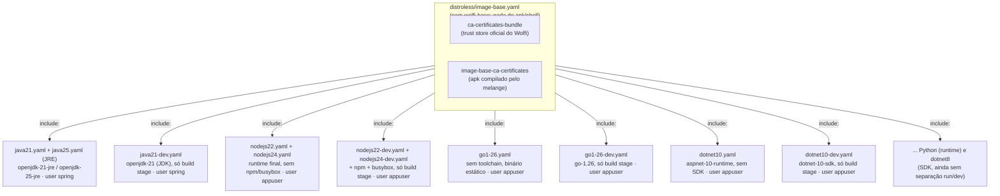
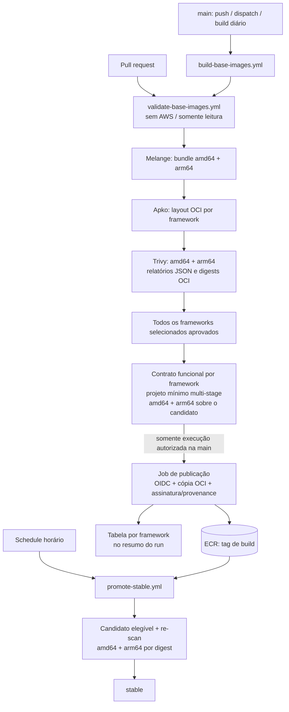

# image-base

Imagens base **distroless multi-arquitetura** (`amd64`/`arm64`) para **Java, Python, Go, Node.js e .NET** — cada linguagem com **duas versões estáveis/LTS** publicadas em paralelo. Construídas com [apko](https://github.com/chainguard-dev/apko) + [melange](https://github.com/chainguard-dev/melange) (pacotes [Wolfi](https://github.com/wolfi-dev), sem Dockerfile), escaneadas com [Trivy](https://github.com/aquasecurity/trivy) e publicadas no **Amazon ECR** via workflows reusáveis do GitHub Actions, com autenticação por OIDC (sem chave de acesso estática).

## Índice

- [image-base](#image-base)
  - [Índice](#índice)
  - [O que é uma imagem Distroless?](#o-que-é-uma-imagem-distroless)
  - [Imagens disponíveis](#imagens-disponíveis)
  - [Pré-requisitos](#pré-requisitos)
  - [Como usar](#como-usar)
  - [Estrutura do repositório](#estrutura-do-repositório)
  - [Como as imagens são compostas](#como-as-imagens-são-compostas)
  - [O pacote `image-base-ca-certificates` (melange)](#o-pacote-image-base-ca-certificates-melange)
  - [Pipeline de CI/CD (GitHub Actions)](#pipeline-de-cicd-github-actions)
  - [Checks obrigatórios, revisão e endurecimento (M12/M16)](#checks-obrigatórios-revisão-e-endurecimento-m12m16)
  - [Gate de promoção para stable (canário de soak)](#gate-de-promoção-para-stable-canário-de-soak)
  - [Recuperação de stable (runbook, M15)](#recuperação-de-stable-runbook-m15)
  - [Verificação: assinatura e build provenance](#verificação-assinatura-e-build-provenance)
  - [Configuração dos workflows reusáveis](#configuração-dos-workflows-reusáveis)
  - [Build local](#build-local)
  - [Conclusão](#conclusão)

As fronteiras de responsabilidade e as regras de organização estão em
[`docs/repository-architecture.md`](docs/repository-architecture.md). O índice
de automação fica em [`scripts/README.md`](scripts/README.md). Para contribuir,
veja [`CONTRIBUTING.md`](CONTRIBUTING.md); o índice de documentação está em
[`docs/README.md`](docs/README.md).

## O que é uma imagem Distroless?

<p align="center">
  
</p>

Imagens "Distroless" contêm apenas o aplicativo e suas dependências de tempo de execução — sem gerenciador de pacotes, shell ou qualquer outra ferramenta que normalmente vem junto de uma distribuição Linux padrão. Restringir o container de produção precisamente ao que a aplicação precisa reduz a superfície de ataque e é uma prática recomendada, principalmente em ambientes produtivos.

> Como não há shell nem ferramentas de troubleshooting na imagem, depurar um pod rodando distroless exige um mecanismo de debug fora da imagem da aplicação (ex.: um [Container Efêmero](https://kubernetes.io/docs/tasks/debug/debug-application/debug-running-pod/#ephemeral-container) anexado ao pod). O toolkit de referência está isolado em [`troubleshooting/`](troubleshooting/README.md), com ciclo de vida próprio; ele não integra as imagens base nem o pipeline de publicação delas.

Neste repositório isso se traduz em quatro garantias concretas, já padronizadas em todas as imagens:

- **Camada única (single layer):** o `apko` não empilha `RUN` como um Dockerfile faz — ele resolve o grafo de dependências dos pacotes Wolfi e escreve o resultado final numa única camada, sem cache de gerenciador de pacotes, arquivo temporário ou camada intermediária "fantasma" sobrando na imagem publicada.
- **Superfície de ataque mínima:** `distroless/image-base.yaml` (herdado por todo `frameworks/<nome>.yaml`) só traz `ca-certificates-bundle`, `tzdata` e `image-base-ca-certificates` — **sem `wolfi-base`**, que traria `apk-tools` e `busybox` (shell) de brinde via dependência transitiva. Cada `frameworks/<nome>.yaml` só declara o runtime que precisa (ex.: `openjdk-21`) em cima disso — sem shell, gerenciador de pacotes, compilador ou ferramentas de rede além do estritamente necessário, para todas as linguagens. Todas as imagens rodam como usuário non-root por padrão (`spring` ou `appuser`, uid/gid 10000). As variantes `-dev` trazem o toolchain e shell para o estágio de build; as variantes de runtime usam somente os pacotes necessários à execução. A imagem que efetivamente vai pra produção nunca tem shell nem `apk`.
- **Cadeia de suprimentos (supply chain) rastreável:** os pacotes vêm do repositório rolling-release do [Wolfi](https://github.com/wolfi-dev) (assinado e mantido pela Chainguard); o único pacote que não vem de lá (`image-base-ca-certificates`) é compilado neste próprio repositório via melange, com índice assinado por uma chave efêmera gerada a cada build. Não existe imagem base de terceiros nem `FROM` de uma tag de procedência desconhecida.
- **SBOM e scan em todo build:** o `apko` gera um SBOM (SPDX) a cada build, e o [Trivy](#pipeline-de-cicd-github-actions) escaneia a imagem localmente antes de qualquer push — uma CVE `CRITICAL`/`HIGH`/`MEDIUM`/`LOW` **com correção disponível** falha o pipeline e impede o job de publicação daquele run (veja [`ignore-unfixed`](#pipeline-de-cicd-github-actions)).

## Imagens disponíveis

| Linguagem | Versão | Pacote(s) Wolfi | Imagem (repositório ECR) | Usuário | Uso |
|---|---|---|---|---|---|
| Java | 21 (LTS) | `openjdk-21-jre` | `image-base-java21` | `spring` | runtime final (sem `javac`/jmods/shell) |
| Java | 21 (LTS) | `openjdk-21`, `busybox` | `image-base-java21-dev` | `spring` | build stage (JDK completo + shell p/ mvnw/gradlew) |
| Java | 25 (LTS) | `openjdk-25-jre` | `image-base-java25` | `spring` | runtime final (sem `javac`/jmods/shell) |
| Java | 25 (LTS) | `openjdk-25`, `busybox` | `image-base-java25-dev` | `spring` | build stage (JDK completo + shell p/ mvnw/gradlew) |
| Python | 3.13 | `python-3.13` | `image-base-python3-13` | `appuser` | runtime final |
| Python | 3.14 | `python-3.14` | `image-base-python3-14` | `appuser` | runtime final |
| Go | 1.25 | *(nenhum — só a base distroless)* | `image-base-go1-25` | `appuser` | runtime final (binário estático, sem toolchain/shell) |
| Go | 1.25 | `go-1.25`, `busybox` | `image-base-go1-25-dev` | `appuser` | build stage (toolchain completo + shell) |
| Go | 1.26 | *(nenhum — só a base distroless)* | `image-base-go1-26` | `appuser` | runtime final (binário estático, sem toolchain/shell) |
| Go | 1.26 | `go-1.26`, `busybox` | `image-base-go1-26-dev` | `appuser` | build stage (toolchain completo + shell) |
| Node.js | 22 (LTS) | `nodejs-22` | `image-base-nodejs22` | `appuser` | runtime final (sem npm/shell) |
| Node.js | 22 (LTS) | `nodejs-22`, `npm`, `busybox` | `image-base-nodejs22-dev` | `appuser` | build stage (tem npm e shell) |
| Node.js | 24 (LTS) | `nodejs-24` | `image-base-nodejs24` | `appuser` | runtime final (sem npm/shell) |
| Node.js | 24 (LTS) | `nodejs-24`, `npm`, `busybox` | `image-base-nodejs24-dev` | `appuser` | build stage (tem npm e shell) |
| .NET | 8 (LTS) | `dotnet-8-sdk` | `image-base-dotnet8` | `appuser` | runtime final (SDK completo — ainda não separado, ver M07). **Fora do lote padrão** ([ADR-0001](docs/adr/0001-dotnet8-fora-do-lote-padrao.md)): o Wolfi não publica a correção que o scan exige; só builda por `workflow_dispatch` e nunca teve `stable` |
| .NET | 10 (LTS) | `aspnet-10-runtime` | `image-base-dotnet10` | `appuser` | runtime final (ASP.NET Core + .NET runtime, sem SDK/shell) |
| .NET | 10 (LTS) | `dotnet-10-sdk`, `busybox` | `image-base-dotnet10-dev` | `appuser` | build stage (SDK completo + shell, para `dotnet publish`) |

**⚠️ Migração (09/09/2026):** `image-base-go1-26`, `image-base-dotnet10` e `image-base-java21` deixaram de conter o toolchain de build (Go, SDK do .NET, JDK) e passaram a ser runtime-only, seguindo o mesmo padrão que `image-base-nodejs22`/`nodejs24` já usavam. Quem consumia essas três tags para **compilar** (não só rodar) precisa migrar para as novas tags `-dev` (`image-base-go1-26-dev`, `image-base-dotnet10-dev`, `image-base-java21-dev`), que mantêm o toolchain completo — veja os exemplos de Dockerfile multi-stage abaixo. `go1-25`, `dotnet8` e `java25` ainda não passaram por essa separação (continuam com o toolchain completo na tag única).

**⚠️ Migração (10/09/2026):** o mesmo movimento para `image-base-go1-25` e `image-base-java25` — passaram a ser runtime-only (`go1-25` só a base; `java25` com `openjdk-25-jre`). Quem compilava com essas tags deve usar `image-base-go1-25-dev`/`image-base-java25-dev` no estágio de build. Dos frameworks do catálogo, só `dotnet8` continua sem a separação.

Referência completa de uma imagem: `<registro-ecr>/image-base-<framework>:<tag>`, onde `<registro-ecr>` é `<conta-aws>.dkr.ecr.<região>.amazonaws.com`.

Cada imagem publicada tem duas tags: **`stable`** (só avança depois que um build imutável sobrevive à janela de soak sem novas CVEs — veja [Gate de promoção](#gate-de-promoção-para-stable-canário-de-soak)) e **`<ddmmaa>-<hhmm>-r<run_id>-a<tentativa>`** (identificador único por execução/tentativa; as tags históricas `ddmmaa-hhmm` continuam reconhecidas pelo seletor).

## Pré-requisitos

- **Consumir as imagens:** um cliente OCI (`docker`, `podman`, `nerdctl`...) autenticado no ECR (`aws ecr get-login-password`).
- **Build/CI local:** Docker Engine com suporte a `--privileged` (usado pelo melange) — nada de `apko`/`melange` instalado à parte, o [`Makefile`](Makefile) roda os dois via `docker run`. Não precisa de credencial AWS para build local (o OCI é construído e carregado no Docker local).
- **CI (push real):** uma role AWS com permissão de `ecr:*` no(s) repositório(s) alvo, assumível via OIDC pelo GitHub Actions (sem access key de longa duração) — veja [Configuração dos workflows reusáveis](#configuração-dos-workflows-reusáveis).

## Como usar

```bash
aws ecr get-login-password --region <região> | docker login --username AWS --password-stdin <registro-ecr>
docker pull <registro-ecr>/image-base-nodejs24:stable
```

Todas as imagens já vêm com `work-dir: /app` e rodando como usuário non-root (`spring` para Java, `appuser` para as demais). Runtimes cujo artefato final já vem pronto de outro lugar (ex.: um binário Go compilado localmente) podem copiar direto:

```Dockerfile
FROM <registro-ecr>/image-base-go1-26:stable
COPY --chown=appuser:appuser ./app /app/app
CMD ["/app/app"]
```

Para Go, .NET e Java, o normal é compilar dentro do próprio pipeline — use a variante `-dev` só no estágio de build (tem o toolchain e `busybox`, para os wrappers tipo `mvnw`/`gradlew` funcionarem) e a variante final (sem toolchain/shell) no estágio de runtime:

```Dockerfile
# Go: binário estático, sem toolchain no runtime
FROM <registro-ecr>/image-base-go1-26-dev:stable AS build
WORKDIR /app
COPY --chown=appuser:appuser . .
RUN go build -o server .

FROM <registro-ecr>/image-base-go1-26:stable
COPY --chown=appuser:appuser --from=build /app/server /app/server
CMD ["/app/server"]
```

```Dockerfile
# .NET: publica no estágio SDK, roda no runtime ASP.NET (sem SDK)
FROM <registro-ecr>/image-base-dotnet10-dev:stable AS build
WORKDIR /app
COPY --chown=appuser:appuser . .
RUN dotnet publish -c Release -o /app/out --self-contained false

FROM <registro-ecr>/image-base-dotnet10:stable
COPY --chown=appuser:appuser --from=build /app/out /app
CMD ["/usr/bin/dotnet", "/app/app.dll"]
```

```Dockerfile
# Java: compila com javac/Maven/Gradle no JDK, roda no JRE (sem javac)
FROM <registro-ecr>/image-base-java21-dev:stable AS build
WORKDIR /app
COPY --chown=spring:spring . .
RUN javac -d out Main.java

FROM <registro-ecr>/image-base-java21:stable
COPY --chown=spring:spring --from=build /app/out /app
CMD ["java", "-cp", "/app", "Main"]
```

Para Node.js, use a variante `-dev` só no estágio de build (onde `npm install` precisa rodar) e a variante final (sem `npm`/shell) no estágio de runtime — a imagem que vai pra produção nunca tem `npm` nem shell:

```Dockerfile
FROM <registro-ecr>/image-base-nodejs24-dev:stable AS build
COPY package*.json ./
RUN npm ci --omit=dev
COPY . .

FROM <registro-ecr>/image-base-nodejs24:stable
COPY --chown=appuser:appuser --from=build /app .
CMD ["node", "server.js"]
```

Para fixar num build reprodutível (ex.: pipeline de deploy), use a tag imutável em vez de `stable`:

```Dockerfile
FROM <registro-ecr>/image-base-python3-14:010726-0152
```

## Estrutura do repositório

A composição das imagens, as regras Python, as políticas e a orquestração
ficam em áreas distintas. O [mapa de arquitetura](docs/repository-architecture.md)
detalha responsabilidades, dependências e compatibilidade.

```text
.
├── distroless/                    # base comum das imagens
├── frameworks/                    # catálogo de runtimes e variantes -dev
├── melange/                       # receita do pacote adicional de certificados
├── scripts/
│   ├── certificates/              # bundle corporativo, checksum e metadados
│   └── pipeline/
│       ├── catalog/               # validação das entradas
│       ├── artifacts/             # OCI, digests e scans
│       ├── runtime/               # contratos funcionais e readiness
│       ├── release/               # candidatos, publicação e promoção
│       ├── operations/            # saúde, tempos, resumos e versões
│       └── governance/            # hardening, pins e contratos compartilhados
├── policies/
│   ├── operations/health.json     # alertas, donos, cron e retenção
│   └── release/promotion-quarantine.json
├── .github/
│   ├── workflows/                 # gatilhos, permissões e composição de jobs
│   └── scripts/                   # seis adaptadores para o executor publicado
├── tests/
│   ├── unit/pipeline/             # testes por domínio, sem infraestrutura
│   ├── integration/               # certificados, TLS, adaptadores e executor
│   └── runtime/                   # probes e projetos Go, Java e .NET nas imagens
├── docs/                          # arquitetura, runbooks e evidências
├── troubleshooting/               # toolkit de diagnóstico separado do produto
├── CONTRIBUTING.md                # ambiente e fluxo de contribuição
├── requirements-dev.txt           # dependência Python da automação
├── Makefile                       # build local e comandos de verificação
└── README.md
```

Validação rápida: `make test-unit lint-local`. Validação completa da automação:
`make check`, com o checkout compartilhado preparado conforme o guia de contribuição.
Os required checks do CI mantêm os nomes `test` e `lint-workflows`.

## Como as imagens são compostas

Todo `frameworks/<nome>.yaml` usa `include: distroless/image-base.yaml`, herdando os pacotes comuns (o `apko` faz *merge* das listas de pacotes, não substitui) e adicionando só o runtime específico e um usuário non-root próprio:



(a tabela [Imagens disponíveis](#imagens-disponíveis) acima tem a lista completa e exata dos 12 arquivos)

Critério de escolha das versões (no momento em que este README foi escrito):

| Linguagem | Versão A | Versão B | Por quê |
|---|---|---|---|
| Java | `openjdk-21` | `openjdk-25` | as duas últimas LTS (Java só recebe LTS a cada ~2 anos: 17, 21, 25) |
| Node.js | `nodejs-22` | `nodejs-24` | as duas últimas LTS (22 em Maintenance, 24 em Active LTS; 26 ainda é "Current", não é LTS) |
| .NET | `dotnet-8-sdk` | `dotnet-10-sdk` | as duas últimas LTS (.NET tem LTS a cada 2 anos: 6, 8, 10; a 9 é STS, não LTS) |
| Python | `python-3.13` | `python-3.14` | as duas últimas minors estáveis (Python não tem trilha LTS separada) |
| Go | `go-1.25` | `go-1.26` | as duas últimas minors estáveis (Go também não tem trilha LTS separada) |

O Wolfi é um repositório rolling-release. Cada build novo resolve um lock com os patches disponíveis; o build e seus replays usam as versões e checksums registrados nesse lock.

> **Nota:** o pacote `nodejs-*` do Wolfi não traz `npm` funcional sozinho — o `npm` usa `#!/usr/bin/env node` no shebang e o `/usr/bin/env` só existe se o pacote `busybox` também for instalado. Por isso as variantes `-dev` incluem `busybox` explicitamente — e por isso o `npm`/`busybox` ficam isolados nessa variante em vez de irem para a imagem de runtime final.

## O pacote `image-base-ca-certificates` (melange)

O `certificados.sh` busca e verifica os certificados. `make certificates` separa
as CAs do bundle interno em âncoras individuais; o Melange as empacota e o Apko
as incorpora ao bundle do sistema e ao truststore Java. Node usa o mesmo bundle
por `NODE_EXTRA_CA_CERTS`. O perfil padrão contém as raízes públicas do Wolfi;
o manifesto corporativo atual é MOCK e não entra em releases.

A [documentação de composição](docs/image-composition.md) explica essa divisão,
os testes de TLS com a CA instalada na imagem, timezone, camadas, lockfiles,
annotations e a publicação dos SBOMs originais por digest.

## Pipeline de CI/CD (GitHub Actions)

O `workflow.yml` separa validação e publicação:

- **PRs:** chamam `validate-base-images.yml`, com `contents: read`, sem OIDC, autenticação AWS ou push.
- **Push na `main`, execução manual na `main` e schedule diário às 03:00 UTC:** chamam `build-base-images.yml`, que executa a mesma validação antes do job de publicação.
- **Promoção:** roda a cada hora, no minuto 17, e seleciona somente candidatos que completaram o soak mínimo de seis horas desde o push.



O build do CI usa `apko build` uma única vez por framework para produzir um layout OCI multi-arquitetura. [oci_artifact.py](scripts/pipeline/artifacts/oci_artifact.py) verifica hashes/tamanhos dos blobs, presença de amd64/arm64 e coerência dos configs, preservando o índice original em um layout transportável. [scan_images.py](scripts/pipeline/artifacts/scan_images.py) fornece ao Trivy uma visão com apenas o manifest da arquitetura solicitada e confere a arquitetura no relatório: o teste real mostrou que somente `--platform` não bastava para layouts OCI multi-arquitetura no Trivy 0.72.0.

Relatórios JSON e digests dos manifests ficam nos artifacts `build-scans-<framework>-<tentativa>` por 30 dias. O layout aprovado, sua evidência e os SBOMs são transferidos em `validated-oci-<framework>` por três dias. Uma falha em qualquer arquitetura impede a disponibilização desse artifact para publicação.

O **lote padrão** que `workflow.yml` passa aos três chamadores (`validate-pr`, build diário/push e promoção horária) é o catálogo `frameworks/*.yaml` menos os frameworks excluídos em `policies/operations/health.json` → `exceptions` — hoje só `dotnet8` ([ADR-0001](docs/adr/0001-dotnet8-fora-do-lote-padrao.md)). Um lint offline no check obrigatório ([default_batch.py](scripts/pipeline/catalog/default_batch.py)) reprova qualquer divergência entre as três listas e `catálogo − exclusões`; um framework excluído continua no catálogo e pode ser buildado por `workflow_dispatch`, com o mesmo gate.

A validação usa matrix com `fail-fast: false`. **A publicação é independente por framework (M13):** cada leg do publicador exige o seu próprio artifact `validated-oci-<framework>` e falha, visível e sem publicar, se a validação daquele framework tiver reprovado — sem derrubar os demais do lote. Uma falha numa dependência comum, como o bundle melange, continua bloqueando todos. O job de publicação tem matrix própria e autenticação AWS restrita à `main`. Para publicar um subconjunto, uma execução manual pode selecionar os frameworks desejados.

**Identidade do artefato (M02):** o publicador baixa o layout aprovado do mesmo run, verifica novamente sua integridade e usa Skopeo com `copy --all --preserve-digests`. O digest devolvido pela cópia precisa ser igual ao índice validado; não há novo build nem resolução de pacotes nesse job. Após copiar, o publicador lê a tag de volta e confere os bytes do índice e os manifests de ambas as arquiteturas contra a evidência validada. O artifact `publication-<framework>-<tentativa>` preserva essa comparação por 30 dias. A cópia foi comprovada em ECR exclusivo de teste e a leitura de volta em registry local; a integração completa na `main` ainda depende da validação do workflow autenticado.

O gate mantém `--ignore-unfixed` e severidades `CRITICAL,HIGH,MEDIUM,LOW`, além do scan de segredos. O scan aprovado representa apenas a política configurada e os dados disponíveis ao Trivy naquele momento. A triagem automática de CVEs permanece pausada; sua futura reativação deverá consumir os relatórios JSON, pois as tabelas em logs deixaram de ser a saída principal.

**Execução funcional antes de publicar (M08/M10):** entre a validação e a publicação, `test-runtime-images.yml` executa o contrato funcional de cada framework nas duas plataformas, sobre o próprio artifact candidato — sem rebuild da imagem base. Node e Python rodam um probe com o interpretador da imagem; Go, Java e .NET têm projeto mínimo e Dockerfile multi-stage versionados em [tests/runtime/projects](tests/runtime/projects), construídos com a variante `-dev` do candidato no estágio de build e a variante de runtime no estágio final. O contrato confere versão do runtime, UID/GID 10000 herdados da imagem, raiz somente leitura com duas áreas graváveis explícitas, parsing do bundle de CAs da imagem e TLS positivo **e** negativo com CA de teste. **A publicação de cada framework exige o contrato daquele framework aprovado nas duas arquiteturas:** aprovação de build/scan não substitui execução funcional, e evidência ausente é falha, não aprovação. A cobertura é decidida em código versionado ([runtime_images.py](scripts/pipeline/runtime/runtime_images.py)) — os frameworks ainda sem variante `-dev` (`go1-25`, `java25`, `dotnet8`) publicam com o motivo registrado no log e na tabela do run. Detalhes, mecanismos de confiança TLS por linguagem e limites em [tests/runtime/README.md](tests/runtime/README.md).

QEMU serve ao job melange (comandos no sandbox do pacote) e ao contrato funcional, que executa a arquitetura não nativa emulada e **registra emulação e execução nativa separadamente**. Apko continua compondo pacotes sem executar os runtimes.

**Resultado e saúde visíveis (M11/M04):** cada run de build e de promoção publica no `GITHUB_STEP_SUMMARY` uma tabela por framework com digest, arquiteturas, resultado do scan, CVEs sem correção, contrato funcional, publicação, promoção, motivo de bloqueio/skip e links diretos para os artifacts. `bloqueado` (CVE com correção), `CVEs sem correção` (informativo) e `erro de infraestrutura` são estados distintos — o último nunca é lido como aprovação. Um workflow diário separado ([pipeline-health.yml](.github/workflows/pipeline-health.yml)) mede idade de `stable` e última publicação por framework, execução esperada x real de cada cron, atraso de fila e disponibilidade de todos os pins, alertando pela falha do próprio job. Política de limites, donos, canal e retenção em [docs/m11-m04-operational-health.md](docs/m11-m04-operational-health.md).


## Checks obrigatórios, revisão e endurecimento (M12/M16)

Merge na `main` exige, sem exceção para administradores (`enforce_admins`):

- **`test`** — testes unitários de pipeline, contratos entre repositórios e
  integração de certificados, sem AWS.
- **`lint-workflows`** — `actionlint` nos oito workflows mantidos à mão, mais
  quatro lints offline:
  [lint_workflow_hardening.py](scripts/pipeline/governance/lint_workflow_hardening.py)
  (checkout sem `persist-credentials: false`, expressão `${{ }}` dentro de um
  `run`, job executor sem `timeout-minutes`, workflow sem `permissions` no
  topo, Action externa sem SHA completo);
  [pin_inventory.py](scripts/pipeline/governance/pin_inventory.py) `lint` (pin externo
  sem gerenciador de atualização, ou o mesmo insumo com digests diferentes em
  arquivos diferentes); e
  [operational_health.py](scripts/pipeline/operations/operational_health.py) `lint`
  (retenção declarada na política divergente do `retention-days` real, cron
  agendado sem declaração na política); e
  [default_batch.py](scripts/pipeline/catalog/default_batch.py) `lint` (lote
  padrão dos três chamadores diferente de `catálogo − exclusões` ou escrito
  como expressão dinâmica em vez do literal canônico, ou exclusão sem motivo,
  dono, `review_by` e ADR válido em `docs/adr/`).
- **Uma aprovação**, com revisão de code owner nos caminhos do
  [CODEOWNERS](.github/CODEOWNERS) (manifests, workflows, actions,
  automação, testes, políticas de dependência, `melange` e `Makefile`).
  Aprovações são descartadas a cada novo push.

Os dois checks rodam **sem filtro de path**: um required check com filtro
nunca dispara para um PR fora do escopo e fica pendente para sempre em vez de
aprovar. São rápidos (segundos), então um PR só de documentação recebe
resultado definido.

Entradas de execução manual passam por
[validate_inputs.py](scripts/pipeline/catalog/validate_inputs.py) **antes** de
qualquer credencial AWS: nome único pertencente ao catálogo
`frameworks/*.yaml`, soak finito e não negativo, digest `sha256:<64 hex>`. O
input rejeitado não é ecoado de volta no log. Nenhum input é interpolado
dentro de um `run`; todos chegam por `env:` e são usados com aspas.

No lado da plataforma estão ativos secret scanning, push protection e
`sha_pinning_required` para Actions diretas. Os reusable workflows também
usam SHA completo, conferido no checkout de integração do CI. O token
padrão do Actions é `read` e não pode aprovar PRs.
Detalhes, estado anterior e pendências em
[docs/m09-m16-review.md](docs/m09-m16-review.md).

## Gate de promoção para stable (canário de soak)

A tag `stable` **não** é publicada no mesmo run que builda a imagem. `promote-stable.yml` roda separadamente a cada hora (minuto 17) e só promove um build para `stable` se, decorrida a janela de soak, um **re-scan** do mesmo digest continuar limpo:

1. Lista as imagens do repositório ECR e seleciona o índice OCI/Docker com tag de build válida (`ddmmaa-hhmm`, com sufixo opcional `-r<run_id>-a<tentativa>`) mais recente entre os que já completaram o soak. Descarta o digest já marcado como `stable` e candidatos com data de push anterior ou igual à dele ([find_promotion_candidate.py](scripts/pipeline/release/find_promotion_candidate.py)). Um build recente ainda em soak não impede a seleção de outro elegível.
2. Inspeciona o índice e exige exatamente `linux/amd64` e `linux/arm64`. Verifica assinatura cosign com identidade exata do workflow `build-base-images.yml@refs/heads/main` e provenance GitHub vinculada ao signer workflow e à source ref `refs/heads/main`. Falhas e evidências ausentes bloqueiam a promoção.
3. Re-escaneia esse digest com Trivy em `linux/amd64` e `linux/arm64` (`--ignore-unfixed`). Uma falha em qualquer arquitetura bloqueia a promoção. Em seguida, um scan **separado e não-bloqueante** (`report_unfixed_cves.py`, M11) roda sem `--ignore-unfixed`: CVEs sem correção disponível continuam invisíveis pro gate de propósito (bloquear por algo que ninguém pode corrigir ainda não ajuda), mas passam a aparecer em `unfixed-cves-summary.json`, nunca falhando o job. Os relatórios e a referência por digest ficam nos artifacts `promotion-scans-<framework>-<tentativa>` por 30 dias.
4. Se o re-scan continuar limpo, move a tag com `docker buildx imagetools create --tag <imagem>:stable <imagem>@<digest>` — retagueia o índice multi-arch por referência, sem baixar/re-subir camadas.
5. Consulta o ECR novamente com `--image-ids imageTag=stable` e exige um único índice com digest exatamente igual ao candidato verificado. Só então registra `promoted=true`. Tag ausente, erro/timeout de consulta, resposta inválida/ambígua ou digest diferente falham fechado ([verify_stable.py](scripts/pipeline/release/verify_stable.py)).

O artifact final `promotion-<framework>-<tentativa>` registra `candidate_digest`,
`stable_digest_observed`, `read_back_status` (`confirmed`, `mismatch`, `failed`
ou `not_run`) e `promoted` em `promotion-evidence.json`. O campo `digest`
continua identificando o candidato; `stable_digest` preserva a observação
anterior à escrita. Falha de read-back não desfaz automaticamente uma tag já
movida: consulte o estado e siga o runbook de recuperação se necessário.
O read-back confirma o estado naquele instante; escritores externos podem
alterá-lo depois. Aceite hospedado desta alteração: **NOT RUN**, conforme a
[spec P1-01](specs/2026-09-13-stable-promotion-readback/evidence.md).

Isso é um canário de **tempo/CVE**, não um canário de tráfego real contra aplicações consumidoras — não há apps de referência nesta POC pra validar contra. Validar contra consumidores reais (deploy canário, smoke test de aplicação) é responsabilidade de cada pipeline de deploy downstream. O gate reavalia vulnerabilidades conhecidas no momento do scan, nas severidades configuradas e com correção disponível; ele não garante ausência de vulnerabilidades durante toda a janela de soak.

A seleção inicial usa metadados ECR; o gate posterior valida plataformas, assinatura e provenance por digest. O verificador espera que o workflow assinante esteja no mesmo repositório GitHub informado ao script; chamadas externas precisam alinhar explicitamente essa política à localização do workflow assinante. A seleção e a atualização de `stable` são serializadas por role/região/framework dentro do mesmo repositório GitHub, tanto no dispatch direto quanto no workflow reusável; atualizações externas não participam desse controle. Os testes dos scripts rodam em PRs/pushes que alterem os scripts e antes da autenticação AWS na promoção. Para executá-los localmente, sem Docker ou AWS:

```bash
python3 -B -m unittest discover -s tests/unit -t . -p 'test_*.py' -v
```

**SLA de patch (M11 — formalizado com medições reais, não estimativa):**

| Etapa | O que é medido | Valor real observado | Fonte |
| --- | --- | --- | --- |
| Execução do job de promoção | Tempo do job `Promote <framework>` do dispatch até concluir (seleção + verificação + re-scan + retag) | 11-40s | Runs reais desta sessão, ver histórico de entregas M04/M14 |
| Atraso do cron horário | Diferença entre o slot nominal (`17 * * * *`) e a criação do run | ≥24m43s (limite inferior — a API não expõe o instante nominal de enfileiramento) | [run 34390576742](https://github.com/alric-corp/alric-containers-image-base/actions/runs/34390576742), Décima sexta entrega |
| Correção disponível no Wolfi → build que a incorpora → `stable` atualizado | Ainda **não medido de ponta a ponta** — exige correlacionar o timestamp de publicação do pacote corrigido no Wolfi com o build seguinte, e esse rastreamento ainda não existe no pipeline | — | Item aberto (ver M11 — restante) |

A espera nominal após o soak (6h) até a próxima janela de promoção horária é inferior a uma hora, mas uma amostra única de atraso do scheduler não prova regularidade contínua — só observação repetida ao longo do tempo formaliza isso como garantia. O build publicado pode ser consumido antes da promoção, assumindo explicitamente que ainda não passou pelo gate de `stable`.

**Política de exceção (M11/M15):** hoje não existe nenhuma exceção ao gate de CVE, em nenhum workflow, inclusive na recuperação de emergência (`recover-stable.yml`, M15) — um digest que falhe o re-scan não é promovido nem restaurado, ponto. Essa é a política vigente, declarada explicitamente em vez de implícita. Uma exceção formal (permitir conscientemente uma CVE específica, por prazo e responsável definidos) não está implementada; se vier a existir, precisa de escopo, aprovador e validade explícitos — nunca um bypass geral do gate.

## Recuperação de `stable` (runbook, M15)

Se um build promovido apresentar problema depois da promoção (ex.: CVE divulgada após o soak, comportamento inesperado reportado por um consumidor), `recover-stable.yml` restaura `stable` para um digest anterior já aprovado — sem rebuild, sem bypass do gate de segurança:

1. **Escolher o digest de destino.** Precisa ser um build já publicado no repositório (`aws ecr describe-images --repository-name image-base-<framework>`) — nunca um digest arbitrário. Idealmente um build que já foi `stable` antes.
2. **Disparar o workflow** (Actions → "Recover stable to a previous digest" → Run workflow) com `framework`, `digest` (`sha256:...`) e `reason`. O job:
   - confirma que o digest existe no repositório;
   - reverifica plataformas (amd64+arm64), assinatura cosign e provenance GitHub com a **mesma política** de `promote-stable.yml` — um digest antigo que não passe nessa verificação não é restaurado;
   - reescaneia as duas arquiteturas com o banco de CVE atual — uma CVE nova no digest antigo bloqueia a recuperação; correção do gate por exceção exige política explícita, não esse workflow;
   - move `stable` com `docker buildx imagetools create` (mesmo mecanismo da promoção normal, sem rebuild) e confirma por leitura de volta independente;
   - grava um `recovery-evidence.json` (operador = `github.actor`, motivo, digest anterior/novo, run) como artifact.
3. **Abrir um PR** adicionando o digest retirado a `policies/release/promotion-quarantine.json` (o job imprime o trecho JSON pronto pra colar). Sem isso, o build retirado continua sendo o mais recente por timestamp em `find_promotion_candidate.py`, e o próximo ciclo de promoção o selecionaria de novo — desfazendo a recuperação. A entrada de quarentena some quando um build mais novo e aprovado for promovido de verdade (a partir daí o timestamp de `stable` já avança e a exclusão explícita deixa de ser necessária).

A recuperação e uma promoção concorrente do mesmo framework compartilham o grupo de concorrência de `promote-stable.yml` — nunca correm ao mesmo tempo. Restaurar a imagem base **não** reconstrói nem reverte automaticamente aplicações consumidoras; isso é responsabilidade do runbook de deploy de cada time.

## Verificação: assinatura e build provenance

Após a cópia do artifact, o pipeline assina o digest e anexa build provenance. Uma falha nessas etapas pode deixar uma tag de build incompleta; o gate de promoção exige verificação das duas evidências antes de atualizar `stable`:

- **Assinatura (cosign, keyless):** o job `build-push` assina o digest publicado com [cosign](https://github.com/sigstore/cosign) usando o token OIDC do próprio GitHub Actions — sem chave privada pra gerenciar ou rotacionar. A assinatura fica registrada no transparency log público do [Rekor](https://docs.sigstore.dev/logging/overview/).
- **Build provenance (SLSA):** `actions/attest-build-provenance` gera uma attestation nativa do GitHub descrevendo de qual commit, workflow e run a imagem saiu.

Para verificar uma imagem antes de usá-la (ex.: num gate de admissão do cluster, ou manualmente):

```bash
# assinatura (cosign)
cosign verify \
  --certificate-identity-regexp 'https://github.com/<sua-org>/image-base/\.github/workflows/build-base-images\.yml@.*' \
  --certificate-oidc-issuer https://token.actions.githubusercontent.com \
  <registro-ecr>/image-base-java21:stable

# build provenance (SLSA / GitHub attestations)
gh attestation verify oci://<registro-ecr>/image-base-java21:stable --owner <sua-org>
```

Assinatura e provenance foram verificadas em leitura contra um digest já publicado pela main, e um artifact sem assinatura foi rejeitado pelo novo gate. O gate roda no workflow autenticado de promoção a cada ciclo; evidências e digests em [docs/rfc-013-historico-de-entregas.md](docs/rfc-013-historico-de-entregas.md).

## Configuração dos workflows reusáveis

Os workflows podem ser chamados diretamente. `validate-base-images.yml` exige apenas `frameworks` e `contents: read`, sem credenciais AWS. Build/publicação e promoção exigem OIDC e restringem os jobs que acessam AWS a eventos de push/schedule/dispatch na `main` do chamador. No uso externo, `actions/checkout` utiliza o repositório chamador, que precisa conter os manifestos e scripts esperados. Exemplo de permissões para build/publicação e promoção:

```yaml
permissions:
  id-token: write
  contents: read
  attestations: write
  artifact-metadata: write

jobs:
  build-images:
    uses: <sua-org>/image-base/.github/workflows/build-base-images.yml@main
    with:
      aws-region: us-east-1
      aws-role-arn: arn:aws:iam::<conta>:role/github-actions-image-base
      frameworks: '["java25", "java25-dev", "nodejs24", "nodejs24-dev"]'

  promote-images:
    uses: <sua-org>/image-base/.github/workflows/promote-stable.yml@main
    with:
      aws-region: us-east-1
      aws-role-arn: arn:aws:iam::<conta>:role/github-actions-image-base
      soak-hours: 6
      frameworks: '["java25", "java25-dev", "nodejs24", "nodejs24-dev"]'
```

| Nome | Workflow | Tipo | Obrigatório | Descrição |
|---|---|---|---|---|
| `aws-region` | ambos | input | sim | região AWS onde o ECR está |
| `aws-role-arn` | ambos | input | sim | role assumida via OIDC, com permissão de push/leitura no ECR |
| `frameworks` | ambos | input | sim | array JSON com os nomes dos arquivos em `frameworks/*.yaml` a processar |
| `soak-hours` | promote-stable | input | não (default `6`) | horas mínimas que um build imutável espera antes de poder virar `stable` |

Pré-requisito de infraestrutura (fora deste repo): configurar o [provedor OIDC do GitHub Actions](https://docs.github.com/en/actions/deployment/security-hardening-your-deployments/configuring-openid-connect-in-amazon-web-services) na conta AWS e uma IAM role com trust policy restrita a este repositório/branch, com permissão de `ecr:*` nos repositórios `image-base-*`.

## Build local

O [`Makefile`](Makefile) automatiza o build local — melange e apko sempre rodam via `docker run` (não como binário nativo), então funciona em qualquer SO/arquitetura de dev sem precisar instalar nada além do Docker:

```bash
make list                                                # lista os frameworks disponiveis
make build FRAMEWORK=go1-26                               # compõe o OCI e carrega no Docker local
make run FRAMEWORK=go1-26-dev ENTRYPOINT=/usr/bin/go ARGS=version  # builda e roda um comando na imagem (toolchain só existe na variante -dev)
make clean                                                # remove chave e pacotes locais
```

`make build` compila o pacote de âncoras com o Melange, resolve um lockfile e compõe um OCI com data fixa. Depois carrega a arquitetura selecionada no Docker, sem reconstrução. `make oci` conserva somente o layout; `LOCKFILE=<arquivo>` permite replay com as mesmas versões. O `ARCH` é detectado do host e pode ser sobrescrito. As ferramentas continuam executando via Docker, sem credenciais AWS para build local.

## Conclusão

Manter uma imagem base atualizada e escaneada pra 5 linguagens diferentes costuma acabar em um de dois lugares: um Dockerfile artesanal por time/projeto que ninguém revisita depois que funciona uma vez, ou a decisão de aceitar uma imagem genérica de distro completa (com o pacote de ferramentas — e CVEs — que vem junto) só porque é o caminho de menor resistência.

O `image-base` centraliza as 15 combinações linguagem+versão+variante em `frameworks/*.yaml`, com validação das duas arquiteturas antes do job de publicação e nova avaliação por digest antes de promover para `stable`. A identidade do artefato é preservada na cópia OCI; a [RFC-013](RFC-013-Image-Base-Completa-com-Mermaid.md) registra o estado de cada controle e o que falta para produção.

Isso não substitui a imagem final da sua aplicação — é o ponto de partida (`FROM <registro-ecr>/image-base-<framework>:stable`) pra não ter que decidir, de novo, quais pacotes tirar de uma imagem Ubuntu/Alpine pra chegar a um resultado parecido.

## Dependências do pipeline e tags

As Actions diretas dos workflows estão fixadas por SHA completo; apko, melange, Skopeo e actionlint usam digests; a versão do Trivy é fixada por tag de release. Os reusable workflows corporativos também usam SHA completo, conferido no CI. **Todo pin tem um gerenciador de atualização configurado** — Dependabot para Actions, Renovate para os digests de imagem (workflows, Makefile e o executor de contratos) e para `TRIVY_VERSION` — e um lint offline no check obrigatório reprova pin sem gerenciador ou o mesmo insumo com valores divergentes entre arquivos ([pin_inventory.py](scripts/pipeline/governance/pin_inventory.py)).

Renovate ainda precisa ser instalado pelo administrador nos dois repositórios; a configuração não comprova automação ativa. Skopeo usa versão `-immutable` mais digest para evitar depender da retenção dos rebuilds diários. O runtime gerado de `gh-aw` é atualizado pelo compilador, não por alteração isolada do Dependabot. Ver [ajustes e aceites restantes](docs/release-readiness-2026-09-10.md).

As versões **efetivas** do que rodou ficam na evidência de cada etapa ([tool_versions.py](scripts/pipeline/operations/tool_versions.py)): apko/Trivy na validação, cosign/AWS/Docker/Skopeo na publicação, cosign/Trivy/AWS/gh/buildx na promoção, mais `python3`/`git` e a identificação da imagem do runner hospedado — que muda sem passar por nenhum pin deste repositório. Só comandos de versão em allowlist, sem dump de ambiente.

O workflow diário de saúde confere que **cada pin ainda existe na origem** (commit da Action, manifest do digest, release do Trivy) e reporta a idade das PRs de atualização abertas. Um pin recolhido do registry quebra o próximo build; melhor descobrir num job de saúde do que numa publicação.

O workflow de publicação configura tags imutáveis no ECR, com exceção exata para `stable`, incluindo repositórios existentes. As tags novas incluem run ID e tentativa. A compatibilidade das assinaturas/provenance com essa configuração deve ser validada no workflow autenticado antes da liberação. Reexecuções parciais do publicador reutilizam `validated-oci-<framework>` aprovado no mesmo run, independentemente de `run_attempt`. Se a validação for reexecutada, o artifact é substituído somente após o novo scan passar (`overwrite: true`); uma validação malsucedida bloqueia a publicação pelo `needs: validate`, mesmo que exista um artifact anterior. O repositório melange também permite substituição em reexecuções completas. Artifacts expirados exigem nova validação. Os relatórios de scan continuam separados por tentativa.

Para executar as suítes de regressão do pipeline e dos certificados, consulte [tests/README.md](tests/README.md).

## Workflows compartilhados

A validação Apko/Melange e a execução dos contratos de runtime são consumidas
via o commit publicado `0459275b4a2ffbe6e8961041e7b93b41e88ba215` de
`alric-corp/alric-containers-reusable-workflows`. A instalação do Trivy é uma
composite action comum à validação, promoção e recuperação. Gatilhos, catálogo,
scripts/testes de domínio e decisões de release permanecem neste repositório.

Veja a [divisão de responsabilidades, contrato e adoção](docs/m09-m12-reusable-workflows.md).
Para os checks locais, defina `REUSABLE_WORKFLOWS_PATH` apontando para um checkout
da biblioteca no SHA fixado pelos chamadores; no CI esse commit é conferido
automaticamente. A [migração dos nomes e da confiança AWS](docs/repository-rename.md)
descreve a compatibilidade das assinaturas históricas.
