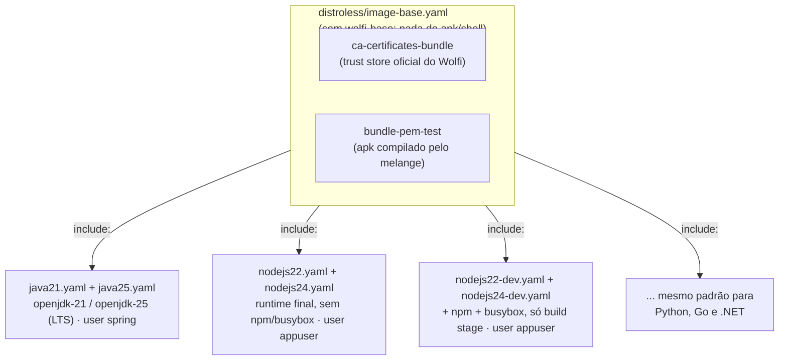
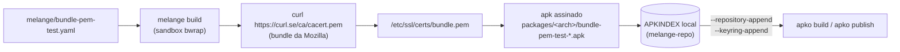
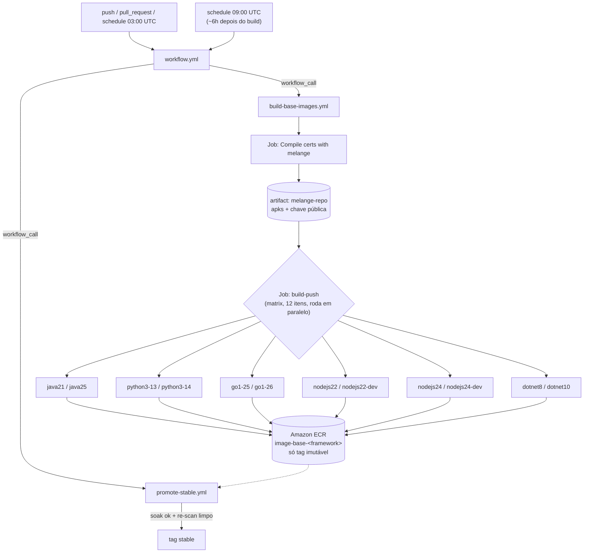
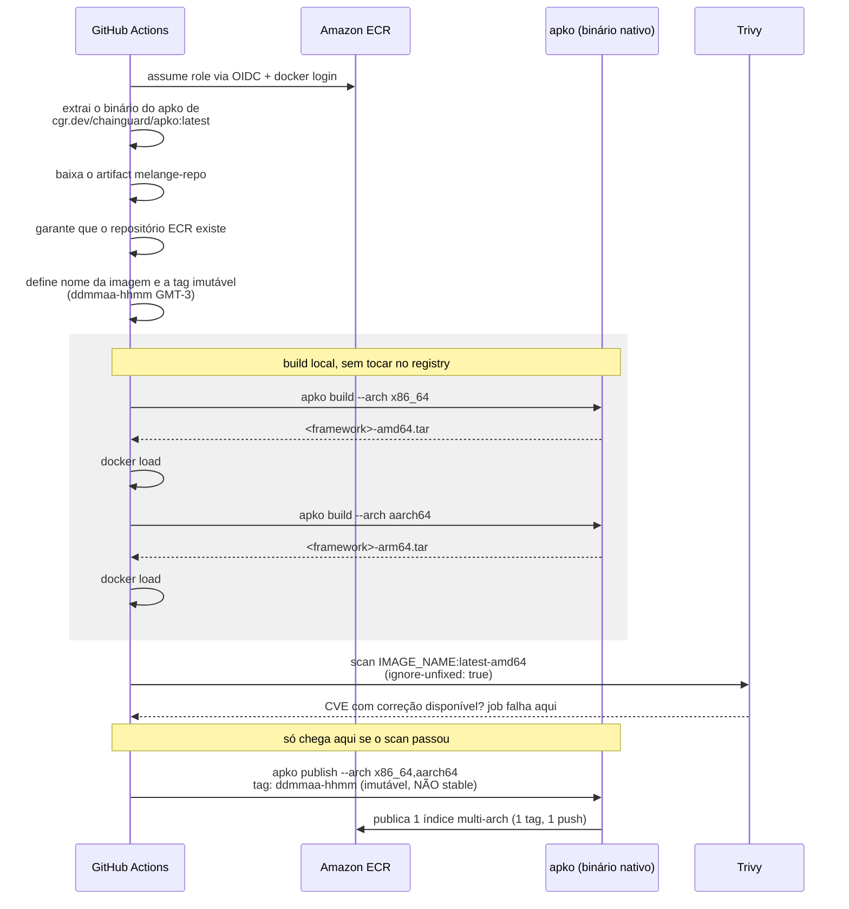

# image-base

Imagens base **distroless multi-arquitetura** (`amd64`/`arm64`) para **Java, Python, Go, Node.js e .NET** — cada linguagem com **duas versões estáveis/LTS** publicadas em paralelo. Construídas com [apko](https://github.com/chainguard-dev/apko) + [melange](https://github.com/chainguard-dev/melange) (pacotes [Wolfi](https://github.com/wolfi-dev), sem Dockerfile), escaneadas com [Trivy](https://github.com/aquasecurity/trivy) e publicadas no **Amazon ECR** via workflows reusáveis do GitHub Actions, com autenticação por OIDC (sem chave de acesso estática).

## Índice

- [image-base](#image-base)
  - [Índice](#índice)
  - [O que é uma imagem Distroless?](#o-que-é-uma-imagem-distroless)
  - [Imagens disponíveis](#imagens-disponíveis)
  - [Pré-requisitos](#pré-requisitos)
  - [Como usar](#como-usar)
  - [Estrutura do repositório](#estrutura-do-repositório)
  - [Como as imagens são compostas](#como-as-imagens-são-compostas)
  - [O pacote `bundle-pem-test` (melange)](#o-pacote-bundle-pem-test-melange)
  - [Pipeline de CI/CD (GitHub Actions)](#pipeline-de-cicd-github-actions)
  - [Gate de promoção para stable (canário de soak)](#gate-de-promoção-para-stable-canário-de-soak)
  - [Verificação: assinatura e build provenance](#verificação-assinatura-e-build-provenance)
  - [Configuração dos workflows reusáveis](#configuração-dos-workflows-reusáveis)
  - [Build local](#build-local)
  - [Conclusão](#conclusão)

## O que é uma imagem Distroless?

<p align="center">
  
</p>

Imagens "Distroless" contêm apenas o aplicativo e suas dependências de tempo de execução — sem gerenciador de pacotes, shell ou qualquer outra ferramenta que normalmente vem junto de uma distribuição Linux padrão. Restringir o container de produção precisamente ao que a aplicação precisa reduz a superfície de ataque e é uma prática recomendada, principalmente em ambientes produtivos.

> Como não há shell nem ferramentas de troubleshooting na imagem, depurar um pod rodando distroless exige um mecanismo de debug fora da imagem da aplicação (ex.: um [Container Efêmero](https://kubernetes.io/docs/tasks/debug/debug-application/debug-running-pod/#ephemeral-container) anexado ao pod). Esse toolkit é mantido fora deste repositório — no ambiente do Itaú, existe um pod de troubleshooting corporativo próprio para isso.

Neste repositório isso se traduz em quatro garantias concretas, já padronizadas em todas as imagens:

- **Camada única (single layer):** o `apko` não empilha `RUN` como um Dockerfile faz — ele resolve o grafo de dependências dos pacotes Wolfi e escreve o resultado final numa única camada, sem cache de gerenciador de pacotes, arquivo temporário ou camada intermediária "fantasma" sobrando na imagem publicada.
- **Superfície de ataque mínima:** `distroless/image-base.yaml` (herdado por todo `frameworks/<nome>.yaml`) só traz `ca-certificates-bundle` + `bundle-pem-test` — **sem `wolfi-base`**, que traria `apk-tools` e `busybox` (shell) de brinde via dependência transitiva. Cada `frameworks/<nome>.yaml` só declara o runtime que precisa (ex.: `openjdk-21`) em cima disso — sem shell, gerenciador de pacotes, compilador ou ferramentas de rede além do estritamente necessário, para todas as linguagens. Todas as imagens rodam como usuário non-root por padrão (`spring` ou `appuser`, uid/gid 10000). Node.js é o único runtime que depende de um gerenciador de pacotes (`npm`) para instalar dependências — por isso ele é o único com duas variantes: `nodejsNN` (runtime final, sem `npm`/`busybox`/shell) e `nodejsNN-dev` (com `npm`/`busybox`, usada só no estágio de build). A imagem que efetivamente vai pra produção nunca tem shell nem `apk`.
- **Cadeia de suprimentos (supply chain) rastreável:** os pacotes vêm do repositório rolling-release do [Wolfi](https://github.com/wolfi-dev) (assinado e mantido pela Chainguard); o único pacote que não vem de lá (`bundle-pem-test`) é compilado neste próprio repositório via melange, com índice assinado por uma chave efêmera gerada a cada build. Não existe imagem base de terceiros nem `FROM` de uma tag de procedência desconhecida.
- **SBOM e scan em todo build:** o `apko` gera um SBOM (SPDX) a cada build, e o [Trivy](#pipeline-de-cicd-github-actions) escaneia a imagem localmente antes de qualquer push — uma CVE `CRITICAL`/`HIGH`/`MEDIUM`/`LOW` **com correção disponível** falha o pipeline e a imagem nunca chega a ser publicada (veja [`ignore-unfixed`](#pipeline-de-cicd-github-actions)).

## Imagens disponíveis

| Linguagem | Versão | Pacote(s) Wolfi | Imagem (repositório ECR) | Usuário | Uso |
|---|---|---|---|---|---|
| Java | 21 (LTS) | `openjdk-21` | `image-base-java21` | `spring` | runtime final |
| Java | 25 (LTS) | `openjdk-25` | `image-base-java25` | `spring` | runtime final |
| Python | 3.13 | `python-3.13` | `image-base-python3-13` | `appuser` | runtime final |
| Python | 3.14 | `python-3.14` | `image-base-python3-14` | `appuser` | runtime final |
| Go | 1.25 | `go-1.25` | `image-base-go1-25` | `appuser` | runtime final |
| Go | 1.26 | `go-1.26` | `image-base-go1-26` | `appuser` | runtime final |
| Node.js | 22 (LTS) | `nodejs-22` | `image-base-nodejs22` | `appuser` | runtime final (sem npm/shell) |
| Node.js | 22 (LTS) | `nodejs-22`, `npm`, `busybox` | `image-base-nodejs22-dev` | `appuser` | build stage (tem npm e shell) |
| Node.js | 24 (LTS) | `nodejs-24` | `image-base-nodejs24` | `appuser` | runtime final (sem npm/shell) |
| Node.js | 24 (LTS) | `nodejs-24`, `npm`, `busybox` | `image-base-nodejs24-dev` | `appuser` | build stage (tem npm e shell) |
| .NET | 8 (LTS) | `dotnet-8-sdk` | `image-base-dotnet8` | `appuser` | runtime final |
| .NET | 10 (LTS) | `dotnet-10-sdk` | `image-base-dotnet10` | `appuser` | runtime final |

Referência completa de uma imagem: `<registro-ecr>/image-base-<framework>:<tag>`, onde `<registro-ecr>` é `<conta-aws>.dkr.ecr.<região>.amazonaws.com`.

Cada imagem publicada tem duas tags: **`stable`** (só avança depois que um build imutável sobrevive à janela de soak sem novas CVEs — veja [Gate de promoção](#gate-de-promoção-para-stable-canário-de-soak)) e **`<ddmmaa>-<hhmm>`** (referência imutável de um build específico, ex.: `010726-0152` para 1º de julho de 2026 às 01:52 no horário de Brasília, GMT-3).

## Pré-requisitos

- **Consumir as imagens:** um cliente OCI (`docker`, `podman`, `nerdctl`...) autenticado no ECR (`aws ecr get-login-password`).
- **Build/CI local:** Docker Engine com suporte a `--privileged` (usado pelo melange) — nada de `apko`/`melange` instalado à parte, o [`Makefile`](Makefile) roda os dois via `docker run`. Não precisa de credencial AWS para build local (`apko publish --local` não toca em nenhum registry).
- **CI (push real):** uma role AWS com permissão de `ecr:*` no(s) repositório(s) alvo, assumível via OIDC pelo GitHub Actions (sem access key de longa duração) — veja [Configuração dos workflows reusáveis](#configuração-dos-workflows-reusáveis).

## Como usar

```bash
aws ecr get-login-password --region <região> | docker login --username AWS --password-stdin <registro-ecr>
docker pull <registro-ecr>/image-base-nodejs24:stable
```

Todas as imagens já vêm com `work-dir: /app` e rodando como usuário non-root (`spring` para Java, `appuser` para as demais). Para runtimes que não dependem de gerenciador de pacotes, um Dockerfile de aplicação normalmente só precisa copiar o binário/artefato:

```Dockerfile
FROM <registro-ecr>/image-base-go1-26:stable
COPY --chown=appuser:appuser ./app /app/app
CMD ["/app/app"]
```

Para Node.js, use a variante `-dev` só no estágio de build (onde `npm install` precisa rodar) e a variante final (sem `npm`/shell) no estágio de runtime — a imagem que vai pra produção nunca tem `npm` nem shell:

```Dockerfile
FROM <registro-ecr>/image-base-nodejs24-dev:stable AS build
COPY package*.json ./
RUN npm ci --omit=dev
COPY . .

FROM <registro-ecr>/image-base-nodejs24:stable
COPY --chown=appuser:appuser --from=build /app .
CMD ["node", "server.js"]
```

Para fixar num build reprodutível (ex.: pipeline de deploy), use a tag imutável em vez de `stable`:

```Dockerfile
FROM <registro-ecr>/image-base-python3-14:010726-0152
```

## Estrutura do repositório

Cada pasta tem uma responsabilidade única: `distroless/` define a base comum, `frameworks/` só adiciona o runtime de cada linguagem em cima dela (Node.js tem duas variantes — `run` e `dev`, as demais linguagens têm 2 arquivos cada, a versão LTS/estável atual e a anterior), `melange/` builda o pacote extra do `bundle.pem`, e `.github/` é o pipeline (build+scan+publish da tag imutável, e a promoção separada pra `stable`):

```text
.
├── .github
│   ├── scripts
│   │   └── find_promotion_candidate.py   # usado pelo promote-stable.yml pra achar o candidato à promoção
│   └── workflows
│       ├── build-base-images.yml   # workflow reusável: build + scan + publish (só a tag imutável)
│       ├── promote-stable.yml      # workflow reusável: gate de promoção (canário de soak) -> tag stable
│       └── workflow.yml            # dispara os dois pipelines acima (push/PR/schedule)
├── distroless
│   └── image-base.yaml             # base comum: ca-certificates-bundle + bundle-pem-test (sem wolfi-base/apk/shell)
├── frameworks
│   ├── dotnet10.yaml                 # dotnet-10-sdk (LTS mais recente)
│   ├── dotnet8.yaml                  # dotnet-8-sdk (LTS)
│   ├── go1-25.yaml                   # go-1.25
│   ├── go1-26.yaml                   # go-1.26 (mais recente)
│   ├── java21.yaml                   # openjdk-21 (LTS)
│   ├── java25.yaml                   # openjdk-25 (LTS mais recente)
│   ├── nodejs22.yaml                 # nodejs-22, variante "run" (sem npm/busybox)
│   ├── nodejs22-dev.yaml             # nodejs-22 + npm + busybox, só para estágio de build
│   ├── nodejs24.yaml                 # nodejs-24, variante "run" (sem npm/busybox)
│   ├── nodejs24-dev.yaml             # nodejs-24 + npm + busybox, só para estágio de build
│   ├── python3-13.yaml               # python-3.13
│   └── python3-14.yaml               # python-3.14 (mais recente)
├── melange
│   └── bundle-pem-test.yaml        # gera o apk com o bundle.pem (Mozilla CA bundle)
├── .gitignore
├── Makefile                        # build local (veja Build local)
└── README.md

6 directories, 21 files
```

## Como as imagens são compostas

Todo `frameworks/<nome>.yaml` usa `include: distroless/image-base.yaml`, herdando os pacotes comuns (o `apko` faz *merge* das listas de pacotes, não substitui) e adicionando só o runtime específico e um usuário non-root próprio:



(a tabela [Imagens disponíveis](#imagens-disponíveis) acima tem a lista completa e exata dos 12 arquivos)

Critério de escolha das versões (no momento em que este README foi escrito):

| Linguagem | Versão A | Versão B | Por quê |
|---|---|---|---|
| Java | `openjdk-21` | `openjdk-25` | as duas últimas LTS (Java só recebe LTS a cada ~2 anos: 17, 21, 25) |
| Node.js | `nodejs-22` | `nodejs-24` | as duas últimas LTS (22 em Maintenance, 24 em Active LTS; 26 ainda é "Current", não é LTS) |
| .NET | `dotnet-8-sdk` | `dotnet-10-sdk` | as duas últimas LTS (.NET tem LTS a cada 2 anos: 6, 8, 10; a 9 é STS, não LTS) |
| Python | `python-3.13` | `python-3.14` | as duas últimas minors estáveis (Python não tem trilha LTS separada) |
| Go | `go-1.25` | `go-1.26` | as duas últimas minors estáveis (Go também não tem trilha LTS separada) |

O Wolfi é um repositório rolling-release, então cada `apko build`/`apko publish` já puxa o patch mais recente de cada uma dessas linhas automaticamente (ex.: `openjdk-21` sempre traz o último `21.0.x`).

> **Nota:** o pacote `nodejs-*` do Wolfi não traz `npm` funcional sozinho — o `npm` usa `#!/usr/bin/env node` no shebang e o `/usr/bin/env` só existe se o pacote `busybox` também for instalado. Por isso as variantes `-dev` incluem `busybox` explicitamente — e por isso o `npm`/`busybox` ficam isolados nessa variante em vez de irem para a imagem de runtime final.

## O pacote `bundle-pem-test` (melange)

O melange builda um pacote `.apk` próprio que baixa o bundle de certificados da Mozilla (a mesma fonte usada pelo `curl`/`certifi`) e o instala em `/etc/ssl/certs/bundle.pem`. Esse `.apk`, junto com o índice assinado, vira um repositório local que o `apko` consome via `--repository-append`/`--keyring-append` — sem precisar publicar esse pacote em nenhum repositório público.

> **Nota (POC caseira vs. ambiente Itaú):** este pacote existe hoje pra validar o pipeline melange → apko com uma fonte de certificado pública, já que o script real usado no Itaú (que baixa o ca-bundle governado pelo CloudSec — Artifactory, Proxy, AWS, certificados corporativos — de um bucket S3 e concatena com o bundle da Mozilla) só é acessível de dentro da rede corporativa. Antes de tratar isso como produção, vale fixar um hash conhecido do `cacert.pem` (hoje o `curl` não valida integridade além de checar se o arquivo tem um `BEGIN CERTIFICATE`) e isolar claramente o passo "buscar CA bundle" para ser o ponto de troca quando migrar pro script do CloudSec.



## Pipeline de CI/CD (GitHub Actions)

O `workflow.yml` dispara dois pipelines reusáveis, cada um num agendamento diferente:



Dentro de cada item da matrix (um framework/versão), a ordem dos passos garante que **o scan de vulnerabilidades roda antes de qualquer push**, e que o multi-arch é publicado num único comando atômico (sem tags soltas do tipo `latest-amd64`/`latest-arm64` ficando visíveis no registry):



Alguns detalhes de design que valem a pena registrar:

- **`apko build` (local) vs `apko publish` (registry):** o `apko build` só grava um `.tar` local, então é usado para montar a imagem que o Trivy escaneia, sem nunca tocar no ECR. Como os builds do apko são reprodutíveis, o `apko publish` gera exatamente o mesmo digest que foi escaneado.
- **`ignore-unfixed: true`:** o gate falha em qualquer CVE `CRITICAL`/`HIGH`/`MEDIUM`/`LOW` que já tenha correção publicada — mas não trava indefinidamente por uma CVE que o próprio Wolfi ainda não corrigiu. Sem isso, o rebuild diário (que existe justamente pra aplicar patches) poderia ficar travado por algo fora do controle do pipeline.
- **Sem tags soltas por arquitetura:** `docker manifest create` (a abordagem "clássica") só resolve referências que já existem no registry remoto — obrigaria a dar push de `latest-amd64`/`latest-arm64` antes de criar a lista multi-arch, e essas tags ficariam visíveis no ECR. `apko publish` builda e publica os dois arches num único índice, então essas tags intermediárias nunca chegam a existir no registry.
- **`apko` "nativo" em vez de via `docker run`:** o binário é extraído da própria imagem `cgr.dev/chainguard/apko:latest` (`docker create` + `docker cp`) e roda direto no runner. Isso garante a versão *latest stable* do apko e permite que ele reaproveite as credenciais que o login no ECR já escreveu em `~/.docker/config.json`, sem precisar montar volumes para simular o `$HOME` de um container.
- **QEMU só no job do melange:** o `apko` apenas extrai pacotes `.apk` (não executa nada), então builda `aarch64` num runner `amd64` sem emulação. Já o `melange` **executa** o pipeline do pacote (o `curl` que baixa o bundle da Mozilla) dentro de um sandbox `bwrap` — por isso só esse job precisa do `docker/setup-qemu-action`.
- **Matrix = push em paralelo:** os 12 frameworks/versões (2 por linguagem, exceto Node.js que tem 2 versões × 2 variantes) são itens de uma `strategy.matrix` com `fail-fast: false`, então o GitHub Actions builda/escaneia/publica todos ao mesmo tempo, e uma falha em um deles não cancela os demais.

## Gate de promoção para stable (canário de soak)

A tag `stable` **não** é publicada no mesmo run que builda a imagem. `promote-stable.yml` roda separadamente (por padrão, ~6h depois do build diário) e só promove um build para `stable` se, decorrida a janela de soak, um **re-scan** do mesmo digest continuar limpo:

1. Lista as imagens do repositório ECR e acha o build imutável mais recente que já passou da janela de soak (`.github/scripts/find_promotion_candidate.py`).
2. Re-escaneia esse digest com Trivy (`ignore-unfixed: true`) — é aqui que uma CVE divulgada durante a janela de soak barra a promoção, mesmo que o build tivesse passado limpo no scan original.
3. Se o re-scan continuar limpo, promove com `docker buildx imagetools create --tag <imagem>:stable <imagem>@<digest>` — retagueia o índice multi-arch por referência, sem baixar/re-subir camadas.

Isso é um canário de **tempo/CVE**, não um canário de tráfego real contra aplicações consumidoras — não há apps de referência nesta POC pra validar contra. Validar contra consumidores reais (deploy canário, smoke test de aplicação) é responsabilidade de cada pipeline de deploy downstream; este repositório garante só que `stable` nunca aponta pra um build que ficou vulnerável nas primeiras horas de vida.

**SLA de patch (pilar "manutenção" de um hardened image, ver RFC-013):** o Wolfi é rolling-release, então um patch de segurança fica disponível pra ele assim que o upstream libera. A partir daí, o pior caso de propagação neste pipeline é: até 24h para o próximo rebuild diário pegar o patch (`build-base-images.yml`, 03:00 UTC) + ~6h de soak antes da promoção (`promote-stable.yml`, 09:00 UTC) — um SLA efetivo de **até ~30h entre o patch existir no Wolfi e `stable` refletir ele**. Quem precisa do patch antes disso pode consumir a tag imutável do dia assim que ela é publicada, sem esperar a promoção.

## Verificação: assinatura e build provenance

Toda imagem publicada (tag imutável) é assinada e tem build provenance anexado — isso é o que falta pra sair de "distroless" pra "hardened" no sentido pleno do termo (ver a seção de maturidade na RFC-013):

- **Assinatura (cosign, keyless):** o job `build-push` assina o digest publicado com [cosign](https://github.com/sigstore/cosign) usando o token OIDC do próprio GitHub Actions — sem chave privada pra gerenciar ou rotacionar. A assinatura fica registrada no transparency log público do [Rekor](https://docs.sigstore.dev/logging/overview/).
- **Build provenance (SLSA):** `actions/attest-build-provenance` gera uma attestation nativa do GitHub descrevendo de qual commit, workflow e run a imagem saiu.

Para verificar uma imagem antes de usá-la (ex.: num gate de admissão do cluster, ou manualmente):

```bash
# assinatura (cosign)
cosign verify \
  --certificate-identity-regexp 'https://github.com/<sua-org>/image-base/\.github/workflows/build-base-images\.yml@.*' \
  --certificate-oidc-issuer https://token.actions.githubusercontent.com \
  <registro-ecr>/image-base-java21:stable

# build provenance (SLSA / GitHub attestations)
gh attestation verify oci://<registro-ecr>/image-base-java21:stable --owner <sua-org>
```

Nenhum dos dois comandos foi validado contra um push real nesta POC ainda (build-base-images.yml não rodou contra AWS/ECR de verdade) — confirme o formato exato do digest retornado por `apko publish` e a compatibilidade do ECR com a OCI Referrers API na sua região antes de tratar isso como pronto para produção.

## Configuração dos workflows reusáveis

Nenhum dos dois workflows depende do `workflow.yml` deste repo — qualquer outro repositório pode chamá-los diretamente. Os dois autenticam via OIDC (nenhuma AWS access key é armazenada como secret):

```yaml
permissions:
  id-token: write
  contents: read

jobs:
  build-images:
    uses: <sua-org>/image-base/.github/workflows/build-base-images.yml@main
    with:
      aws-region: us-east-1
      aws-role-arn: arn:aws:iam::<conta>:role/github-actions-image-base
      frameworks: '["java25", "nodejs24", "nodejs24-dev"]'

  promote-images:
    uses: <sua-org>/image-base/.github/workflows/promote-stable.yml@main
    with:
      aws-region: us-east-1
      aws-role-arn: arn:aws:iam::<conta>:role/github-actions-image-base
      soak-hours: 6
      frameworks: '["java25", "nodejs24", "nodejs24-dev"]'
```

| Nome | Workflow | Tipo | Obrigatório | Descrição |
|---|---|---|---|---|
| `aws-region` | ambos | input | sim | região AWS onde o ECR está |
| `aws-role-arn` | ambos | input | sim | role assumida via OIDC, com permissão de push/leitura no ECR |
| `frameworks` | ambos | input | sim | array JSON com os nomes dos arquivos em `frameworks/*.yaml` a processar |
| `soak-hours` | promote-stable | input | não (default `6`) | horas mínimas que um build imutável espera antes de poder virar `stable` |

Pré-requisito de infraestrutura (fora deste repo): configurar o [provedor OIDC do GitHub Actions](https://docs.github.com/en/actions/deployment/security-hardening-your-deployments/configuring-openid-connect-in-amazon-web-services) na conta AWS e uma IAM role com trust policy restrita a este repositório/branch, com permissão de `ecr:*` nos repositórios `image-base-*`.

## Build local

O [`Makefile`](Makefile) automatiza o build local — melange e apko sempre rodam via `docker run` (não como binário nativo), então funciona em qualquer SO/arquitetura de dev sem precisar instalar nada além do Docker:

```bash
make list                                                # lista os frameworks disponiveis
make build FRAMEWORK=go1-26                               # builda uma imagem local (apko publish --local)
make run FRAMEWORK=go1-26 ENTRYPOINT=/usr/bin/go ARGS=version  # builda e roda um comando na imagem
make clean                                                # remove chave e pacotes locais
```

`make build` builda o pacote `bundle-pem-test` com o melange (gerando uma chave de assinatura local descartável) e depois usa `apko publish --local`, que carrega a imagem direto no Docker daemon local sem tocar em nenhum registry — é exatamente o que o pipeline de CI faz antes de escanear com o Trivy. O `ARCH` é detectado automaticamente a partir do host (pode ser sobrescrito, ex.: `make build FRAMEWORK=go1-26 ARCH=x86_64`). Build local não precisa de credencial AWS — só entra em jogo quando o CI publica de fato no ECR.

## Conclusão

Manter uma imagem base atualizada e escaneada pra 5 linguagens diferentes costuma acabar em um de dois lugares: um Dockerfile artesanal por time/projeto que ninguém revisita depois que funciona uma vez, ou a decisão de aceitar uma imagem genérica de distro completa (com o pacote de ferramentas — e CVEs — que vem junto) só porque é o caminho de menor resistência.

O `image-base` existe pra tirar essa decisão do caminho: uma única fonte de verdade (`frameworks/*.yaml`) cobre as 12 combinações linguagem+versão+variante suportadas, e o pipeline garante que nenhuma imagem chega ao ECR sem passar pelo scan de vulnerabilidades antes — publicar algo com uma CVE conhecida e corrigível deixa de ser possível por descuido. A promoção pra `stable` só acontece depois que o build sobrevive a uma janela de soak sem novas CVEs, então nenhum time fica exposto a um base image que ficou vulnerável horas depois de publicado.

Isso não substitui a imagem final da sua aplicação — é o ponto de partida (`FROM <registro-ecr>/image-base-<framework>:stable`) pra não ter que decidir, de novo, quais pacotes tirar de uma imagem Ubuntu/Alpine pra chegar a um resultado parecido.
