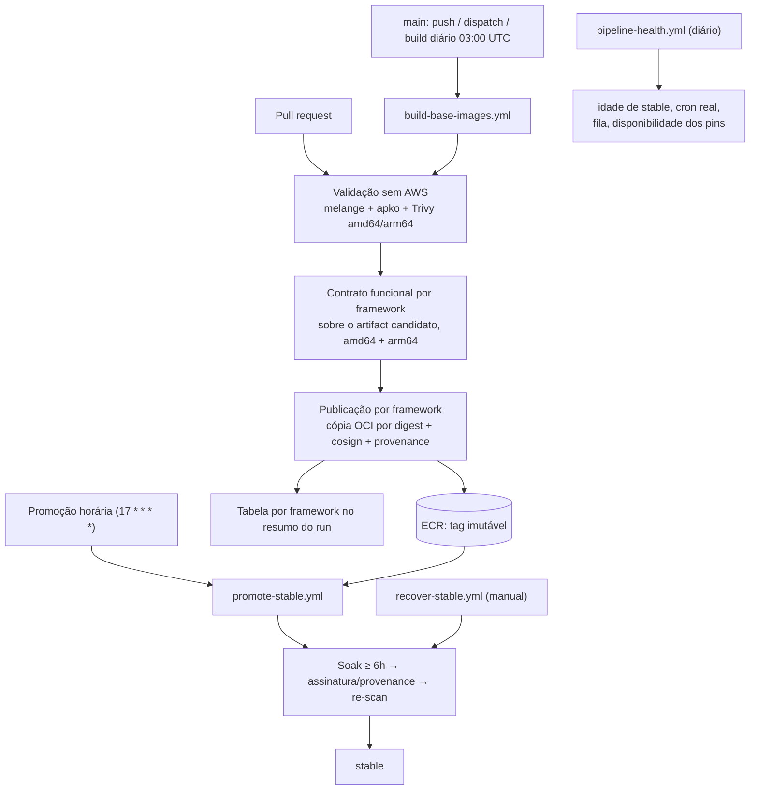
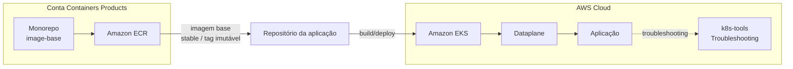

# RFC-013 - Plataforma de imagens base seguras e padronizadas para containers

## Status

| Informação | Valor |
| --- | --- |
| Status | Proposto |
| Possíveis estados | Aceito - Obsoleto - Substituído |
| Owner | Containers Products |
| Data | 01/09/2026 |
| Última revisão técnica | 10/09/2026 — estado do produto após 25 entregas sobre a POC |
| Prontidão para produção | **Não** — ver [Prontidão para produção](#prontidão-para-produção) |
| Impacto | Alto |
| Criticidade | Alta |
| Referência | Segurança, Supply Chain e Eficiência Operacional |

Esta RFC descreve o que a plataforma entrega hoje e o que separa esse estado
de uma liberação para produção. O caminho até aqui — diagnóstico original da
POC, cada entrega, achados reais e links de PR/run — está preservado na
íntegra em [docs/rfc-013-historico-de-entregas.md](docs/rfc-013-historico-de-entregas.md).

## TL;DR

- **O que:** um monorepo que centraliza o build de imagens base distroless, multi-arquitetura e padronizadas para os frameworks do banco.
- **Por quê:** hoje as aplicações usam imagens base heterogêneas e não governadas, elevando risco de CVE, não conformidade, falhas de certificado e ineficiência operacional.
- **Como:** Melange para o pacote de certificados, Apko para compor as imagens OCI a partir de pacotes Wolfi, scan Trivy e contrato funcional nas duas arquiteturas antes de publicar, assinatura e provenance no ECR, e promoção de `stable` só depois de uma janela de soak com re-scan.
- **Onde está:** implementado e exercitado com infraestrutura real (GitHub Actions + ECR) em um sandbox; não está em produção e não deve ser tratado como tal.

## Resumo

Atualmente, as áreas constroem aplicações em container de forma descentralizada, consumindo imagens base diversas (Alpine, Oracle, Ubuntu, Debian e outras), sem um padrão corporativo único. Esse cenário aumenta a exposição a vulnerabilidades, gera inconsistências de configuração, cria riscos de compliance e amplia o esforço operacional dos times.

Esta RFC estabelece uma plataforma de imagens base corporativas, com foco em segurança, rastreabilidade e eficiência. A abordagem utiliza a stack Chainguard (Melange + Apko), produzindo imagens distroless e multi-arquitetura (`amd64` e `arm64`) para frameworks estratégicos, com versionamento, auditoria e governança centralizada.

## Contexto

O modelo atual apresenta os seguintes problemas estruturais:

- **Uso de imagens externas não controladas**, com diferentes níveis de hardening e atualização.
- **Adoção eventual de imagens enterprise não homologadas**, com impacto potencial em compliance.
- **Ausência de boas práticas consistentes** em Dockerfiles e na composição das imagens.
- **Certificados SSL versionados diretamente em repositórios de aplicação**, sem processo central de atualização.
- **Baixa visibilidade** sobre quais imagens são usadas por framework/time e qual o nível de aderência aos padrões.

Além disso, não há controle robusto da cadeia de supply para imagens base. Na prática, isso reduz previsibilidade, aumenta risco de exposição a CVEs e pode causar indisponibilidade por expiração de certificados ou limitação de pull em registries públicos.

## Problema

A ausência de padronização de imagens base leva ao uso de imagens externas não controladas, aumenta riscos de segurança e compliance, gera inconsistências técnicas entre aplicações e cria ineficiência operacional no ciclo de build e deploy.

## Objetivo

- Padronizar imagens base para os principais frameworks utilizados no Itaú.
- Disponibilizar imagens seguras, otimizadas e multi-plataforma (`amd64` / `arm64`).
- Reduzir vulnerabilidades e superfície de ataque com abordagem distroless.
- Centralizar governança de dependências e certificados.
- Melhorar eficiência operacional dos times de desenvolvimento e plataforma.

## Solução entregue

Origem: POC funcional em https://github.com/gersontpc/image-base. A stack e a
forma do catálogo vieram de lá e foram mantidas; o que mudou foi a engenharia
de release em volta delas.

### Relação com a POC de referência

| Mantido da POC | Substituído ou acrescentado |
| --- | --- |
| Melange + Apko sobre pacotes Wolfi, sem Dockerfile de base | Docker Hub → ECR corporativo, um repositório por framework, tags imutáveis |
| Um YAML por framework em `frameworks/`, `distroless/image-base.yaml` como base comum | `wolfi-base` retirado da base (trazia `apk` e shell para toda imagem "distroless") |
| Pacote `bundle-pem-test` compilado pelo melange e consumido pelo apko | Scan nas **duas** arquiteturas (a POC escaneava só `latest-amd64` e publicava as duas) |
| Usuário non-root `uid/gid 10000`, `work-dir: /app` | Publicação sem rebuild: o mesmo OCI escaneado é o que vai para o registry, digest comparado |
| `Makefile` de build local via `docker run` | `stable` deixa de ser publicada no build: só promovida após soak com re-scan |
| Duas versões por linguagem | Variantes runtime e `-dev` para Go, Java e .NET; contrato funcional por framework |
| Toolkit de troubleshooting para ephemeral container | Assinatura keyless, provenance SLSA, ferramentas fixadas por SHA/digest, testes, gates de merge |

### Componentes

1. **Catálogo declarativo** — `distroless/image-base.yaml` (só `ca-certificates-bundle` + `bundle-pem-test`) e `frameworks/<nome>.yaml`, um por runtime/variante.
2. **Validação sem credenciais** — melange compila o bundle nas duas arquiteturas; `apko build` gera **um** layout OCI multi-arquitetura por framework; Trivy escaneia cada manifest separadamente (`--ignore-unfixed`, `CRITICAL,HIGH,MEDIUM,LOW`, mais segredos). O layout aprovado vira artifact `validated-oci-<framework>`.
3. **Contrato funcional** — executado sobre o próprio artifact candidato, nas duas arquiteturas, sem rebuild: Node e Python rodam um probe com o interpretador da imagem; Go, Java e .NET compilam um projeto mínimo versionado com a variante `-dev` e o executam na variante de runtime. Confere versão, UID/GID herdados, raiz somente leitura com áreas graváveis explícitas, bundle de CAs e TLS positivo/negativo.
4. **Publicação por framework** — Skopeo copia o OCI aprovado para o ECR preservando digests, lê a tag de volta e compara; assina com cosign keyless e anexa provenance SLSA. Tag imutável `ddmmaa-hhmm-r<run>-a<tentativa>`.
5. **Promoção de `stable`** — a cada ciclo, seleciona o build mais recente que completou o soak (6h), verifica assinatura/provenance com identidade fixa do workflow assinador, re-escaneia as duas arquiteturas com a base de CVE atual e só então move `stable` por referência.
6. **Recuperação** — `recover-stable.yml` restaura `stable` para um digest já publicado, com as mesmas verificações e sem bypass; quarentena versionada impede a repromoção do candidato retirado.
7. **Governança executável** — lints obrigatórios no merge (hardening dos workflows, cobertura e consistência dos pins, política de retenção e de cron), política de saúde/alerta versionada, tabela por framework em cada run.

Detalhes operacionais (como consumir, runbooks, configuração dos workflows)
estão no [README](README.md); arquitetura e fronteiras em
[docs/repository-architecture.md](docs/repository-architecture.md).

### O que o pipeline faz hoje



Nenhum framework publica sem o seu próprio artifact aprovado **e** o seu
contrato funcional aprovado nas duas plataformas; uma falha isola só aquele
framework. PRs, inclusive de fork, nunca recebem credenciais AWS nem OIDC.

### Nível de maturidade

"Slim", "distroless" e "hardened" não são sinônimos. A solução está no
patamar distroless e cobre parte dos controles de hardened:

| Pilar | Estado em 10/09/2026 |
| --- | --- |
| Minimalismo | Base sem shell nem gerenciador de pacotes, comprovado por execução nas variantes finais de Node, Python, Go, Java e .NET. Go 1.25/1.26, Java 21/25 e .NET 10 têm runtime separado do toolchain; só `dotnet8` ainda carrega o SDK completo. |
| Imutabilidade | Tags de build imutáveis no ECR (exceção só para `stable`), rejeição de sobrescrita comprovada nos 15 repositórios. Raiz somente leitura testada em contrato; continua dependendo da configuração do consumidor em runtime. |
| Manutenção | Rebuild diário e promoção por soak em execução; ferramentas por SHA/digest com lint de cobertura. A entrega do agendador do GitHub é de melhor esforço (medido: 10% das ocorrências horárias viraram run), a automação de atualização (Renovate) não está ativa e a primeira execução de saúde no runner detectou o Skopeo indisponível e lacuna de agendamento. |
| Verificabilidade | SBOM por build, assinatura cosign keyless e provenance SLSA no ECR, verificados na promoção e de forma independente fora do pipeline. Identidade do assinador vinculada ao ID numérico do repositório, não só ao nome. |

## Catálogo

| Framework | Variante | Conteúdo | Contrato funcional | Observação |
| --- | --- | --- | --- | --- |
| `java21` / `java21-dev` | runtime / build | `openjdk-21-jre` / `openjdk-21` + shell | compilado (par) | — |
| `java25` / `java25-dev` | runtime / build | `openjdk-25-jre` / `openjdk-25` + shell | compilado (par) | separado em 10/09/2026 |
| `python3-13`, `python3-14` | runtime | `python-3.x` | interpretado | — |
| `go1-26` / `go1-26-dev` | runtime / build | só a base / `go-1.26` + shell | compilado (par) | binário estático não precisa de runtime |
| `go1-25` / `go1-25-dev` | runtime / build | só a base / `go-1.25` + shell | compilado (par) | separado em 10/09/2026 |
| `nodejs22`, `nodejs24` e `-dev` | runtime / build | `nodejs-2x` / + `npm` + shell | interpretado (as quatro) | — |
| `dotnet10` / `dotnet10-dev` | runtime / build | `aspnet-10-runtime` / `dotnet-10-sdk` + shell | compilado (par) | — |
| `dotnet8` | único | `dotnet-8-sdk` | nenhum | **bloqueado pelo scan**: correção `8.0.129-r1` ainda não existe no repositório Wolfi consultado (verificado em 09/09/2026); nunca teve `stable` |

Dezessete definições, um repositório ECR por definição (os dois novos são
criados pelo próprio publicador no primeiro build). `stable` existe para as
catorze publicadas até 10/09;
`dotnet8` é reportado como exceção conhecida, com dono e data de revisão em
[policies/operations/health.json](policies/operations/health.json).

## Melhorias M01–M16: estado

Diagnóstico original, critérios de aceite completos e as evidências de cada
item estão no [histórico](docs/rfc-013-historico-de-entregas.md). Aqui, só
o estado.

| ID | Tema | Estado | Comprovado por | O que falta |
| --- | --- | --- | --- | --- |
| M01 | Scan das duas arquiteturas | Concluído | Scan por manifest no build e na promoção; bloqueio real por CVE; evidência por digest | — |
| M02 | Identidade do artefato publicado | Concluído | Cópia OCI sem rebuild com digest comparado três vezes; retry reaproveita o artifact | — |
| M03 | Gate de promoção verificável | Concluído | Assinatura + provenance verificadas; negativo autenticado (`no signatures found`) | Primeira promoção após a renomeação do repositório (identidade por ID) ainda sem run |
| M04 | Soak, concorrência e agendamento | Concluído / medido | Serialização real, sem regressão nem dupla promoção; cron real observado | Cadência do cron é de melhor esforço — SLA precisa ser por lacuna, não por horário |
| M05 | PR sem credenciais, trust policy | Concluído | PR interno rejeitado, fork real sem OIDC, policy por IDs numéricos | Recriar e reprovar no ambiente de produção |
| M06 | Imutabilidade no ECR | Concluído | 15 repositórios `IMMUTABLE_WITH_EXCLUSION`; sobrescrita rejeitada de verdade | — |
| M07 | Runtime separado do toolchain | Parcial | Go 1.25/1.26, Java 21/25 e .NET 10 separados, tamanho medido, apps mínimas executadas nas duas arquiteturas | `dotnet8` (bloqueado pelo scan; separar não muda isso) |
| M08 | Testes funcionais das imagens | Parcial | 11 frameworks com contrato; gate por framework; Go/Java/.NET aprovados no runner em amd64/arm64 sobre artifacts do PR #48; Go 1.25 e Java 25 aprovados localmente e no runner sobre artifacts do PR #49 | Cadeia com o gate ligado ainda sem run no runner hospedado; só `dotnet8` sem contrato |
| M09 | Ferramentas fixadas e mantidas | Parcial | SHA/digest em tudo; lint de cobertura e consistência; versões efetivas por etapa; check de disponibilidade | Renovate inativo; Skopeo corrigido com tag `-immutable` + digest nesta branch; integrar e validar publicação |
| M10 | Certificados com integridade verificável | Parcial | Parsing do bundle e TLS positivo/negativo nos 5 runtimes; script corporativo com manifesto SHA-256 | Mozilla agora fixado por data e SHA-256 nesta branch; fonte corporativa não integrada ao build |
| M11 | Documentação, SLA e visibilidade | Parcial | CVEs sem correção visíveis; tabela por framework em cada run; saúde diária com política versionada | SLA não formalizado; canal externo de alerta não definido; saúde já executada, com alertas reais ainda abertos |
| M12 | Checks obrigatórios | Concluído | `test` + `lint-workflows` exigidos, `enforce_admins`, merge com check falho rejeitado | — |
| M13 | Publicação independente por framework | Concluído | `dotnet8` falha sem derrubar os demais; retry sem rebuild | — |
| M14 | Timeouts e concorrência | Concluído | Limites por duração real; cancelamento por PR; timeout real observado | — |
| M15 | Recuperação de `stable` | Concluído | Runbook executado de ponta a ponta; quarentena versionada | — |
| M16 | Endurecimento e revisão efetiva | Concluído | Lint obrigatório; code owner comprovado pós-merge; regressão de `enforce_admins` achada e corrigida | — |
| M09/M12 | Executores compartilhados | Parcial | Validação, contrato e Trivy consumidos por SHA de `alric-containers-reusable-workflows` | `main` da biblioteca protegida; pin corrigido nesta branch, pendente de revisão do PR #2 |
| — | Scanner corporativo (Veracode SCA) | Aberto | Seis critérios de aceite registrados | Decisão de AppSec; cobertura de Wolfi não comprovada |

## Prontidão para produção

**Não.** A engenharia de release está em nível de produção em vários
controles — publicação por digest, assinatura, imutabilidade, gates de merge
sem bypass, promoção por soak com re-scan, recuperação testada — mas cinco
coisas impedem a liberação, em ordem do que bloqueia hoje para o que exige
decisão.

### 1. A `main` não publica neste momento

- **Renomeação dos repositórios (10/09, 12:24 UTC).** O executor compartilhado fixado (`081270c`) referencia internamente o nome antigo `itau-xj7-reusable-workflows`; desde a renomeação, o workflow de build falha na inicialização (`startup_failure`, runs 34475952305 e 34476466006). A correção — apontar os chamadores para o commit `0459275` da biblioteca renomeada — está implementada nesta branch. Esse commit está no PR #2 da biblioteca, ainda não na `main` dela.
- **Digest do Skopeo removido do `quay.io`.** O build diário de 10/09 (run 34450492208) validou 14 frameworks e falhou **as 14 publicações** em `Verify pinned Skopeo is available`: `manifest unknown`. É a segunda vez (a primeira em 09/09). As tags comuns do upstream são reconstruídas diariamente. O primeiro run de saúde (34493238551) confirmou a indisponibilidade; esta branch atualiza publicador e contratos para `v1.22.2-immutable` + digest, já resolvido e executado localmente.

- **Permissões dos workflows aninhados.** O primeiro run do PR de ajustes (34495120049) revelou `actions: read` solicitado por contratos/resumo, ausente no chamador. A passagem da permissão foi corrigida e ganhou lint obrigatório entre workflows.

Enquanto esses bloqueios não forem corrigidos e um build completo passar no runner
hospedado — validação → contrato → publicação → resumo —, nenhum outro item
desta seção pode ser considerado provado na cadeia atual.

### 2. Tudo está num sandbox

GitHub `alric-corp` e uma conta AWS pessoal. Para `itau-corp` é preciso
recriar e **reprovar** (os testes de aceite são repetíveis, os resultados não
transferem): trust policy OIDC com os IDs numéricos do repositório novo,
repositórios ECR com a resource policy dos Org IDs reais, `CODEOWNERS` e time
com escrita de verdade, branch protection com `enforce_admins`, secret
scanning/push protection, `policies/release/signing-identities.json` com o ID
do repositório de produção. O assinador continua sendo
`build-base-images.yml` na `main` do repositório de produção — qualquer
outra identidade invalida a verificação da promoção.

### 3. Decisões que não são código

| Decisão | Estado | De quem |
| --- | --- | --- |
| Scanner de container corporativo | O gate roda Trivy; a esteira corporativa levantada usa Veracode SCA agent-based, cuja documentação não lista Wolfi. Seis critérios de aceite abertos (cobertura, entrega por arquitetura, política válida, re-scan na promoção, credenciais, normalização de evidências). | AppSec + Containers Products |
| Fonte corporativa de certificados (M10) | `scripts/certificates/certificados.sh` baixa e verifica os bundles CloudSec/Itaú por manifesto SHA-256, mas não participa da composição da imagem; `melange/bundle-pem-test.yaml` fixa o bundle Mozilla por data e verifica SHA-256 nesta branch. | Containers Products + Segurança |
| Catálogo | `dotnet8` sem correção disponível no Wolfi: retirar do catálogo ou aceitar exceção formal (hoje: exceção com revisão em 09/10/2026). | Containers Products |
| Canal e dono de alerta, SLA publicável | Política e limites versionados; `external_destination` deliberadamente `null`. O SLA precisa ser escrito sobre a cadência observada do cron, não a nominal. | Containers Products |

### 4. Manutenção ainda não ligada

Renovate ainda depende de instalação pelo administrador. O Dependabot #47 foi
revisado: altera runtime de código gerado sem recompilar, portanto não deve ser
integrado isoladamente. A saúde já rodou e alertou; a `main` da biblioteca agora
exige checks e revisão independente de CODEOWNERS, inclusive de administradores.
O SHA em adoção ainda aguarda essa revisão no PR #2. Ver
[ajustes finais e aceites](docs/release-readiness-2026-09-10.md).

### 5. Cobertura e evidência parciais

Contratos compilados de Go 1.26, Java 21 e .NET 10 aprovados no runner em
amd64/arm64 sobre artifacts do PR #48 ([seis relatórios](docs/evidence/runtime-runner-2026-09-10.json)),
mas a cadeia `validação → contrato → publicação` no mesmo run ainda não rodou no runner
hospedado; `dotnet8` sem contrato; contratos de `go1-25`/`java25` só
executados localmente; primeira promoção
pós-renomeação sem run. A lifecycle policy foi aplicada e relida nos 15 ECRs:
imagens sem tag após 30 dias; todas as releases com tag preservadas.

### O que já está no nível esperado

Publicação por digest sem rebuild; assinatura keyless e provenance SLSA
verificadas na promoção e fora dela; imutabilidade com exceção só para
`stable`; PRs e forks sem credenciais; entradas validadas antes de qualquer
credencial; checks obrigatórios sem bypass de administrador e revisão de
code owner comprovada; soak com re-scan e serialização; recuperação de
`stable` sem bypass; 176 testes unitários e 20 de integração; lints
obrigatórios que impedem regressão dos controles.

## Valor e impacto

- Redução significativa de vulnerabilidades em imagens de runtime.
- Padronização de artefatos em diferentes frameworks e times.
- Redução da superfície de ataque por eliminação de pacotes desnecessários.
- Melhoria de performance de pull e armazenamento por imagens menores/otimizadas.
- Mitigação de risco de indisponibilidade por limites de pull em registries públicos.
- Melhor conformidade com requisitos de auditoria, segurança e supply chain.
- Menor esforço dos times de desenvolvimento na configuração de imagens base.
- Aceleração do ciclo de desenvolvimento e deploy com base reutilizável.

## Escopo inicial

| Item do escopo | Estado |
| --- | --- |
| Padrões de imagem base por framework prioritário (Java, Node.js, Python, Go e .NET) | Entregue (15 definições) |
| Pipeline de build com Melange e Apko | Entregue |
| Primeiras imagens base em formato distroless | Entregue no sandbox |
| Build multi-plataforma (`amd64` e `arm64`) | Entregue, escaneado e testado por arquitetura |
| Consumo pela tag `stable` | Entregue, promovida por soak; tag imutável por build para fixar |
| Publicação no ECR | Entregue no sandbox; produção pendente |
| Pull liberado para todas as orgs do Itaú | Resource policy validada no sandbox com Org IDs de teste; produção pendente |
| Automação no GitHub com scheduler diário | Entregue; cadência real do agendador medida e documentada |
| Scan das imagens a cada build | Entregue com Trivy; scanner corporativo em decisão |
| Documentação de uso para consumidores | Entregue no [README](README.md) |
| Trilha de troubleshooting distroless | Toolkit em `troubleshooting/`, ciclo de vida separado |

## Fora de escopo

- Criação de imagens customizadas específicas por aplicação.
- Cobertura de 100% dos frameworks legados na primeira fase.
- Migração automática de aplicações existentes para novas imagens.
- Gestão de CI/CD dos times consumidores.
- Suporte a sistemas operacionais fora do modelo distroless proposto.
- Criação de ferramenta paralela fora da stack Melange/Apko nesta fase.
- Gestão de runtime dos containers em clusters (orquestração/execução).
- Enforcement bloqueante imediato de imagens externas na fase inicial.

## Plano de adoção

### Fase 1 - Fundação (em andamento)

- Pipeline estruturado e imagens publicadas por framework — feito no sandbox.
- Catálogo, naming e versionamento definidos — feito; SLA de atualização a formalizar.
- Documentação técnica e guia de consumo — feito.
- Itens P1 de M01–M11 antes da produção — M10 aberto, M08/M09 parciais; ver [Prontidão](#prontidão-para-produção).
- **Restante desta fase:** corrigir a `main`, recriar o ambiente em `itau-corp` e reprovar os aceites, fechar as quatro decisões.

### Fase 2 - Adoção assistida

- Onboard dos primeiros times com acompanhamento do Containers Products.
- Coleta de métricas de adoção, vulnerabilidades e performance de build/pull.
- Ajustes de imagem base conforme feedback operacional.
- Concluir os itens P2, incluindo os runtimes restantes (M07) e o SLA com métricas observadas.

### Fase 3 - Escala e governança

- Expandir cobertura de frameworks/versões conforme priorização.
- Formalizar política de exceção e trilha de conformidade.
- Evoluir para mecanismos de controle de consumo de imagens em produção.
- Estender a verificação de assinatura/provenance ao consumo das imagens e acompanhar o SLA de patch.

## Critérios de sucesso

- Percentual de aplicações migradas para imagens base corporativas.
- Redução de vulnerabilidades altas/críticas nas imagens de runtime.
- Redução do tamanho médio das imagens e do tempo médio de pull.
- Aumento da rastreabilidade de origem dos artefatos (SBOM/tag imutável).
- Redução de incidentes relacionados a certificado/cadeia de build.
- Percentual de imagens promovidas com assinatura e build provenance verificadas, scans e testes aprovados em ambas as arquiteturas.

## Diagramas da arquitetura

### Visão de consumo



### Fluxo da fábrica de imagens

```mermaid
flowchart LR
    SRC["Monorepo"] --> MELANGE["Melange<br/>pacote de certificados"]
    MELANGE --> APKO["Apko<br/>um layout OCI multi-arch por framework"]
    APKO --> SBOM["SBOM"]
    SBOM --> SCAN["Trivy + contrato funcional<br/>amd64 + arm64"]
    SCAN --> IMMUTABLE["ECR: mesmo digest validado<br/>tag de build imutável"]
    IMMUTABLE --> SIGN["cosign keyless + provenance SLSA"]
    SIGN --> SOAK["Candidato com soak concluído"]
    SOAK --> VERIFY["Assinatura/provenance<br/>+ re-scan nas duas arquiteturas"]
    VERIFY --> STABLE["stable movida por referência"]
```



> A versão editável da arquitetura também está disponível no arquivo `RFC-013-Image-Base.drawio`.

## Arquitetura e fluxo de consumo

A solução separa a responsabilidade da plataforma de imagens base do ciclo de desenvolvimento das aplicações consumidoras:

1. O monorepo do **Containers Products** centraliza a definição e o build das imagens base.
2. As imagens são publicadas no **Amazon ECR**, com liberação de pull para as organizações consumidoras.
3. Cada framework/versão possui uma referência estável para consumo e uma identificação imutável por build.
4. O repositório da aplicação consome a imagem corporativa como base.
5. A aplicação é construída e posteriormente executada no ambiente de containers, como EKS.
6. O troubleshooting específico de runtime permanece separado da fábrica de imagens base.

### Convenção de imagens

```text
image-base-java21:stable
image-base-<framework>:<ddmmaa-hhmm>-r<run_id>-a<tentativa>
image-base-<framework>@sha256:<digest>
```

`stable` é a referência de consumo simplificada. A tag de build é única por
run e tentativa e imutável no registry. Para fixar exatamente o conteúdo
consumido, usar a referência por digest.

### Um repositório ECR por linguagem/framework

Cada framework tem seu próprio repositório ECR (`image-base-java21`, `image-base-nodejs22`, `image-base-dotnet8`, etc.), em vez de um único repositório compartilhado com todas as linguagens diferenciadas por tag. Avaliada e descartada a alternativa de repositório único: a granularidade por repositório é o que viabiliza, sem trabalho extra, os controles já definidos neste RFC:

- **Least-privilege por consumidor:** a resource policy do ECR (`ecr:BatchGetImage`/`ecr:GetDownloadUrlForLayer`, ver `policies/policy-ecr.json`, fora deste repositório por conter identificadores reais de organização) é aplicada por repositório. Um time que só usa Java não precisa de permissão de pull nos repositórios de .NET ou Node.js. ECR não restringe ações por prefixo de tag, então um repositório único obrigaria conceder pull de tudo para todos, ou recriar a separação por convenção de tag — o que move a complexidade sem reduzi-la.
- **Imutabilidade com exceção (M06):** a exceção `IMMUTABLE_WITH_EXCLUSION` para a tag `stable` é configurada por repositório; um namespace de tags compartilhado entre linguagens multiplicaria o risco de colisão.
- **Blast radius:** um incidente ou rotação malformada na pipeline de uma linguagem fica contido ao repositório correspondente, sem risco de afetar tags ou permissões de outra.
- **Catálogo:** o nome do repositório já documenta o que ele contém (`image-base-java21`), sem depender de convenção de tag para diferenciar o conteúdo.

O custo é operacional (mais repositórios para criar/gerenciar lifecycle policy), mitigado por serem criados programaticamente pelo próprio workflow de build. Validado no sandbox: a resource policy least-privilege foi aplicada individualmente aos repositórios `image-base-*`, na mesma estrutura da produção (`Principal: "*"` restrito por `Condition` em `aws:PrincipalOrgID`), usando a Organization do sandbox no lugar dos Org IDs do Itaú.

### Consumo

Runtime pronto (binário já compilado, JAR, saída de `dotnet publish`):

```dockerfile
FROM image-base-java21:stable
COPY --chown=spring:spring app.jar /app/app.jar
CMD ["java", "-jar", "/app/app.jar"]
```

Compilação dentro do pipeline: variante `-dev` no estágio de build (toolchain
e shell, para `RUN` shell-form e wrappers como `mvnw`/`gradlew`), variante de
runtime no estágio final:

```dockerfile
FROM image-base-go1-26-dev:stable AS build
WORKDIR /app
COPY --chown=appuser:appuser . .
RUN go build -o server .

FROM image-base-go1-26:stable
COPY --chown=appuser:appuser --from=build /app/server /app/server
CMD ["/app/server"]
```

`RUN apk add` e pacotes customizados não existem na imagem final: dependências
adicionais de runtime entram pela composição declarativa da base governada,
com scan e testes. Exemplos para Node.js, .NET e Java no [README](README.md#como-usar).

### Publicação e retenção

- Publicação das imagens no ECR corporativo; liberação de pull para as organizações do Itaú.
- Uma tag `stable` para consumo e tags imutáveis para rastreabilidade.
- Retenção de evidências de CI por finalidade (1, 3 e 30 dias), versionada em `policies/operations/health.json` e conferida por lint contra os workflows. `retention-days` não é backup: reexecução gera digests novos.
- Lifecycle ECR aplicada no sandbox: expira somente imagens sem tag após 30 dias; preview dos 15 repositórios sem alvos atuais. Todas as releases com tag permanecem preservadas para recuperação. Reduzir a retenção de releases publicadas exige definir a janela de recuperação.

## Repositórios

| Repositório | Papel |
| --- | --- |
| `https://github.com/itau-corp/itau-xj7-container-image-base` | Destino de produção do monorepo (a criar) |
| `https://github.com/itau-corp/itau-ev3-container-k8s-tools` | Ferramentas de troubleshooting do ambiente de containers |
| `https://github.com/alric-corp/alric-containers-image-base` | Sandbox onde a implementação e as evidências desta RFC estão (antes `itau-xj7-containers-image-base`) |
| `https://github.com/alric-corp/alric-containers-reusable-workflows` | Executores compartilhados (validação, contrato, Trivy) consumidos por SHA |
| `https://github.com/gersontpc/image-base` | POC de referência |

## Referências

- [Chainguard Apko](https://github.com/chainguard-dev/apko), [Melange](https://github.com/chainguard-dev/melange), [Wolfi](https://github.com/wolfi-dev), [Trivy](https://github.com/aquasecurity/trivy).
- [Trivy: seleção explícita de arquitetura no scan](https://trivy.dev/docs/latest/target/container_image/#scan-image-on-a-specific-architecture-and-os).
- [Amazon ECR: imutabilidade de tags e filtros de exceção](https://docs.aws.amazon.com/AmazonECR/latest/userguide/image-tag-mutability.html).
- [GitHub Actions: uso seguro e fixação por SHA completo](https://docs.github.com/en/actions/reference/security/secure-use#using-third-party-actions).
- [GitHub Actions: reuso de workflows e identidade OIDC](https://docs.github.com/en/actions/how-tos/reuse-automations/reuse-workflows).
- [Wolfi: definição do OpenJDK 21 e subpacote JRE](https://github.com/wolfi-dev/os/blob/main/openjdk-21.yaml).
- [Veracode SCA — scan de containers](https://docs.veracode.com/r/c_sc_container_scan).
- Histórico completo de entregas, aceites e achados: [docs/rfc-013-historico-de-entregas.md](docs/rfc-013-historico-de-entregas.md).
