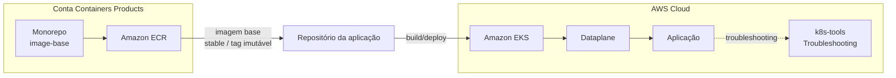

# RFC-013 - Plataforma de imagens base seguras e padronizadas para containers

## Status

| Informação | Valor |
| --- | --- |
| Status | Proposto |
| Possíveis estados | Aceito - Obsoleto - Substituído |
| Owner | Containers Products |
| Data | 01/09/2026 |
| Última revisão técnica | 08/09/2026 — melhorias propostas a partir da avaliação da POC |
| Impacto | Alto |
| Criticidade | Alta |
| Referência | Segurança, Supply Chain e Eficiência Operacional |

## TL;DR

- **O que:** criar um monorepo para centralizar o build de imagens base distroless, multi-arquitetura e padronizadas para os frameworks do banco.
- **Por quê:** hoje as aplicações usam imagens base heterogêneas e não governadas, elevando risco de CVE, não conformidade, falhas de certificado e ineficiência operacional.
- **Como:** usar Melange para empacotamento de dependências/certificados e Apko para build/publicação das imagens, com scan de vulnerabilidade (Trivy) no pipeline.
- **Resultado esperado:** reduzir superfície de ataque, padronizar artefatos, melhorar performance de build/pull e fortalecer governança da cadeia de supply.

## Resumo

Atualmente, as áreas constroem aplicações em container de forma descentralizada, consumindo imagens base diversas (Alpine, Oracle, Ubuntu, Debian e outras), sem um padrão corporativo único. Esse cenário aumenta a exposição a vulnerabilidades, gera inconsistências de configuração, cria riscos de compliance e amplia o esforço operacional dos times.

Esta RFC propõe estabelecer uma plataforma de imagens base corporativas, com foco em segurança, rastreabilidade e eficiência. A abordagem utiliza a stack Chainguard (Melange + Apko), produzindo imagens distroless e multi-arquitetura (`amd64` e `arm64`) para frameworks estratégicos, com versionamento, auditoria e governança centralizada.

O objetivo é reduzir risco operacional e de segurança, simplificar o ciclo de build/deploy dos times consumidores e criar base reutilizável confiável para workloads do banco.

## Contexto

O modelo atual apresenta os seguintes problemas estruturais:

- **Uso de imagens externas não controladas**, com diferentes níveis de hardening e atualização.
- **Adoção eventual de imagens enterprise não homologadas**, com impacto potencial em compliance.
- **Ausência de boas práticas consistentes** em Dockerfiles e na composição das imagens.
- **Certificados SSL versionados diretamente em repositórios de aplicação**, sem processo central de atualização.
- **Baixa visibilidade** sobre quais imagens são usadas por framework/time e qual o nível de aderência aos padrões.

Além disso, não há controle robusto da cadeia de supply para imagens base. Na prática, isso reduz previsibilidade, aumenta risco de exposição a CVEs e pode causar indisponibilidade por expiração de certificados ou limitação de pull em registries públicos.

## Problema

A ausência de padronização de imagens base leva ao uso de imagens externas não controladas, aumenta riscos de segurança e compliance, gera inconsistências técnicas entre aplicações e cria ineficiência operacional no ciclo de build e deploy.

## Objetivo

- Padronizar imagens base para os principais frameworks utilizados no Itaú.
- Disponibilizar imagens seguras, otimizadas e multi-plataforma (`amd64` / `arm64`).
- Reduzir vulnerabilidades e superfície de ataque com abordagem distroless.
- Centralizar governança de dependências e certificados.
- Melhorar eficiência operacional dos times de desenvolvimento e plataforma.

## Solução proposta

Referência da POC funcional: https://github.com/gersontpc/image-base

A proposta é implementar uma fábrica centralizada de imagens base com os seguintes componentes:

1. **Build sem Dockerfile de base**, utilizando:
   - **Melange** para empacotamento/gerenciamento de dependências específicas e certificados.
   - **Apko** para composição e publicação das imagens OCI.
2. **Imagens distroless e multi-arquitetura**, reduzindo superfície de ataque e mantendo portabilidade entre arquiteturas.
3. **Pipeline com validação de segurança**, incluindo geração de SBOM e scan com Trivy antes da publicação.
4. **Versionamento e tagging padronizados**, com tag estável e tag imutável por build para rastreabilidade.
5. **Publicação em registry corporativo**, eliminando dependência operacional de registries externos para consumo interno.

### Características técnicas esperadas

- Imagens por framework e versão suportada (ex.: Java, Node.js, Python, Go, .NET).
- Execução por usuário não-root por padrão.
- Inclusão do certificado de maneira dinâmica a cada build.
- Rebuild contínuo para aplicação de patches de segurança.

### Nível de maturidade: distroless hoje, caminho para hardened

"Slim", "distroless" e "hardened" não são sinônimos, e vale deixar isso explícito para alinhar expectativa com quem avaliar esta RFC:

- **Slim** não é um padrão de segurança — normalmente indica que alguns pacotes foram removidos de uma imagem convencional, com o conjunto exato dependendo do fornecedor.
- **Distroless** é uma imagem orientada a runtime: minimalista, sem shell nem gerenciador de pacotes. A POC registra validações locais de ausência de `/bin/sh` e `apk` em Java, Python, Go e Node.js, mas ainda precisa automatizar essa verificação para todas as variantes finais e arquiteturas. Ausência de shell não comprova ausência de SDKs ou compiladores.
- **Scratch** é um ponto de partida vazio — útil para binários estáticos, mas não é um bom default para runtimes como Java.
- **Hardened** envolve controles além do minimalismo: integridade dos artefatos, restrições de escrita e execução, manutenção com SLA de patch e verificabilidade (SBOM, assinatura e build provenance). Ausência de `apk` não torna o filesystem imutável; restrições como filesystem somente leitura dependem também da configuração do ambiente consumidor.

O que a solução entrega hoje, mapeado nesses quatro pilares:

| Pilar | Status atual |
|---|---|
| Minimalismo | Parcial — há validações locais registradas, mas Go inclui toolchain, .NET inclui SDK e Java usa o pacote OpenJDK completo; falta validar automaticamente a composição por arquitetura |
| Imutabilidade | Parcial — ausência de `apk` reduz ferramentas disponíveis, mas o pipeline cria repositórios ECR com tags mutáveis; filesystem somente leitura precisa ser validado com os consumidores |
| Manutenção | Parcial — rebuild diário, seleção por soak e promoção horária configurados; execução remota e SLA medido ainda pendentes |
| Verificabilidade | Parcial — SBOM, assinatura cosign e build provenance estão previstos no pipeline implementado; falta validar a cadeia ponta a ponta e exigir assinatura/provenance na promoção |

A passagem da POC para uma plataforma de produção depende de comprovar essas propriedades por artefato e arquitetura. O backlog abaixo registra as lacunas identificadas e os critérios para avaliar essa evolução.

### Melhorias propostas após avaliação da POC — 08/09/2026

A tabela abaixo registra as lacunas observadas na avaliação inicial e as melhorias propostas; o andamento está registrado após a tabela. A avaliação incluiu leitura dos manifestos e workflows, `actionlint` nos três workflows principais (sem erros) e execução de cenários sintéticos do script de promoção. Não incluiu builds completos, novos scans de vulnerabilidade ou validação no ECR/IAM. Os cenários sintéticos comprovam o comportamento do script, não a ocorrência de incidentes no registry.

**Prioridades:** P1 = corrigir antes de liberar a plataforma para produção; P2 = completar para adoção assistida. O owner da RFC coordena a execução; responsáveis por item e prazos permanecem a definir.

| ID | Prioridade | Lacuna e evidência na POC | Melhoria proposta e critério de aceite |
| --- | --- | --- | --- |
| M01 | P1 | [Build](.github/workflows/build-base-images.yml) escaneia apenas `latest-amd64` e publica duas arquiteturas; [promoção](.github/workflows/promote-stable.yml) não seleciona ambas as plataformas. | Escanear `linux/amd64` e `linux/arm64` explicitamente no build e na promoção. Uma falha em qualquer arquitetura deve impedir a publicação ou promoção do índice; preservar os relatórios associados aos respectivos digests. |
| M02 | P1 | O build local e o `apko publish` resolvem os pacotes separadamente, sem lockfile nem comparação de digests. | Publicar os artefatos já validados ou fixar todos os insumos e comprovar a identidade dos manifests publicados com os validados. Uma divergência deve bloquear a liberação; uma mudança no repositório Wolfi entre as etapas não pode introduzir conteúdo sem scan. |
| M03 | P1 | [Seleção de candidato](.github/scripts/find_promotion_candidate.py) aceita qualquer tag diferente de `stable`; a promoção não verifica assinatura/provenance. | Aceitar somente tags de build no padrão definido e índices de imagem com as plataformas esperadas. Verificar assinatura, identidade do workflow/branch autorizados e provenance do digest antes de promover. Testes devem rejeitar tags de assinatura, artefatos auxiliares e imagens cujo push teve sucesso mas cuja assinatura/attestation falhou. |
| M04 | P1 | O script escolhe o mais recente antes de filtrar a idade. Build às 03h UTC e promoção às 09h UTC não asseguram seis horas desde o push. | Filtrar candidatos que completaram o soak antes de ordenar; evitar promover novamente o digest já estável e impedir regressão automática para builds anteriores ao stable atual. Executar a promoção com frequência compatível com a janela e serializar atualizações concorrentes por imagem. Testar build publicado às 03h20, candidato recente inelegível com outro elegível e stable já atualizado. |
| M05 | P1 | [PRs](.github/workflows/workflow.yml) chamam o mesmo fluxo de autenticação/publicação usado pela branch principal. | Separar validação de PR sem credenciais AWS da publicação restrita à branch principal autorizada. Verificar que PRs internos e de forks executam build/scan sem push e que a trust policy OIDC e as permissões dos jobs refletem essa separação. |
| M06 | P1 | O workflow cria repositórios ECR como `MUTABLE` e usa timestamp com precisão de minuto. | Adotar tags únicas por run/tentativa e imutabilidade no ECR com exceção para `stable`, contemplando a configuração de repositórios existentes. Validar compatibilidade com os artefatos de assinatura. Uma segunda publicação na mesma tag de build deve ser rejeitada; documentar consumo por digest. |
| M07 | P2 | [Go](frameworks/go1-26.yaml) inclui toolchain, [.NET](frameworks/dotnet10.yaml) inclui SDK e [Java](frameworks/java21.yaml) inclui OpenJDK completo. | Separar variantes de build e runtime: base para Go estático ou com dependências de CGO, runtime/ASP.NET para .NET e JRE para Java quando suficiente. Comparar tamanho e inventário de pacotes e executar aplicações mínimas; exceções que exijam ferramentas de desenvolvimento devem ser justificadas no catálogo. |
| M08 | P1 | O pipeline valida vulnerabilidades, mas não executa uma suíte funcional das imagens finais. | Automatizar testes por framework e arquitetura: inicialização do runtime/aplicação mínima, usuário non-root, permissões de `/app`, TLS e execução com filesystem somente leitura e áreas temporárias declaradas. Inspecionar ausência de shell e gerenciador de pacotes nas variantes finais; falhas devem bloquear a liberação. |
| M09 | P1 | Apko/melange usam `latest`; Actions dos workflows principais usam tags, sem SHA completo. | Fixar ferramentas por digest e Actions por SHA completo, com atualização automatizada e revisão. Registrar as versões efetivas no build; atualizar ferramentas e dependências de forma controlada sem perder a rotina de patches. |
| M10 | P1 | [Bundle de certificados](melange/bundle-pem-test.yaml) baixa conteúdo variável sem checksum e só verifica presença de `BEGIN CERTIFICATE`. | Usar fonte corporativa versionada e integridade verificável, registrando a versão do bundle no pacote. Validar parsing dos certificados e integração com o trust store de cada runtime. Testes TLS devem comprovar confiança em uma CA de teste aprovada e rejeição de uma CA não autorizada. |
| M11 | P2 | README associa scan aprovado a ausência de novas CVEs e anuncia SLA de aproximadamente 30h, embora o gate use `ignore-unfixed: true` e a promoção tenha as lacunas de M04. | Documentar que o gate bloqueia vulnerabilidades detectadas nas severidades configuradas com correção disponível. Dar visibilidade também às CVEs sem correção; publicar SLA com ponto inicial/final, frequência de promoção, atrasos/falhas e política de exceções. Medir o tempo entre disponibilidade do patch no Wolfi e atualização de `stable` antes de assumir o compromisso. |

Na reprodução local de M03/M04, o script selecionou uma tag sintética `sha256-example.sig`, retornou `skip=true` quando havia um build elegível mais antigo e voltou a selecionar um digest que já possuía `stable`. Esses cenários devem compor os testes de regressão da implementação.

#### Checklist de acompanhamento

Atualizar este checklist a cada entrega, preservando os IDs M01–M11 e registrando data, escopo e evidências no histórico abaixo. Uma caixa marcada comprova apenas o escopo descrito: implementação e validação local não equivalem a execução no GitHub ou liberação no ECR. Marcar uma melhoria inteira como concluída somente após cumprir todos os seus critérios de aceite. Acrescentar links de commit/PR/run quando disponíveis.

**Implementado e validado localmente — 08/09/2026**

- [x] **M03 — filtro de candidatos:** aceitar tags válidas `ddmmaa-hhmm` e tipos de índice OCI/Docker; descartar tags de assinatura e manifests individuais.
- [x] **M04 — seleção após soak:** filtrar pela idade antes de escolher o mais recente, permitindo selecionar outro build elegível quando o mais novo ainda está em soak.
- [x] **M04 — proteção em relação ao stable:** excluir o digest já estável e candidatos com `imagePushedAt` anterior ou igual ao stable atual. A comparação usa a data informada pelo ECR e não comprova ordem de commits.
- [x] **Testes de regressão:** adicionar e executar 14 testes do seletor, incluindo tags auxiliares, tipos de manifest, idade, fuso horário, prevenção de regressão e contrato de saída para GitHub Actions.
- [x] **Configuração de CI dos testes:** adicionar workflow próprio de PR/push e etapa de testes antes da autenticação AWS na promoção; validar a configuração com `actionlint`.
- [x] **Contrato do build:** tornar obrigatório o input `frameworks` do workflow reusável.
- [x] **M11 — precisão da documentação:** corrigir no README a garantia de ausência de CVEs e retirar a estimativa de ~30h como SLA garantido.

**Segunda entrega — implementação e validação local, 08/09/2026**

- [x] **M01 — scan das duas arquiteturas:** configurar Trivy para `linux/amd64` e `linux/arm64`, tanto nos tars locais quanto no digest remoto da promoção. Testes com scanner simulado comprovam agregação de falhas e tentativa das duas arquiteturas.
- [x] **M01 — evidências:** configurar artifacts por framework/tentativa com retenção de 30 dias, relatórios JSON e metadados de plataforma/alvo/resultado; calcular SHA-256 de cada tar local. O hash do tar não substitui o digest OCI; a vinculação ao conteúdo publicado depende de M02.
- [x] **M05 — separação de workflows e permissões:** extrair `validate-base-images.yml` com `contents: read`, sem AWS/OIDC. PRs chamam apenas a validação; publicação e promoção restringem os jobs AWS a push/schedule/dispatch na `main`. Configuração verificada localmente em oito cenários de evento/ref/schedule.
- [x] **M04 — agendamento:** configurar promoção horária no minuto 17, mantendo o soak mínimo de seis horas desde o push.
- [x] **M04 — concorrência:** configurar um grupo por role/região/framework, compartilhado entre dispatch direto e chamada reusável no mesmo repositório GitHub, sem cancelar o job em andamento. A seleção acontece dentro do job serializado; atualizações externas não participam desse controle.
- [x] **Testes e documentação:** ampliar a suíte para 21 testes e atualizar o README para o fluxo implementado, incluindo bloqueio do lote quando algum framework falha na validação.

**Validação da primeira entrega em ambiente remoto**

- [x] Executar os testes no GitHub Actions: [run 34187982413](https://github.com/alric-corp/itau-xj7-containers-image-base/actions/runs/34187982413), 21 testes aprovados na primeira versão do PR.
- [ ] Validar a seleção com respostas reais do ECR, incluindo imagem já estável, candidatos em soak e artefatos auxiliares.
- [ ] Validar o fluxo de promoção no ambiente de teste e registrar run e digest resultante.

**Terceira entrega — testes reais e continuação, 08/09/2026**

- [x] **M01/M05 — PR real:** [run 34187982748](https://github.com/alric-corp/itau-xj7-containers-image-base/actions/runs/34187982748): melange e builds concluídos, 11 frameworks aprovados nas duas arquiteturas; .NET 8 bloqueado em ambas por CVEs corrigíveis. Artifacts de todos os scans preservados; jobs de publicação/promoção ignorados no PR. Teste de fork ainda pendente.
- [x] **M02 — implementação:** build único em layout OCI, verificação de blobs/plataformas, transferência de artifact aprovado e cópia Skopeo com preservação/comparação de digests, sem reconstrução.
- [x] **M02 — teste ECR isolado:** cópia do layout Node.js 24 para `image-base-validation-nodejs24` preservou o índice `sha256:49d0c59ce62eae51bf5f507920d45fea626145e64fa8c3186afe62626e8d90ed` e seus dois manifests. Teste manual com credenciais locais; não equivale a validar OIDC/assinatura do workflow na main.
- [x] **M01/M02 — correção descoberta em teste real:** Trivy 0.72.0 selecionou amd64 nas duas chamadas contra um layout OCI multi-arquitetura. O scanner agora recebe uma visão com um único manifest e confere a arquitetura no relatório. Scans reais corrigidos confirmaram amd64 e arm64 distintos, sem CVEs bloqueantes no layout Node.js 24 testado.
- [x] **M06 — implementação:** tags com run/tentativa, compatibilidade do seletor com tags históricas e configuração ECR `IMMUTABLE_WITH_EXCLUSION` com exceção exata para `stable`.
- [x] **M06 — teste ECR isolado:** sobrescrita de `review-pr1` rejeitada com `ImageTagAlreadyExistsException`; `stable` pôde ser alterada e restaurada ao índice original no repositório exclusivo de teste. Repositórios de consumo não foram alterados.
- [x] **M09 — fixação inicial:** Actions diretas de build/validação/promoção por SHA; apko/melange/Skopeo por digest, incluindo Makefile para apko/melange. Dependabot semanal para Actions configurado. Atualizações de digests de ferramentas ainda manuais.
- [ ] **M05 — corrigir IAM:** inspeção real identificou trust policy com wildcard de repositório/ref; restringir ao repositório e branch autorizados. A política remota ainda não foi alterada.
- [ ] Validar a versão com layout OCI no GitHub e executar o fluxo autenticado completo, incluindo assinatura/provenance, antes do merge/liberação.

**Pendências por melhoria**

- [ ] **M01 — validação remota:** executar scans reais nas duas arquiteturas, confirmar bloqueio de publicação/promoção e auditar os relatórios em artifacts; comprovar vínculo com os manifests publicados junto com M02.
- [ ] **M02 — integração final:** validar no workflow autenticado a cópia OCI já implementada e comprovada manualmente no ECR, incluindo obtenção do artifact do run/tentativa e falhas por adulteração.
- [ ] **M03 — restante:** inspecionar plataformas do índice e verificar assinatura, identidade autorizada e provenance; testar rejeição de imagens sem essas evidências.
- [ ] **M04 — validação remota:** confirmar execução horária e ausência de regressão com execuções concorrentes no GitHub/ECR; medir atrasos de fila e scheduler.
- [ ] **M05 — validação remota:** executar PRs internos/de forks e publicação na `main`; verificar permissões efetivas e trust policy OIDC na conta AWS.
- [ ] **M06 — integração final:** confirmar compatibilidade com assinaturas/provenance e aplicar/validar a configuração dos repositórios de consumo pelo workflow autorizado.
- [ ] **M07:** separar build/runtime em Go, .NET e Java; comparar inventário e tamanho e executar aplicações mínimas.
- [ ] **M08:** implementar e executar testes funcionais das imagens finais por framework e arquitetura, incluindo TLS, permissões e filesystem somente leitura.
- [ ] **M09 — restante:** automatizar também atualizações dos digests de ferramentas e registrar versões efetivas; validar os PRs do Dependabot e a política de revisão.
- [ ] **M10:** versionar e verificar a integridade do bundle corporativo; testar parsing e confiança TLS positiva/negativa em cada runtime.
- [ ] **M11 — restante:** dar visibilidade às CVEs sem correção, medir tempo de atualização e formalizar SLA e política de exceções.

#### Histórico de entregas

| Data | Escopo | Evidência | Limites / próxima validação |
| --- | --- | --- | --- |
| 08/09/2026 | Primeira implementação: M03/M04 parciais, testes de regressão, input obrigatório e ajuste documental de M11 | [Seletor](.github/scripts/find_promotion_candidate.py), [14 testes](.github/scripts/test_find_promotion_candidate.py) e [workflow de testes](.github/workflows/test-promotion.yml). Execução local: 14 testes aprovados; `actionlint` aprovado nos quatro workflows da entrega; `git diff --check` sem erros. | Alterações locais, sem commit/PR/run remoto registrado. Validação GitHub/ECR pendente; M03/M04/M11 continuam parciais. |
| 08/09/2026 | Segunda implementação: M01/M05 parciais e configuração de agendamento/concorrência de M04 | [Validação sem AWS](.github/workflows/validate-base-images.yml), [scanner](.github/scripts/scan_images.py), [testes do scanner](.github/scripts/test_scan_images.py) e [promoção](.github/workflows/promote-stable.yml). Execução local: 21 testes aprovados, oito cenários de roteamento verificados e `actionlint` aprovado nos cinco workflows da entrega. | Scanner simulado nos testes; sem builds/scans reais ou execução no GitHub/ECR nesta entrega. A publicação depende do sucesso de todo o lote selecionado. M02 permanece aberto: `apko publish` ainda reconstrói a imagem. |
| 08/09/2026 | Terceira entrega: PR real, cópia OCI, tags imutáveis e ferramentas fixadas | [PR #1](https://github.com/alric-corp/itau-xj7-containers-image-base/pull/1), runs referenciados acima e teste no ECR exclusivo `image-base-validation-nodejs24`, digest registrado no checklist. | PR em rascunho; sem merge. .NET 8 permanece bloqueado por CVEs. O teste ECR foi manual e não valida OIDC/assinatura do workflow. M03, M07, M08, M10 e demais validações remotas permanecem pendentes. |

Comando para repetir os testes locais, sem Docker ou AWS:

```bash
python3 -B -m unittest discover -s .github/scripts -p 'test_*.py' -v
```

A janela de soak é uma espera seguida de nova avaliação de vulnerabilidades conhecidas. Ela não comprova ausência de vulnerabilidades durante toda a janela e não substitui testes funcionais nem canário de tráfego das aplicações consumidoras. O scan da imagem base também não cobre dependências adicionadas posteriormente pela aplicação.

## Valor e impacto

- Redução significativa de vulnerabilidades em imagens de runtime.
- Padronização de artefatos em diferentes frameworks e times.
- Redução da superfície de ataque por eliminação de pacotes desnecessários.
- Melhoria de performance de pull e armazenamento por imagens menores/otimizadas.
- Mitigação de risco de indisponibilidade por limites de pull em registries públicos.
- Melhor conformidade com requisitos de auditoria, segurança e supply chain.
- Menor esforço dos times de desenvolvimento na configuração de imagens base.
- Aceleração do ciclo de desenvolvimento e deploy com base reutilizável.

## Escopo inicial

- Definir padrões de imagem base por framework prioritário (Java, Node.js, Python, Go e .NET).
- Implementar pipeline de build com Melange e Apko.
- Publicar primeiras imagens base em formato distroless.
- Habilitar build multi-plataforma inicial (`amd64` e `arm64`).
- O usuário irá apontar para a tag da imagem base como `stable`.
- Publicar imagens no ECR.
- Liberar o pull das imagens para todas as orgs do Itaú.
- O processo deve ser automatizado no workflow do GitHub, com scheduler diário.
- Container Aqua para fazer o scan das imagens a cada build.
- Documentação para o usuário com a jornada de como utilizar a imagem base em seus projetos.
- Documentação de uso para times consumidores e trilha de troubleshooting para cenários distroless.

## Fora de escopo

- Criação de imagens customizadas específicas por aplicação.
- Cobertura de 100% dos frameworks legados na primeira fase.
- Migração automática de aplicações existentes para novas imagens.
- Gestão de CI/CD dos times consumidores.
- Suporte a sistemas operacionais fora do modelo distroless proposto.
- Criação de ferramenta paralela fora da stack Melange/Apko nesta fase.
- Gestão de runtime dos containers em clusters (orquestração/execução).
- Enforcement bloqueante imediato de imagens externas na fase inicial.

## Plano de adoção

### Fase 1 - Fundação

- Estruturar pipeline e publicar imagens base iniciais por framework prioritário.
- Definir catálogo oficial, naming, versionamento e SLA de atualização.
- Publicar documentação técnica e guia de consumo.
- Concluir os itens P1 de M01–M11 antes da liberação para produção, com evidências por digest e arquitetura.

### Fase 2 - Adoção assistida

- Onboard dos primeiros times com acompanhamento do Containers Products.
- Coleta de métricas de adoção, vulnerabilidades e performance de build/pull.
- Ajustes de imagem base conforme feedback operacional.
- Concluir os itens P2 de M01–M11, incluindo redução dos runtimes e formalização do SLA com métricas observadas.

### Fase 3 - Escala e governança

- Expandir cobertura de frameworks/versões conforme priorização.
- Formalizar política de exceção e trilha de conformidade.
- Evoluir para mecanismos de controle de consumo de imagens em produção.
- Expandir os controles de verificação de assinatura/provenance para o consumo das imagens e acompanhar continuamente o SLA de patch formalizado na adoção assistida.

## Critérios de sucesso

- Percentual de aplicações migradas para imagens base corporativas.
- Redução de vulnerabilidades altas/críticas nas imagens de runtime.
- Redução do tamanho médio das imagens e do tempo médio de pull.
- Aumento da rastreabilidade de origem dos artefatos (SBOM/tag imutável).
- Redução de incidentes relacionados a certificado/cadeia de build.
- Percentual de imagens promovidas com assinatura e build provenance verificadas, scans e testes aprovados em ambas as arquiteturas.

## Diagramas da arquitetura

### Visão de consumo



### Fluxo da fábrica de imagens

Fluxo alvo após implementação das melhorias propostas; não representa controles já integralmente validados na POC.

```mermaid
flowchart LR
    SRC["Monorepo"] --> MELANGE["Melange<br/>Dependências e certificados"]
    MELANGE --> APKO["Apko<br/>Composição da imagem OCI"]
    APKO --> SBOM["Geração de SBOM"]
    SBOM --> SCAN["Scan e testes<br/>amd64 + arm64"]
    SCAN --> IMMUTABLE["ECR: artefatos validados<br/>tag de build imutável"]
    IMMUTABLE --> SIGN["Assinatura e provenance"]
    SIGN --> SOAK["Seleção de candidato elegível<br/>janela de soak concluída"]
    SOAK --> VERIFY["Verificar assinatura/provenance<br/>e re-scan nas duas arquiteturas"]
    VERIFY --> STABLE["Promover mesmo digest<br/>para stable"]
```



> A versão editável da arquitetura também está disponível no arquivo `RFC-013-Image-Base.drawio`.

## Arquitetura e fluxo de consumo

A solução separa a responsabilidade da plataforma de imagens base do ciclo de desenvolvimento das aplicações consumidoras:

1. O monorepo do **Containers Products** centraliza a definição e o build das imagens base.
2. As imagens são publicadas no **Amazon ECR**, com liberação de pull para as organizações consumidoras.
3. Cada framework/versão possui uma referência estável para consumo e uma identificação imutável por build.
4. O repositório da aplicação consome a imagem corporativa como base.
5. A aplicação é construída e posteriormente executada no ambiente de containers, como EKS.
6. O troubleshooting específico de runtime permanece separado da fábrica de imagens base.

### Convenção de imagens

Exemplos apresentados na arquitetura:

```text
image-base-java21:stable
image-base-${framework}${version}:${Timestamp+Hour}
```

A tag `stable` representa a referência de consumo simplificada para os times. O timestamp apresentado é a convenção atual da POC; a evolução M06 exige identificação única por run/tentativa e imutabilidade aplicada pelo registry. Para fixar exatamente o conteúdo consumido, usar a referência `imagem@sha256:<digest>`.

### Evolução do consumo

O consumidor compila a aplicação em um estágio de build compatível e copia o artefato para a imagem final. Exemplo para um JAR já compilado:

```dockerfile
FROM image-base-java21:stable
COPY --chown=spring:spring app.jar /app/app.jar
CMD ["java", "-jar", "/app/app.jar"]
```

Os exemplos anteriores com `RUN apk add` e `CUSTOM_PACKAGES` foram retirados porque exigiam shell e gerenciador de pacotes ausentes na imagem final proposta. Dependências adicionais de runtime precisam ser avaliadas na composição declarativa da base governada, com scan e testes. Ferramentas de compilação ficam nas variantes de build; ferramentas de troubleshooting permanecem no mecanismo externo já previsto no escopo.

### Publicação e retenção

- Publicação das imagens no ECR corporativo.
- Liberação de pull para as organizações do Itaú.
- Policy de lifecycle inicialmente definida para 7 dias, conforme a proposta apresentada.
- Manutenção de uma tag estável para consumo e tags imutáveis para rastreabilidade.

## Repositórios

- `https://github.com/itau-corp/itau-xj7-container-image-base` — monorepo da plataforma de imagens base.
- `https://github.com/itau-corp/itau-ev3-container-k8s-tools` — ferramentas relacionadas ao ambiente de containers/Kubernetes.

## Referências

### POC e documentação base

- Repositório da POC - image-base.
- README da POC.

### Ferramentas e conceitos

- Chainguard Apko.
- Chainguard Melange.
- Wolfi.
- Trivy.
- Distroless containers.

### Referências da revisão técnica de 08/09/2026

- [Trivy: seleção explícita de arquitetura no scan](https://trivy.dev/docs/latest/target/container_image/#scan-image-on-a-specific-architecture-and-os).
- [Amazon ECR: imutabilidade de tags e filtros de exceção](https://docs.aws.amazon.com/AmazonECR/latest/userguide/image-tag-mutability.html).
- [GitHub Actions: uso seguro e fixação por SHA completo](https://docs.github.com/en/actions/reference/security/secure-use#using-third-party-actions).
- [Wolfi: definição do OpenJDK 21 e subpacote JRE](https://github.com/wolfi-dev/os/blob/main/openjdk-21.yaml).
