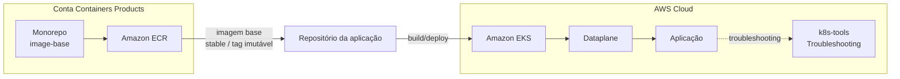
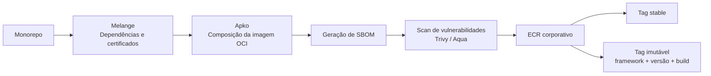

# RFC-013 - Plataforma de imagens base seguras e padronizadas para containers

## Status

| Informação | Valor |
| --- | --- |
| Status | Proposto |
| Possíveis estados | Aceito - Obsoleto - Substituído |
| Owner | Containers Products |
| Data | 01/09/2026 |
| Impacto | Alto |
| Criticidade | Alta |
| Referência | Segurança, Supply Chain e Eficiência Operacional |

## TL;DR

- **O que:** criar um monorepo para centralizar o build de imagens base distroless, multi-arquitetura e padronizadas para os frameworks do banco.
- **Por quê:** hoje as aplicações usam imagens base heterogêneas e não governadas, elevando risco de CVE, não conformidade, falhas de certificado e ineficiência operacional.
- **Como:** usar Melange para empacotamento de dependências/certificados e Apko para build/publicação das imagens, com scan de vulnerabilidade (Trivy) no pipeline.
- **Resultado esperado:** reduzir superfície de ataque, padronizar artefatos, melhorar performance de build/pull e fortalecer governança da cadeia de supply.

## Resumo

Atualmente, as áreas constroem aplicações em container de forma descentralizada, consumindo imagens base diversas (Alpine, Oracle, Ubuntu, Debian e outras), sem um padrão corporativo único. Esse cenário aumenta a exposição a vulnerabilidades, gera inconsistências de configuração, cria riscos de compliance e amplia o esforço operacional dos times.

Esta RFC propõe estabelecer uma plataforma de imagens base corporativas, com foco em segurança, rastreabilidade e eficiência. A abordagem utiliza a stack Chainguard (Melange + Apko), produzindo imagens distroless e multi-arquitetura (`amd64` e `arm64`) para frameworks estratégicos, com versionamento, auditoria e governança centralizada.

O objetivo é reduzir risco operacional e de segurança, simplificar o ciclo de build/deploy dos times consumidores e criar base reutilizável confiável para workloads do banco.

## Contexto

O modelo atual apresenta os seguintes problemas estruturais:

- **Uso de imagens externas não controladas**, com diferentes níveis de hardening e atualização.
- **Adoção eventual de imagens enterprise não homologadas**, com impacto potencial em compliance.
- **Ausência de boas práticas consistentes** em Dockerfiles e na composição das imagens.
- **Certificados SSL versionados diretamente em repositórios de aplicação**, sem processo central de atualização.
- **Baixa visibilidade** sobre quais imagens são usadas por framework/time e qual o nível de aderência aos padrões.

Além disso, não há controle robusto da cadeia de supply para imagens base. Na prática, isso reduz previsibilidade, aumenta risco de exposição a CVEs e pode causar indisponibilidade por expiração de certificados ou limitação de pull em registries públicos.

## Problema

A ausência de padronização de imagens base leva ao uso de imagens externas não controladas, aumenta riscos de segurança e compliance, gera inconsistências técnicas entre aplicações e cria ineficiência operacional no ciclo de build e deploy.

## Objetivo

- Padronizar imagens base para os principais frameworks utilizados no Itaú.
- Disponibilizar imagens seguras, otimizadas e multi-plataforma (`amd64` / `arm64`).
- Reduzir vulnerabilidades e superfície de ataque com abordagem distroless.
- Centralizar governança de dependências e certificados.
- Melhorar eficiência operacional dos times de desenvolvimento e plataforma.

## Solução proposta

Referência da POC funcional: https://github.com/gersontpc/image-base

A proposta é implementar uma fábrica centralizada de imagens base com os seguintes componentes:

1. **Build sem Dockerfile de base**, utilizando:
   - **Melange** para empacotamento/gerenciamento de dependências específicas e certificados.
   - **Apko** para composição e publicação das imagens OCI.
2. **Imagens distroless e multi-arquitetura**, reduzindo superfície de ataque e mantendo portabilidade entre arquiteturas.
3. **Pipeline com validação de segurança**, incluindo geração de SBOM e scan com Trivy antes da publicação.
4. **Versionamento e tagging padronizados**, com tag estável e tag imutável por build para rastreabilidade.
5. **Publicação em registry corporativo**, eliminando dependência operacional de registries externos para consumo interno.

### Características técnicas esperadas

- Imagens por framework e versão suportada (ex.: Java, Node.js, Python, Go, .NET).
- Execução por usuário não-root por padrão.
- Inclusão do certificado de maneira dinâmica a cada build.
- Rebuild contínuo para aplicação de patches de segurança.

### Nível de maturidade: distroless hoje, caminho para hardened

"Slim", "distroless" e "hardened" não são sinônimos, e vale deixar isso explícito para alinhar expectativa com quem avaliar esta RFC:

- **Slim** não é um padrão de segurança — normalmente indica que alguns pacotes foram removidos de uma imagem convencional, com o conjunto exato dependendo do fornecedor.
- **Distroless** é uma imagem orientada a runtime: minimalista, sem shell nem gerenciador de pacotes. É o que esta RFC propõe e o que a POC já entrega hoje (validado localmente: sem `/bin/sh` e sem `apk` em Java, Python, Go e Node.js).
- **Scratch** é um ponto de partida vazio — útil para binários estáticos, mas não é um bom default para runtimes como Java.
- **Hardened** é uma categoria mais ampla que distroless: minimalismo + imutabilidade (impossível instalar pacotes em runtime) + manutenção com SLA de patch documentado + verificabilidade (SBOM, assinatura de imagem, build provenance). Minimalismo sozinho não garante os outros três pilares.

O que a solução entrega hoje, mapeado nesses quatro pilares:

| Pilar | Status atual |
|---|---|
| Minimalismo | Entregue — imagens sem shell/gerenciador de pacotes, validado em Java, Python, Go e Node.js |
| Imutabilidade | Entregue — nenhuma imagem de runtime final tem `apk`; instalar pacotes só é possível na variante de build (uso restrito ao estágio de build da aplicação, nunca no artefato final) |
| Manutenção | Parcial — Wolfi é rolling-release e o pipeline reconstrói diariamente, mas ainda falta um SLA de patch formalmente publicado para quem consome |
| Verificabilidade | Parcial — SBOM (SPDX) é gerado automaticamente a cada build; assinatura de imagem e build provenance ainda não estão implementados |

Em resumo: a solução proposta entrega **distroless de fato**, mas ainda não atinge o padrão completo de **hardened image** praticado por fornecedores como Chainguard, BellSoft ou Docker Hardened Images. Fechar esse gap (assinatura, provenance e SLA formal) é o que diferencia "montar uma fábrica própria de imagens minimalistas" de "montar uma fábrica própria de imagens *hardened*" — e é a pergunta mais provável de um comitê de segurança/arquitetura: por que construir isso internamente em vez de adotar um fornecedor que já entrega hardened pronto (decisão de construir vs. comprar, ver [Plano de adoção](#plano-de-adoção)).

## Valor e impacto

- Redução significativa de vulnerabilidades em imagens de runtime.
- Padronização de artefatos em diferentes frameworks e times.
- Redução da superfície de ataque por eliminação de pacotes desnecessários.
- Melhoria de performance de pull e armazenamento por imagens menores/otimizadas.
- Mitigação de risco de indisponibilidade por limites de pull em registries públicos.
- Melhor conformidade com requisitos de auditoria, segurança e supply chain.
- Menor esforço dos times de desenvolvimento na configuração de imagens base.
- Aceleração do ciclo de desenvolvimento e deploy com base reutilizável.

## Escopo inicial

- Definir padrões de imagem base por framework prioritário (Java, Node.js, Python, Go e .NET).
- Implementar pipeline de build com Melange e Apko.
- Publicar primeiras imagens base em formato distroless.
- Habilitar build multi-plataforma inicial (`amd64` e `arm64`).
- O usuário irá apontar para a tag da imagem base como `stable`.
- Publicar imagens no ECR.
- Liberar o pull das imagens para todas as orgs do Itaú.
- O processo deve ser automatizado no workflow do GitHub, com scheduler diário.
- Container Aqua para fazer o scan das imagens a cada build.
- Documentação para o usuário com a jornada de como utilizar a imagem base em seus projetos.
- Documentação de uso para times consumidores e trilha de troubleshooting para cenários distroless.

## Fora de escopo

- Criação de imagens customizadas específicas por aplicação.
- Cobertura de 100% dos frameworks legados na primeira fase.
- Migração automática de aplicações existentes para novas imagens.
- Gestão de CI/CD dos times consumidores.
- Suporte a sistemas operacionais fora do modelo distroless proposto.
- Criação de ferramenta paralela fora da stack Melange/Apko nesta fase.
- Gestão de runtime dos containers em clusters (orquestração/execução).
- Enforcement bloqueante imediato de imagens externas na fase inicial.

## Plano de adoção

### Fase 1 - Fundação

- Estruturar pipeline e publicar imagens base iniciais por framework prioritário.
- Definir catálogo oficial, naming, versionamento e SLA de atualização.
- Publicar documentação técnica e guia de consumo.

### Fase 2 - Adoção assistida

- Onboard dos primeiros times com acompanhamento do Containers Products.
- Coleta de métricas de adoção, vulnerabilidades e performance de build/pull.
- Ajustes de imagem base conforme feedback operacional.

### Fase 3 - Escala e governança

- Expandir cobertura de frameworks/versões conforme priorização.
- Formalizar política de exceção e trilha de conformidade.
- Evoluir para mecanismos de controle de consumo de imagens em produção.
- Fechar o gap de verificabilidade para atingir o padrão *hardened*: assinatura de imagem (cosign) e build provenance (attestation SLSA), além de formalizar o SLA de patch da fábrica de imagens.

## Critérios de sucesso

- Percentual de aplicações migradas para imagens base corporativas.
- Redução de vulnerabilidades altas/críticas nas imagens de runtime.
- Redução do tamanho médio das imagens e do tempo médio de pull.
- Aumento da rastreabilidade de origem dos artefatos (SBOM/tag imutável).
- Redução de incidentes relacionados a certificado/cadeia de build.
- Percentual de imagens publicadas com assinatura e build provenance verificáveis (padrão *hardened*, Fase 3).

## Diagramas da arquitetura

### Visão de consumo



### Fluxo da fábrica de imagens



> A versão editável da arquitetura também está disponível no arquivo `RFC-013-Image-Base.drawio`.

## Arquitetura e fluxo de consumo

A solução separa a responsabilidade da plataforma de imagens base do ciclo de desenvolvimento das aplicações consumidoras:

1. O monorepo do **Containers Products** centraliza a definição e o build das imagens base.
2. As imagens são publicadas no **Amazon ECR**, com liberação de pull para as organizações consumidoras.
3. Cada framework/versão possui uma referência estável para consumo e uma identificação imutável por build.
4. O repositório da aplicação consome a imagem corporativa como base.
5. A aplicação é construída e posteriormente executada no ambiente de containers, como EKS.
6. O troubleshooting específico de runtime permanece separado da fábrica de imagens base.

### Convenção de imagens

Exemplos apresentados na arquitetura:

```text
image-base-java21:stable
image-base-${framework}${version}:${Timestamp+Hour}
```

A tag `stable` representa a referência de consumo simplificada para os times, enquanto a tag específica por build fornece rastreabilidade e imutabilidade.

### Evolução do consumo

#### v1

O consumidor referencia diretamente a imagem base e adiciona dependências necessárias no próprio Dockerfile:

```dockerfile
FROM image-base-java21:stable
RUN apk add...
```

#### v2

A proposta evolui para uma experiência mais padronizada, abstraindo do usuário parte da configuração da imagem base e permitindo declarar pacotes adicionais quando necessário:

```dockerfile
FROM image-base-framework-versao:stable

ARG CUSTOM_PACKAGES=""
ENV CUSTOM_PACKAGES=${CUSTOM_PACKAGES}

RUN if [ -n "$CUSTOM_PACKAGES" ]; then apk add --no-cache $CUSTOM_PACKAGES; fi

COPY --chown=spring:spring *.jar .
```

Exemplo de build:

```bash
docker build --build-arg CUSTOM_PACKAGES="curl bash" -t minha-imagem .
```

Exemplo de configuração:

```yaml
build:
  custom_packages:
    - curl
    - tcpdump
```

> A possibilidade de instalação de pacotes adicionais deve ser tratada como mecanismo controlado de compatibilidade. Para workloads efetivamente distroless, o conteúdo necessário deve preferencialmente ser incorporado no processo de construção da imagem, evitando dependência de package manager no runtime.

### Publicação e retenção

- Publicação das imagens no ECR corporativo.
- Liberação de pull para as organizações do Itaú.
- Policy de lifecycle inicialmente definida para 7 dias, conforme a proposta apresentada.
- Manutenção de uma tag estável para consumo e tags imutáveis para rastreabilidade.

## Repositórios

- `https://github.com/itau-corp/itau-xj7-container-image-base` — monorepo da plataforma de imagens base.
- `https://github.com/itau-corp/itau-ev3-container-k8s-tools` — ferramentas relacionadas ao ambiente de containers/Kubernetes.

## Referências

### POC e documentação base

- Repositório da POC - image-base.
- README da POC.

### Ferramentas e conceitos

- Chainguard Apko.
- Chainguard Melange.
- Wolfi.
- Trivy.
- Distroless containers.
