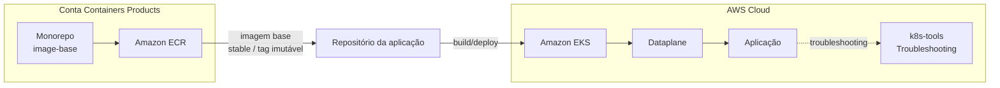

# RFC-013 - Plataforma de imagens base seguras e padronizadas para containers

## Status

| Informação | Valor |
| --- | --- |
| Status | Proposto |
| Possíveis estados | Aceito - Obsoleto - Substituído |
| Owner | Containers Products |
| Data | 01/09/2026 |
| Última revisão técnica | 08/09/2026 — melhorias propostas a partir da avaliação da POC |
| Impacto | Alto |
| Criticidade | Alta |
| Referência | Segurança, Supply Chain e Eficiência Operacional |

## TL;DR

- **O que:** criar um monorepo para centralizar o build de imagens base distroless, multi-arquitetura e padronizadas para os frameworks do banco.
- **Por quê:** hoje as aplicações usam imagens base heterogêneas e não governadas, elevando risco de CVE, não conformidade, falhas de certificado e ineficiência operacional.
- **Como:** usar Melange para empacotamento de dependências/certificados e Apko para build/publicação das imagens, com scan de vulnerabilidade (Trivy) no pipeline.
- **Resultado esperado:** reduzir superfície de ataque, padronizar artefatos, melhorar performance de build/pull e fortalecer governança da cadeia de supply.

## Resumo

Atualmente, as áreas constroem aplicações em container de forma descentralizada, consumindo imagens base diversas (Alpine, Oracle, Ubuntu, Debian e outras), sem um padrão corporativo único. Esse cenário aumenta a exposição a vulnerabilidades, gera inconsistências de configuração, cria riscos de compliance e amplia o esforço operacional dos times.

Esta RFC propõe estabelecer uma plataforma de imagens base corporativas, com foco em segurança, rastreabilidade e eficiência. A abordagem utiliza a stack Chainguard (Melange + Apko), produzindo imagens distroless e multi-arquitetura (`amd64` e `arm64`) para frameworks estratégicos, com versionamento, auditoria e governança centralizada.

O objetivo é reduzir risco operacional e de segurança, simplificar o ciclo de build/deploy dos times consumidores e criar base reutilizável confiável para workloads do banco.

## Contexto

O modelo atual apresenta os seguintes problemas estruturais:

- **Uso de imagens externas não controladas**, com diferentes níveis de hardening e atualização.
- **Adoção eventual de imagens enterprise não homologadas**, com impacto potencial em compliance.
- **Ausência de boas práticas consistentes** em Dockerfiles e na composição das imagens.
- **Certificados SSL versionados diretamente em repositórios de aplicação**, sem processo central de atualização.
- **Baixa visibilidade** sobre quais imagens são usadas por framework/time e qual o nível de aderência aos padrões.

Além disso, não há controle robusto da cadeia de supply para imagens base. Na prática, isso reduz previsibilidade, aumenta risco de exposição a CVEs e pode causar indisponibilidade por expiração de certificados ou limitação de pull em registries públicos.

## Problema

A ausência de padronização de imagens base leva ao uso de imagens externas não controladas, aumenta riscos de segurança e compliance, gera inconsistências técnicas entre aplicações e cria ineficiência operacional no ciclo de build e deploy.

## Objetivo

- Padronizar imagens base para os principais frameworks utilizados no Itaú.
- Disponibilizar imagens seguras, otimizadas e multi-plataforma (`amd64` / `arm64`).
- Reduzir vulnerabilidades e superfície de ataque com abordagem distroless.
- Centralizar governança de dependências e certificados.
- Melhorar eficiência operacional dos times de desenvolvimento e plataforma.

## Solução proposta

Referência da POC funcional: https://github.com/gersontpc/image-base

A proposta é implementar uma fábrica centralizada de imagens base com os seguintes componentes:

1. **Build sem Dockerfile de base**, utilizando:
   - **Melange** para empacotamento/gerenciamento de dependências específicas e certificados.
   - **Apko** para composição e publicação das imagens OCI.
2. **Imagens distroless e multi-arquitetura**, reduzindo superfície de ataque e mantendo portabilidade entre arquiteturas.
3. **Pipeline com validação de segurança**, incluindo geração de SBOM e scan com Trivy antes da publicação.
4. **Versionamento e tagging padronizados**, com tag estável e tag imutável por build para rastreabilidade.
5. **Publicação em registry corporativo**, eliminando dependência operacional de registries externos para consumo interno.

### Características técnicas esperadas

- Imagens por framework e versão suportada (ex.: Java, Node.js, Python, Go, .NET).
- Execução por usuário não-root por padrão.
- Inclusão do certificado de maneira dinâmica a cada build.
- Rebuild contínuo para aplicação de patches de segurança.

### Nível de maturidade: distroless hoje, caminho para hardened

"Slim", "distroless" e "hardened" não são sinônimos, e vale deixar isso explícito para alinhar expectativa com quem avaliar esta RFC:

- **Slim** não é um padrão de segurança — normalmente indica que alguns pacotes foram removidos de uma imagem convencional, com o conjunto exato dependendo do fornecedor.
- **Distroless** é uma imagem orientada a runtime: minimalista, sem shell nem gerenciador de pacotes. A POC registra validações locais de ausência de `/bin/sh` e `apk` em Java, Python, Go e Node.js, mas ainda precisa automatizar essa verificação para todas as variantes finais e arquiteturas. Ausência de shell não comprova ausência de SDKs ou compiladores.
- **Scratch** é um ponto de partida vazio — útil para binários estáticos, mas não é um bom default para runtimes como Java.
- **Hardened** envolve controles além do minimalismo: integridade dos artefatos, restrições de escrita e execução, manutenção com SLA de patch e verificabilidade (SBOM, assinatura e build provenance). Ausência de `apk` não torna o filesystem imutável; restrições como filesystem somente leitura dependem também da configuração do ambiente consumidor.

O que a solução entrega hoje, mapeado nesses quatro pilares:

| Pilar | Status atual |
|---|---|
| Minimalismo | Parcial — há validações locais registradas, mas Go inclui toolchain, .NET inclui SDK e Java usa o pacote OpenJDK completo; falta validar automaticamente a composição por arquitetura |
| Imutabilidade | Parcial — ausência de `apk` reduz ferramentas disponíveis, mas o pipeline cria repositórios ECR com tags mutáveis; filesystem somente leitura precisa ser validado com os consumidores |
| Manutenção | Parcial — rebuild diário, seleção por soak e promoção horária configurados; execução remota e SLA medido ainda pendentes |
| Verificabilidade | Parcial — SBOM, assinatura cosign e build provenance estão previstos no pipeline implementado; falta validar a cadeia ponta a ponta e exigir assinatura/provenance na promoção |

A passagem da POC para uma plataforma de produção depende de comprovar essas propriedades por artefato e arquitetura. O backlog abaixo registra as lacunas identificadas e os critérios para avaliar essa evolução.

### Melhorias propostas após avaliação da POC — 08/09/2026

A tabela abaixo registra as lacunas observadas na avaliação inicial e as melhorias propostas; o andamento está registrado após a tabela. A avaliação incluiu leitura dos manifestos e workflows, `actionlint` nos três workflows principais (sem erros) e execução de cenários sintéticos do script de promoção. Não incluiu builds completos, novos scans de vulnerabilidade ou validação no ECR/IAM. Os cenários sintéticos comprovam o comportamento do script, não a ocorrência de incidentes no registry.

**Prioridades:** P1 = corrigir antes de liberar a plataforma para produção; P2 = completar para adoção assistida. O owner da RFC coordena a execução; responsáveis por item e prazos permanecem a definir.

| ID | Prioridade | Lacuna e evidência na POC | Melhoria proposta e critério de aceite |
| --- | --- | --- | --- |
| M01 | P1 | [Build](.github/workflows/build-base-images.yml) escaneia apenas `latest-amd64` e publica duas arquiteturas; [promoção](.github/workflows/promote-stable.yml) não seleciona ambas as plataformas. | Escanear `linux/amd64` e `linux/arm64` explicitamente no build e na promoção. Uma falha em qualquer arquitetura deve impedir a publicação ou promoção do índice; preservar os relatórios associados aos respectivos digests. |
| M02 | P1 | O build local e o `apko publish` resolvem os pacotes separadamente, sem lockfile nem comparação de digests. | Publicar os artefatos já validados ou fixar todos os insumos e comprovar a identidade dos manifests publicados com os validados. Uma divergência deve bloquear a liberação; uma mudança no repositório Wolfi entre as etapas não pode introduzir conteúdo sem scan. |
| M03 | P1 | [Seleção de candidato](.github/scripts/find_promotion_candidate.py) aceita qualquer tag diferente de `stable`; a promoção não verifica assinatura/provenance. | Aceitar somente tags de build no padrão definido e índices de imagem com as plataformas esperadas. Verificar assinatura, identidade do workflow/branch autorizados e provenance do digest antes de promover. Testes devem rejeitar tags de assinatura, artefatos auxiliares e imagens cujo push teve sucesso mas cuja assinatura/attestation falhou. |
| M04 | P1 | O script escolhe o mais recente antes de filtrar a idade. Build às 03h UTC e promoção às 09h UTC não asseguram seis horas desde o push. | Filtrar candidatos que completaram o soak antes de ordenar; evitar promover novamente o digest já estável e impedir regressão automática para builds anteriores ao stable atual. Executar a promoção com frequência compatível com a janela e serializar atualizações concorrentes por imagem. Testar build publicado às 03h20, candidato recente inelegível com outro elegível e stable já atualizado. |
| M05 | P1 | [PRs](.github/workflows/workflow.yml) chamam o mesmo fluxo de autenticação/publicação usado pela branch principal. | Separar validação de PR sem credenciais AWS da publicação restrita à branch principal autorizada. Verificar que PRs internos e de forks executam build/scan sem push e que a trust policy OIDC e as permissões dos jobs refletem essa separação. |
| M06 | P1 | O workflow cria repositórios ECR como `MUTABLE` e usa timestamp com precisão de minuto. | Adotar tags únicas por run/tentativa e imutabilidade no ECR com exceção para `stable`, contemplando a configuração de repositórios existentes. Validar compatibilidade com os artefatos de assinatura. Uma segunda publicação na mesma tag de build deve ser rejeitada; documentar consumo por digest. |
| M07 | P2 | [Go](frameworks/go1-26.yaml) inclui toolchain, [.NET](frameworks/dotnet10.yaml) inclui SDK e [Java](frameworks/java21.yaml) inclui OpenJDK completo. | Separar variantes de build e runtime: base para Go estático ou com dependências de CGO, runtime/ASP.NET para .NET e JRE para Java quando suficiente. Comparar tamanho e inventário de pacotes e executar aplicações mínimas; exceções que exijam ferramentas de desenvolvimento devem ser justificadas no catálogo. |
| M08 | P1 | O pipeline valida vulnerabilidades, mas não executa uma suíte funcional das imagens finais. | Automatizar testes por framework e arquitetura: inicialização do runtime/aplicação mínima, usuário non-root, permissões de `/app`, TLS e execução com filesystem somente leitura e áreas temporárias declaradas. Inspecionar ausência de shell e gerenciador de pacotes nas variantes finais; falhas devem bloquear a liberação. |
| M09 | P1 | Apko/melange usam `latest`; Actions dos workflows principais usam tags, sem SHA completo. | Fixar ferramentas por digest e Actions por SHA completo, com atualização automatizada e revisão. Registrar as versões efetivas no build; atualizar ferramentas e dependências de forma controlada sem perder a rotina de patches. |
| M10 | P1 | [Bundle de certificados](melange/bundle-pem-test.yaml) baixa conteúdo variável sem checksum e só verifica presença de `BEGIN CERTIFICATE`. | Usar fonte corporativa versionada e integridade verificável, registrando a versão do bundle no pacote. Validar parsing dos certificados e integração com o trust store de cada runtime. Testes TLS devem comprovar confiança em uma CA de teste aprovada e rejeição de uma CA não autorizada. |
| M11 | P2 | README associa scan aprovado a ausência de novas CVEs e anuncia SLA de aproximadamente 30h, embora o gate use `ignore-unfixed: true` e a promoção tenha as lacunas de M04. | Documentar que o gate bloqueia vulnerabilidades detectadas nas severidades configuradas com correção disponível. Dar visibilidade também às CVEs sem correção; publicar SLA com ponto inicial/final, frequência de promoção, atrasos/falhas e política de exceções. Medir o tempo entre disponibilidade do patch no Wolfi e atualização de `stable` antes de assumir o compromisso. |

Na reprodução local de M03/M04, o script selecionou uma tag sintética `sha256-example.sig`, retornou `skip=true` quando havia um build elegível mais antigo e voltou a selecionar um digest que já possuía `stable`. Esses cenários devem compor os testes de regressão da implementação.

#### Checklist de acompanhamento

Atualizar este checklist a cada entrega, preservando os IDs M01–M11 e registrando data, escopo e evidências no histórico abaixo. Uma caixa marcada comprova apenas o escopo descrito: implementação e validação local não equivalem a execução no GitHub ou liberação no ECR. Marcar uma melhoria inteira como concluída somente após cumprir todos os seus critérios de aceite. Acrescentar links de commit/PR/run quando disponíveis.

**Implementado e validado localmente — 08/09/2026**

- [x] **M03 — filtro de candidatos:** aceitar tags válidas `ddmmaa-hhmm` e tipos de índice OCI/Docker; descartar tags de assinatura e manifests individuais.
- [x] **M04 — seleção após soak:** filtrar pela idade antes de escolher o mais recente, permitindo selecionar outro build elegível quando o mais novo ainda está em soak.
- [x] **M04 — proteção em relação ao stable:** excluir o digest já estável e candidatos com `imagePushedAt` anterior ou igual ao stable atual. A comparação usa a data informada pelo ECR e não comprova ordem de commits.
- [x] **Testes de regressão:** adicionar e executar 14 testes do seletor, incluindo tags auxiliares, tipos de manifest, idade, fuso horário, prevenção de regressão e contrato de saída para GitHub Actions.
- [x] **Configuração de CI dos testes:** adicionar workflow próprio de PR/push e etapa de testes antes da autenticação AWS na promoção; validar a configuração com `actionlint`.
- [x] **Contrato do build:** tornar obrigatório o input `frameworks` do workflow reusável.
- [x] **M11 — precisão da documentação:** corrigir no README a garantia de ausência de CVEs e retirar a estimativa de ~30h como SLA garantido.

**Segunda entrega — implementação e validação local, 08/09/2026**

- [x] **M01 — scan das duas arquiteturas:** configurar Trivy para `linux/amd64` e `linux/arm64`, tanto nos tars locais quanto no digest remoto da promoção. Testes com scanner simulado comprovam agregação de falhas e tentativa das duas arquiteturas.
- [x] **M01 — evidências:** configurar artifacts por framework/tentativa com retenção de 30 dias, relatórios JSON e metadados de plataforma/alvo/resultado; calcular SHA-256 de cada tar local. O hash do tar não substitui o digest OCI; a vinculação ao conteúdo publicado depende de M02.
- [x] **M05 — separação de workflows e permissões:** extrair `validate-base-images.yml` com `contents: read`, sem AWS/OIDC. PRs chamam apenas a validação; publicação e promoção restringem os jobs AWS a push/schedule/dispatch na `main`. Configuração verificada localmente em oito cenários de evento/ref/schedule.
- [x] **M04 — agendamento:** configurar promoção horária no minuto 17, mantendo o soak mínimo de seis horas desde o push.
- [x] **M04 — concorrência:** configurar um grupo por role/região/framework, compartilhado entre dispatch direto e chamada reusável no mesmo repositório GitHub, sem cancelar o job em andamento. A seleção acontece dentro do job serializado; atualizações externas não participam desse controle.
- [x] **Testes e documentação:** ampliar a suíte para 21 testes e atualizar o README para o fluxo implementado, incluindo bloqueio do lote quando algum framework falha na validação.

**Validação da primeira entrega em ambiente remoto**

- [x] Executar os testes no GitHub Actions: [run 34187982413](https://github.com/alric-corp/itau-xj7-containers-image-base/actions/runs/34187982413), 21 testes aprovados na primeira versão do PR.
- [ ] Validar a seleção com respostas reais do ECR, incluindo imagem já estável, candidatos em soak e artefatos auxiliares.
- [ ] Validar o fluxo de promoção no ambiente de teste e registrar run e digest resultante.

**Terceira entrega — testes reais e continuação, 08/09/2026**

- [x] **M01/M05 — PR real:** [run 34187982748](https://github.com/alric-corp/itau-xj7-containers-image-base/actions/runs/34187982748): melange e builds concluídos, 11 frameworks aprovados nas duas arquiteturas; .NET 8 bloqueado em ambas por CVEs corrigíveis. Artifacts de todos os scans preservados; jobs de publicação/promoção ignorados no PR. Teste de fork ainda pendente.
- [x] **M02 — implementação:** build único em layout OCI, verificação de blobs/plataformas, transferência de artifact aprovado e cópia Skopeo com preservação/comparação de digests, sem reconstrução.
- [x] **M02 — teste ECR isolado:** cópia do layout Node.js 24 para `image-base-validation-nodejs24` preservou o índice `sha256:49d0c59ce62eae51bf5f507920d45fea626145e64fa8c3186afe62626e8d90ed` e seus dois manifests. Teste manual com credenciais locais; não equivale a validar OIDC/assinatura do workflow na main.
- [x] **M01/M02 — correção descoberta em teste real:** Trivy 0.72.0 selecionou amd64 nas duas chamadas contra um layout OCI multi-arquitetura. O scanner agora recebe uma visão com um único manifest e confere a arquitetura no relatório. Scans reais corrigidos confirmaram amd64 e arm64 distintos, sem CVEs bloqueantes no layout Node.js 24 testado.
- [x] **M06 — implementação:** tags com run/tentativa, compatibilidade do seletor com tags históricas e configuração ECR `IMMUTABLE_WITH_EXCLUSION` com exceção exata para `stable`.
- [x] **M06 — teste ECR isolado:** sobrescrita de `review-pr1` rejeitada com `ImageTagAlreadyExistsException`; `stable` pôde ser alterada e restaurada ao índice original no repositório exclusivo de teste. Repositórios de consumo não foram alterados.
- [x] **M09 — fixação inicial:** Actions diretas de build/validação/promoção por SHA; apko/melange/Skopeo por digest, incluindo Makefile para apko/melange. Dependabot semanal para Actions configurado. Atualizações de digests de ferramentas ainda manuais.
- [x] **M05 — corrigir IAM:** inspeção real identificou trust policy com wildcard de repositório/ref; restringida ao repositório e branch autorizados. Ver detalhes e testes reais na Sexta entrega, abaixo.
- [ ] Validar a versão com layout OCI no GitHub e executar o fluxo autenticado completo, incluindo assinatura/provenance, antes do merge/liberação.

**Quarta entrega — integração OCI e gate M03, 08/09/2026**

- [x] **Revalidação do gate M03 no CI:** [testes 34240181172](https://github.com/alric-corp/itau-xj7-containers-image-base/actions/runs/34240181172) aprovados; [builds 34240181974](https://github.com/alric-corp/itau-xj7-containers-image-base/actions/runs/34240181974) com onze frameworks aprovados e somente .NET 8 reprovado no scan. Publicação e promoção ignoradas no PR.
- [x] **M01 — conferência de arquitetura na promoção:** scanner remoto agora exige a arquitetura esperada no JSON do Trivy e registra a arquitetura observada. Relatórios anteriores são removidos antes de cada scan, impedindo reutilização acidental. Suite local com 35 testes aprovados, incluindo arquitetura remota incorreta e scanner que não gera relatório novo. Execução desse complemento no job autenticado permanece pendente.

- [x] **M01/M02 — OCI real no GitHub:** [run 34237737025](https://github.com/alric-corp/itau-xj7-containers-image-base/actions/runs/34237737025) gerou os layouts e 24 relatórios com arquiteturas auditadas. Onze frameworks aprovados; .NET 8 bloqueado nas duas arquiteturas. Artifact Node.js baixado e verificado localmente.
- [x] **M02 — artifact do CI no ECR de teste:** cópia de `validated-oci-nodejs24-1` para `image-base-validation-nodejs24:review-pr1-ci-oci` preservou o índice `sha256:b9074171f0fb0d2ff2d401beda4dcf41f58ebfe378fc23ada3b8d9ae3552c759`. Sem rebuild entre scan no CI e cópia manual autenticada.
- [x] **Correção Melange:** [run 34236884288](https://github.com/alric-corp/itau-xj7-containers-image-base/actions/runs/34236884288) falhou com `test-dirfs-0` ausente durante builds simultâneos. Execução sequencial por arquitetura corrigiu a falha no run seguinte; Makefile alinhado ao CI.
- [x] **M03 — gate implementado:** promoção exige índice com exatamente amd64/arm64, assinatura cosign com identidade exata do workflow de build na main e provenance GitHub com signer workflow e source ref restritos. Falha ou ausência de evidências impede a promoção.
- [x] **M03 — verificação real positiva:** o gate aceitou o digest de consumo já existente `sha256:fa3ea99fe683e4c3f43b40b0fbf9e343eda356676ff1e8369e997acfb50cf755`, verificando duas assinaturas e uma attestation. Somente leitura; nenhuma tag de consumo alterada.
- [x] **M03 — verificação real negativa:** o gate rejeitou o artifact não assinado do repositório de teste com `no signatures found` (exit code 10 do cosign).
- [x] **Testes locais:** 33 testes aprovados, incluindo rejeição de arquitetura incorreta no relatório, corrupção de blobs, ausência de plataforma e falhas dos verificadores.
- [ ] Executar a promoção autenticada pelo workflow após integração autorizada na main; os testes positivos/negativos acima foram executados manualmente contra o ECR.

**Quinta entrega — revisão dos 13 achados, 08/09/2026**

As caixas abaixo registram correções implementadas e verificadas localmente; testes remotos específicos ainda pendentes estão separados ao final.

- [x] **R01 / M01:** falha na verificação inicial OCI gera evidência de erro para ambas as arquiteturas, sem iniciar Trivy. A gravação pressupõe diretório de relatórios gravável; falta de espaço/permissão ainda pode impedir evidências.
- [x] **R02 / M01:** JSON nulo ou estruturalmente inválido do scanner é tratado e não impede a tentativa da segunda arquitetura.
- [x] **R03 / M02:** artifact aprovado com nome por framework no mesmo run, independente da tentativa do publicador. Revalidação substitui apenas após scan aprovado; `needs: validate` continua exigindo sucesso do lote. `melange-repo` também permite substituição em reexecução completa. [Semântica de overwrite](https://github.com/actions/upload-artifact#overwriting-an-artifact).
- [x] **R04 / M01:** seleção da visão OCI considera campos os/architecture, preservando metadados adicionais como `variant: v8`.
- [x] **R05 / M03:** CLI da verificação trata erros de dados e ferramentas ausentes com mensagem em stderr e status não zero, preservando o código do subprocesso quando aplicável.
- [x] **R06 / M04:** rótulo usa data cronológica e desempate numérico por run/tentativa; seleção do digest e soak continuam baseados no push ECR.
- [x] **R07 / M04:** removida permissão para evento push da promoção, alinhando aos chamadores atuais. Ressalva: não era intrinsecamente código morto, pois workflows reutilizáveis [herdam o contexto do chamador](https://docs.github.com/en/actions/reference/workflows-and-actions/reusing-workflow-configurations#github-context).
- [x] **R08 / M03:** todos os passos condicionais da promoção exigem `skip == 'false'`. Output vazio não inicia verificações nem promoção. O código anterior não pulava as verificações; a mudança torna a intenção explícita.
- [x] **R09 / M02:** publicador verifica os blobs uma vez e transfere o digest esperado por output de step; a cópia continua comparando o digest resultante.
- [x] **R10 / M02:** helper `load_index` compartilhado valida o wrapper e o blob do índice para ambos os consumidores. A verificação completa de manifests/configs/layers permanece em `verify`, antes da criação das visões.
- [x] **R11 / M03:** validação de referência por digest compartilhada entre scan e promoção; referências iniciadas por hífen também são rejeitadas.
- [x] **R12 / M01:** removido modo local de tar e seus testes sem consumidores. CLI atual oferece `oci` e `remote`; o build local do Makefile permanece disponível.
- [x] **R13:** removida suíte repetida na matriz horária. Testes continuam no workflow dedicado em mudanças dos scripts/promoção, no PR e na main, além de dispatch manual.
- [x] **Validação local:** 40 testes aprovados e actionlint aprovado nos cinco workflows do pipeline. O lint global ainda aponta `queue` não reconhecido e SC2016 no arquivo gerado preexistente `cve-triage.lock.yml`, fora desta alteração.
- [ ] **R03 — validação remota:** comprovar retry parcial do publicador e reexecução completa no workflow autenticado; a nova convenção não recupera artifacts produzidos por versões antigas do workflow.

**Sexta entrega — build/scan multi-arquitetura locais reais e correção da trust policy IAM (M01, M05, M10), 09/09/2026**

- [x] **M10 — primeira validação real do pin do bundle Mozilla:** `melange build bundle-pem-test.yaml` com o `EXPECTED_SHA256` fixado compilou com sucesso em x86_64 e aarch64 (Docker local, sem mocks). Primeira vez que esse fix roda contra um build de verdade desde que foi escrito.
- [x] **M01 — scan real das duas arquiteturas (local):** `apko build --arch x86_64,aarch64` para `nodejs22` gerou um índice OCI com manifests `sha256:bd48500f...` (amd64) e `sha256:13033802...` (arm64); `scan_images.py oci` escaneou cada um e o `manifest_digest` registrado em `evidence-{amd64,arm64}.json` bate exatamente com o do índice — confirma que `platform_view()` isola a arquitetura correta para o Trivy.
- [x] **M01 — bloqueio real por CVE:** reproduzido com `dotnet8` (framework já conhecido como bloqueado): CVE-2026-47304 (CRITICAL, `FixedVersion: 8.0.129-r1` disponível) fez `scan_images.py` sair com código 1; evidência de ambas as arquiteturas preservada mesmo com falha (R01/R02).
- [x] **M01 — bloqueio de publicação confirmado no workflow:** `build-push` em `build-base-images.yml` declara `needs: validate` sem `if: always()`; uma falha de scan em qualquer framework do lote impede a publicação de todo o lote, consistente com o comportamento já observado em runs anteriores no GitHub.
- [x] **M01 — validação remota (scan):** confirmada com PR descartável a partir desta branch ([run 34362746523](https://github.com/alric-corp/itau-xj7-containers-image-base/actions/runs/34362746523)): 11 frameworks aprovados, `dotnet8` bloqueado pela mesma CVE observada localmente (CVE-2026-47304). `manifest_digest` de `evidence-{amd64,arm64}.json` bate com o índice OCI gerado no artifact em ambas as arquiteturas, igual à validação local. `build-base-images`/`promote-stable` corretamente `skipped` (zero tentativa de AWS num PR). `validated-oci-dotnet8` não foi enviado (o passo de upload é ignorado após falha no scan); `build-scans-dotnet8-1` preservado mesmo assim.
- [ ] **M02 — vínculo com manifests publicados:** o teste acima não passa da etapa de validação (`build-base-images`/`promote-stable` ficam skipped em PR, por desenho) — falta rodar o publicador de verdade na `main`, o que exige integrar esses workflows (hoje só na branch `improvements/image-pipeline-validation`, PR #1 fechado) na `main`, já que o `build-base-images.yml` de lá ainda não tem o scan OCI.
- [x] **M05 — corrigir IAM (trust policy):** a policy tinha `StringLike` com `repo:alric-corp*/itau-xj7-containers-image-base*:*` — três wildcards. Descoberta em produção: este repositório usa o formato de `sub` com sufixo de ID numérico (`repo:alric-corp@178685987/itau-xj7-containers-image-base@1360616627:...`, confirmado via `gh api .../actions/oidc/customization/sub`), não nomes em texto puro; os wildcards originais existiam para absorver esse sufixo, não por permissividade proposital. Substituída por `StringEquals` exato: `repo:alric-corp@178685987/itau-xj7-containers-image-base@1360616627:ref:refs/heads/main`.
- [x] **M05 — teste positivo real:** `workflow_dispatch` na `main` ([run 34360315927](https://github.com/alric-corp/itau-xj7-containers-image-base/actions/runs/34360315927)) autenticou e publicou `go1-26` com sucesso sob a policy corrigida — confirma que o caminho legítimo não quebrou.
- [x] **M05 — teste negativo real:** PR descartável #4 tocando `Makefile` ([run 34360358454](https://github.com/alric-corp/itau-xj7-containers-image-base/actions/runs/34360358454)) teve os 12 frameworks rejeitados em `configure-aws-credentials` com `Not authorized to perform sts:AssumeRoleWithWebIdentity` — nenhuma imagem publicada. Prova que a policy agora barra o que o próprio `build-base-images.yml` em produção não bloqueia internamente (não tem `if: github.ref == 'refs/heads/main'` no job `build-push`); antes da correção, o `sub` de PR (`repo:...:pull_request`) batia no wildcard `:*` e esse mesmo teste teria passado.

**Sétima entrega — integração dos workflows OCI e evidência de publicação, 09/09/2026**

- [x] **Preparação da integração:** nova extração a partir da `main` após o merge do PR #3, reaproveitando os quatro workflows do commit `9704e46`. Mantém os testes de certificados já integrados e traz validação sem AWS, cópia OCI, gate de promoção, tags únicas e ferramentas fixadas. PR #1 continua fechado; seu histórico foi preservado.
- [x] **M02 — verificação antes de AWS:** o publicador baixa o artifact do mesmo run e verifica blobs, plataformas e evidência `validated-index.json` antes de solicitar credenciais.
- [x] **M02 — conferência após cópia:** lê a tag publicada de volta com Skopeo e compara o hash dos bytes do índice remoto, o digest da cópia e os manifests amd64/arm64 com a evidência de validação. Divergência bloqueia assinatura/provenance. Registra `publication-evidence.json` e os índices em artifact por framework/tentativa por 30 dias.
- [x] **M02 — teste real local de transporte:** Skopeo fixado copiou o artifact Node.js 24 para registry Docker temporário e leu a tag de volta. Índice `sha256:b9074171f0fb0d2ff2d401beda4dcf41f58ebfe378fc23ada3b8d9ae3552c759`, amd64 `sha256:74955afd7605e5a42904249e45e96ed63b7692f16f5ae2da415cfa534c1d45d4` e arm64 `sha256:e66b8754ef74f1d9351cda79b4edfd4f555fa65b6431ac02fe228374997ed26b` preservados. Sem AWS, sem rebuild, registry/rede temporários removidos ao terminar.
- [x] **Regressão local:** 46 testes de pipeline (incluindo seis testes novos de divergência na publicação) e 13 de certificados; actionlint nos cinco workflows envolvidos e `git diff --check` aprovados.
- [x] **M02 — execução autenticada:** [PR #6](https://github.com/alric-corp/itau-xj7-containers-image-base/pull/6) integrado na `main`. Primeiro dispatch pós-merge ([run 34369130944](https://github.com/alric-corp/itau-xj7-containers-image-base/actions/runs/34369130944)) falhou antes de AWS: `docker: manifest for quay.io/skopeo/stable@sha256:db41...ded not found: manifest unknown` — o digest do Skopeo fixado tinha sido removido do registry upstream (quay.io não garante retenção de digests antigos numa tag rolling como `stable`). Corrigido em [PR #12](https://github.com/alric-corp/itau-xj7-containers-image-base/pull/12): novo digest fixado, mais um passo `Verify pinned Skopeo is available` (`docker run --pull=always ... --version`) antes da autenticação AWS, pra falhar cedo e claro em vez de no meio da publicação.
- [x] **M02 — publicação real de `go1-26`:** [run 34371208971](https://github.com/alric-corp/itau-xj7-containers-image-base/actions/runs/34371208971), workflow_dispatch na `main` pós-fix. `publication-go1-26-1`: `validated_digest` = `copied_digest` = `remote_digest` = `sha256:53f9a106b88e00773513d6cd3e2a62a3adaadef3e9f21d3720993793af2dd63e` (amd64 `sha256:9faa1d68...`, arm64 `sha256:917211307d...`) — o índice validado pelo scan, o resultado da cópia Skopeo e a leitura de volta do registry são byte-a-byte o mesmo conteúdo. `image-base-go1-26@sha256:53f9a106b8...` publicado no ECR real.
- [x] **M02 — assinatura/provenance verificadas de forma independente:** `cosign verify` (fora do workflow, contra o digest publicado no ECR real) retornou 2 assinaturas válidas — `https://sigstore.dev/cosign/sign/v1` e `https://slsa.dev/provenance/v1` — com a identidade do certificado restrita ao workflow deste repositório (`certificate-identity-regexp` + `certificate-oidc-issuer`). Não é só o passo do workflow reportar sucesso; a verificação foi refeita depois, contra o artifact já publicado.
- [x] **M02 — retry reaproveita o artifact aprovado, sem rebuild:** job `Build & push go1-26` reexecutado no mesmo run (`gh api .../jobs/.../rerun`) produziu `publication-go1-26-2` com os mesmos três digests (`validated`/`copied`/`remote`) do primeiro attempt. O step list do retry começa em `Download validated OCI artifact` — não em `apko build` — confirmando que a segunda publicação reutilizou o artifact já validado em vez de reconstruir a imagem.
- [x] **M03 — gate de promoção autenticado (positivo):** `promote-stable.yml` despachado na `main` com `soak-hours=0` para `go1-26` ([run 34372447340](https://github.com/alric-corp/itau-xj7-containers-image-base/actions/runs/34372447340)). Todos os passos passaram: `Find promotion candidate` selecionou exatamente o build recém-publicado no M02 (`090926-1238-r34371208971-a2`, digest `sha256:53f9a106b8...`); `Verify candidate platforms, signature and provenance` aprovou; re-scan Trivy das duas arquiteturas aprovou; `Promote to stable` copiou o índice por referência (sem rebuild) para a tag `stable`. Confirmado de forma independente contra o ECR real (`aws ecr describe-images --image-ids imageTag=stable`): a tag `stable` de `image-base-go1-26` agora aponta pro mesmo digest `sha256:53f9a106b8...` já verificado no M02 (assinatura + provenance válidas via `cosign verify` fora do workflow).
- [ ] **M03 — gate de promoção autenticado (negativo):** a rejeição de um candidato não assinado já foi comprovada com credenciais locais contra o ECR real (ver achado acima, "verificação real negativa"), mas não foi repetida especificamente dentro do job autenticado (`workflow_dispatch` do `promote-stable.yml`). Não há hoje um candidato não assinado "natural" nos 12 repositórios reais pra reproduzir isso sem construir um cenário artificial.
- [x] **M04 — concorrência real:** dois `workflow_dispatch` de `promote-stable.yml` disparados para `go1-26` com ~2s de diferença ([run 34372950849](https://github.com/alric-corp/itau-xj7-containers-image-base/actions/runs/34372950849), [run 34372954115](https://github.com/alric-corp/itau-xj7-containers-image-base/actions/runs/34372954115)). O grupo de concorrência serializou de verdade: o job do segundo run só começou (15:51:23) depois do primeiro terminar (15:51:19) — não rodaram em paralelo, apesar de despachados quase juntos.
- [x] **M04 — proteção contra regressão/dupla promoção sob concorrência:** o segundo run, ao rodar depois do primeiro já ter promovido `stable`, corretamente reportou `"nenhum build elegível mais novo que stable, nada a promover"` e pulou verificação/re-scan/promoção (todos `skipped`). Confirmado fora do workflow que a tag `stable` permaneceu no mesmo digest (`sha256:53f9a106b8...`) — sem dupla publicação nem corrupção de estado.
- [ ] **M04 — agendamento real (schedule):** o teste acima usou `workflow_dispatch` com `soak-hours=0`; não testa o cron horário/diário de produção nem mede atraso de fila do scheduler do GitHub Actions, que só se observa ao longo do tempo.
- [x] **M06 — configuração aplicada nos 12 repositórios reais:** só `image-base-go1-26` tinha `IMMUTABLE_WITH_EXCLUSION` (efeito colateral dos testes de M02-M04). Os outros 11 ainda estavam `MUTABLE` — a config só é aplicada quando o framework passa por um build real via `build-base-images.yml`. Disparado `workflow.yml` na `main` para os 11 restantes ([run 34373813723](https://github.com/alric-corp/itau-xj7-containers-image-base/actions/runs/34373813723), excluindo `dotnet8`); confirmado fora do workflow (`aws ecr describe-repositories`) que os 11 passaram a `IMMUTABLE_WITH_EXCLUSION`. `image-base-dotnet8` continua `MUTABLE`: seu scan segue bloqueado pela CVE conhecida, então o framework nunca chega no passo que aplica a config — fica pendente até a CVE ser corrigida/excepcionada.
- [x] **M06 — rejeição real de overwrite num repositório de produção:** `docker buildx imagetools create --tag` tentando reescrever uma tag de build já existente em `image-base-nodejs22` (repositório de consumo real, não o isolado de teste) foi rejeitado pelo ECR: `"The image tag '...' already exists ... and cannot be overwritten because the tag is immutable."` — confirma a config aplicada acima em enforcement real, não só no repositório de teste isolado usado antes.
- [x] **M06 — compatibilidade com assinatura/provenance sob imutabilidade:** no mesmo run 34373813723, `Sign published image (keyless)` e `Attest build provenance (SLSA)` foram bem-sucedidos para `nodejs22`/`nodejs22-dev` publicando num repositório que acabara de virar `IMMUTABLE_WITH_EXCLUSION` no mesmo job. Consistente com a evidência já coletada no retry de M02 (assinatura/provenance repetidas com sucesso contra `image-base-go1-26`, já imutável na ocasião).
- [ ] **M05 — fork:** executar validação em PR de fork sem credenciais AWS; o teste interno anterior não cobre esse evento.
- **Fora desta rodada, por decisão do responsável:** teste de bloqueio da resource policy ECR. Nenhuma resource policy foi alterada ou testada.
- **M10:** o pin Mozilla testado na sexta entrega ainda está nas alterações locais de Makefile/melange; não faz parte desta extração dos workflows. Os testes históricos são preservados sem afirmar que esse pin já está na `main`.

**Décima segunda entrega — separação build/runtime para Go, .NET e Java (M07), 09/09/2026**

- [x] **M07 — pacotes runtime-only reais:** confirmado via APKINDEX real do Wolfi que existem pacotes runtime-only distintos: `openjdk-21-jre` (Java), `aspnet-10-runtime`/`dotnet-10-runtime` (.NET). Para Go não existe (nem faz sentido existir) um pacote de runtime — um binário estático não depende do toolchain, só do CA bundle já incluído em `distroless/image-base.yaml`.
- [x] **M07 — arquivos runtime/dev separados:** seguindo a convenção já usada em `nodejs22.yaml`/`nodejs22-dev.yaml` (nome puro = runtime, sufixo `-dev` = build stage), `go1-26.yaml`/`dotnet10.yaml`/`java21.yaml` viraram runtime-only e o conteúdo anterior (toolchain completo) foi movido para `go1-26-dev.yaml`/`dotnet10-dev.yaml`/`java21-dev.yaml`.
- [x] **M07 — comparação real de tamanho e inventário:** build local multi-arch (apko + Docker reais) de cada par. Go: 236K (runtime) vs 51M (dev) — sem toolchain, o binário estático não precisa de nada. .NET: 69M (`aspnet-10-runtime`) vs 264M (`dotnet-10-sdk`, 1561 pacotes) — SDK e targeting packs saem do runtime. Java: 72M (`openjdk-21-jre`) vs 98M (`openjdk-21`) — redução real de ~26MB, mas a contagem de pacotes SPDX não muda (172 em ambos): `openjdk-21-jre` carrega a mesma árvore de dependências transitivas do JDK, a diferença está nos arquivos do próprio pacote (sem `javac`/jmods/demos/doc), não em menos pacotes instalados — registrado com precisão em vez de inflar o resultado.
- [x] **M07 — aplicações mínimas executadas de verdade:** (1) Go — binário estático compilado com `go1-26-dev`, copiado e executado com sucesso em `go1-26` (runtime), confirmado que `/usr/bin/go` e `/bin/sh` não existem nele. (2) Java — `Main.class` compilado com `javac` em `java21-dev`, executado com sucesso em `java21` (runtime) usando o mesmo `JAVA_HOME=/usr/lib/jvm/java-21-openjdk` do JDK (path confirmado, não só assumido) — e confirmado que `javac` não existe no runtime. (3) .NET — na primeira rodada, só `dotnet --list-runtimes`/rejeição de `dotnet build`; ver correção abaixo após revisão.
- [x] **Regressão local:** 59 testes (46 de pipeline + 13 de certificados) aprovados; `actionlint` aprovado no workflow modificado; build multi-arquitetura (x86_64+aarch64) confirmado para os 3 pares novos.
- [ ] **M07 — escopo restante:** `go1-25`, `dotnet8` e `java25` continuam sem separação run/dev — mesmo padrão, não replicado ainda por escopo/tempo desta entrega.
- [x] **M07 — validação remota (build/scan):** confirmado que as 6 variantes novas já passaram por build/scan real no runner do GitHub Actions — o `pull_request` do próprio PR #17 disparou `validate-pr` e as 6 (`go1-26`, `go1-26-dev`, `dotnet10`, `dotnet10-dev`, `java21`, `java21-dev`) foram aprovadas ([run 34376349776](https://github.com/alric-corp/itau-xj7-containers-image-base/actions/runs/34376349776), commit `ab70467`, antes da correção do `busybox`). Reconfirmado após a correção, no [run 34379925341](https://github.com/alric-corp/itau-xj7-containers-image-base/actions/runs/34379925341), commit `5ea6dfb`: as mesmas 6 variantes aprovadas de novo, agora já com `busybox`; único `failure` em ambos os runs foi `dotnet8`, arquivo não alterado neste PR. Falta só a publicação/promoção autenticadas (dependem de merge na `main`).

**Revisão do PR #17 (commit ab70467) — dois achados reais, corrigidos**

1. **[P2] Variantes `-dev` não suportavam os comandos que o próprio comentário anunciava.** Sem shell, `RUN go build ...`/`RUN javac ...`/`RUN dotnet publish ...` (shell-form, o jeito normal de escrever um Dockerfile) falham com `/bin/sh: no such file or directory` — reproduzido de verdade com um Dockerfile real antes de corrigir. Os wrappers `mvnw`/`gradlew` são scripts `#!/bin/sh` e não rodam de jeito nenhum sem shell, nem em exec-form. Corrigido: `busybox` adicionado às três variantes `-dev` (`go1-26-dev`, `dotnet10-dev`, `java21-dev`), mesma solução já usada em `nodejs22-dev`/`nodejs24-dev`. Validado com Dockerfiles multi-stage reais e representativos: `RUN go build` (shell-form) compilando no estágio `-dev` e o binário rodando no runtime; um script `#!/bin/sh` simulando `mvnw` compilando com `javac` e a classe rodando no JRE runtime.
2. **[P2] Evidência de aplicação .NET estava incompleta.** A primeira rodada só enumerou runtimes e confirmou a rejeição de comandos de SDK — não provava que uma aplicação publicada roda de fato. Corrigido: `dotnet publish -c Release` real (sem acesso à rede, projeto sem dependências NuGet externas) no estágio `-dev`, artefato copiado e executado com `dotnet app.dll` no runtime `aspnet-10-runtime` — saída correta confirmada.
3. **Documentação de migração:** como a mudança de `go1-26`/`dotnet10`/`java21` pra runtime-only quebra quem usava essas tags pra compilar, adicionado um aviso explícito no README (seção "Imagens disponíveis") e três exemplos de Dockerfile multi-stage novos (Go/.NET/Java), inclusive com `--chown` correto para o usuário non-root de cada imagem (achado à parte do próprio teste: `COPY` sem `--chown` falha com "Operation not permitted" ao tentar `chmod` como non-root — já documentado no README antes, mas não estava nos meus próprios Dockerfiles de teste).

Confirmações independentes do revisor, batendo com o que já era conhecido: 59 testes, `actionlint` e verificação de whitespace aprovados; único CI failure foi `dotnet8` (arquivo não alterado); compilação Go direta (exec-form) já funcionava no artifact exato do CI antes da correção.

**Pendências por melhoria**

- [x] **M01 — validação remota:** scan real das duas arquiteturas e bloqueio por CVE confirmados no runner do GitHub Actions (ver Sexta entrega). Falta só o vínculo com manifests publicados, que depende de M02.
- [x] **M02 — integração final:** workflow autenticado integrado na `main` e executado de verdade (ver Sétima/Oitava entrega): cópia OCI, leitura de volta do índice/manifests por arquitetura, assinatura e provenance verificadas independentemente, e retry comprovadamente reaproveitando o artifact aprovado sem rebuild. Falhas por adulteração continuam cobertas só pelos 46 testes locais (`test_verify_publication.py`), não por um cenário real de digest divergente no ECR.
- [x] **M03 — integração final:** gate confirmado no job autenticado de promoção, com permissões efetivas do GitHub Actions (ver Nona entrega): seleção, verificação de assinatura/provenance, re-scan e promoção real da tag `stable` no ECR. Falta só repetir o caso negativo dentro do job autenticado (hoje só validado com credenciais locais).
- [x] **M04 — validação remota (concorrência):** dois runs concorrentes reais confirmaram serialização pelo grupo de concorrência e ausência de regressão/dupla promoção (ver entrega abaixo). Falta só a parte de agendamento: confirmar o cron real e medir atraso de fila/scheduler, que só se observa ao longo do tempo em produção.
- [x] **M05 — validação remota:** trust policy corrigida e testada com PR interno real (rejeitado) e publicação real na `main` (aceita), ver Sexta entrega. PR de fork não foi testado à parte; o resultado do PR interno não comprova o comportamento de forks e essa validação permanece pendente.
- [x] **M06 — integração final:** compatibilidade com assinaturas/provenance confirmada e configuração aplicada/validada nos repositórios de consumo reais via workflow autorizado (ver Décima primeira entrega). Único gap: `image-base-dotnet8` continua `MUTABLE` porque nunca completa um build real (CVE bloqueante); depende de M08/decisão sobre esse framework, não de M06 em si.
- [ ] **M07 — parcial:** Go/.NET/Java separados em runtime + `-dev` (com shell nas `-dev`, corrigido em revisão), tamanho/inventário comparados, aplicações mínimas executadas de verdade nos três (incluindo `dotnet publish` real) e build/scan real confirmado no GitHub Actions via CI do PR (ver Décima segunda entrega). Falta: `go1-25`/`dotnet8`/`java25` ainda sem separação; publicação/promoção autenticadas dependem do merge na `main`.
- [ ] **M08:** implementar e executar testes funcionais das imagens finais por framework e arquitetura, incluindo TLS, permissões e filesystem somente leitura.
- [ ] **M09 — restante:** automatizar também atualizações dos digests de ferramentas e registrar versões efetivas; validar os PRs do Dependabot e a política de revisão.
- [ ] **M10:** versionar e verificar a integridade do bundle corporativo; testar parsing e confiança TLS positiva/negativa em cada runtime.
- [ ] **M11 — restante:** dar visibilidade às CVEs sem correção, medir tempo de atualização e formalizar SLA e política de exceções.

#### Histórico de entregas

| Data | Escopo | Evidência | Limites / próxima validação |
| --- | --- | --- | --- |
| 08/09/2026 | Primeira implementação: M03/M04 parciais, testes de regressão, input obrigatório e ajuste documental de M11 | [Seletor](.github/scripts/find_promotion_candidate.py), [14 testes](.github/scripts/test_find_promotion_candidate.py) e [workflow de testes](.github/workflows/test-promotion.yml). Execução local: 14 testes aprovados; `actionlint` aprovado nos quatro workflows da entrega; `git diff --check` sem erros. | Alterações locais, sem commit/PR/run remoto registrado. Validação GitHub/ECR pendente; M03/M04/M11 continuam parciais. |
| 08/09/2026 | Segunda implementação: M01/M05 parciais e configuração de agendamento/concorrência de M04 | [Validação sem AWS](.github/workflows/validate-base-images.yml), [scanner](.github/scripts/scan_images.py), [testes do scanner](.github/scripts/test_scan_images.py) e [promoção](.github/workflows/promote-stable.yml). Execução local: 21 testes aprovados, oito cenários de roteamento verificados e `actionlint` aprovado nos cinco workflows da entrega. | Scanner simulado nos testes; sem builds/scans reais ou execução no GitHub/ECR nesta entrega. A publicação depende do sucesso de todo o lote selecionado. M02 permanece aberto: `apko publish` ainda reconstrói a imagem. |
| 08/09/2026 | Terceira entrega: PR real, cópia OCI, tags imutáveis e ferramentas fixadas | [PR #1](https://github.com/alric-corp/itau-xj7-containers-image-base/pull/1), runs referenciados acima e teste no ECR exclusivo `image-base-validation-nodejs24`, digest registrado no checklist. | PR em rascunho; sem merge. .NET 8 permanece bloqueado por CVEs. O teste ECR foi manual e não valida OIDC/assinatura do workflow. M03, M07, M08, M10 e demais validações remotas permanecem pendentes. |
| 08/09/2026 | Quarta entrega: validação OCI no GitHub, cópia do artifact do CI no ECR e gate M03 | Run 34237737025, digests e testes positivos/negativos registrados acima; 33 testes locais aprovados. | Sem merge nem alteração de tags de consumo. Promoção pelo workflow, IAM, runtimes mínimos, testes funcionais/TLS e fonte corporativa de certificados continuam pendentes. |
| 09/09/2026 | Sexta entrega: build/scan multi-arquitetura reais (local e remoto) e correção + teste real da trust policy IAM (M01, M05, primeira validação real de M10) | Bundle Mozilla pinado compilado em x86_64/aarch64; `nodejs22`/`dotnet8` escaneados local e remotamente com `manifest_digest` batendo com o índice publicado nos dois ambientes; `dotnet8` bloqueado por CVE-2026-47304 (CRITICAL, correção disponível) tanto local quanto no [run remoto 34362746523](https://github.com/alric-corp/itau-xj7-containers-image-base/actions/runs/34362746523) (11/12 frameworks aprovados). Trust policy corrigida (`StringEquals` exato com sufixo de ID numérico do repo); [run 34360315927](https://github.com/alric-corp/itau-xj7-containers-image-base/actions/runs/34360315927) prova publicação real bem-sucedida na `main`, [run 34360358454](https://github.com/alric-corp/itau-xj7-containers-image-base/actions/runs/34360358454) prova rejeição real de um PR interno nos 12 frameworks. | M02 (vínculo com manifests publicados) ainda pendente: o teste remoto não passa da validação, já que publicação fica `skipped` em PR por desenho — falta integrar o scan OCI na `main` (hoje só na branch `improvements/image-pipeline-validation`, PR #1 fechado) pra testar o publicador de verdade. PR de fork não testado; validar separadamente antes de concluir esse critério de M05. |
| 09/09/2026 | Sétima/Oitava entrega: integração dos workflows OCI na `main` e M02 autenticado ([PR #6](https://github.com/alric-corp/itau-xj7-containers-image-base/pull/6), [PR #12](https://github.com/alric-corp/itau-xj7-containers-image-base/pull/12)) | `main` passa a ter o publicador que verifica blobs/plataformas antes de AWS e confere a leitura de volta do registry depois. Bug real encontrado e corrigido: digest do Skopeo fixado sumiu do quay.io (`manifest unknown`) — [run 34369130944](https://github.com/alric-corp/itau-xj7-containers-image-base/actions/runs/34369130944) falhou, corrigido em PR #12 com digest novo + passo de verificação antes da autenticação AWS. Publicação real de `go1-26` ([run 34371208971](https://github.com/alric-corp/itau-xj7-containers-image-base/actions/runs/34371208971)): `validated_digest` = `copied_digest` = `remote_digest` = `sha256:53f9a106b8...`. Assinatura e provenance conferidas de forma independente via `cosign verify` contra o digest publicado no ECR real (2 assinaturas válidas, identidade restrita ao workflow do repositório). Retry do job de publicação reaproveitou o artifact aprovado (step `Download validated OCI artifact`, não rebuild) e produziu o mesmo digest. | M03/M04/M06 (gate de promoção, soak/concorrência, imutabilidade) e M05 em PR de fork continuam sem teste autenticado. Falha por adulteração no ECR real (digest divergente) só está coberta pelos 46 testes locais, não por um cenário real. |
| 09/09/2026 | Nona entrega: gate de promoção (M03) autenticado, com `stable` promovido de verdade no ECR | `promote-stable.yml` despachado na `main` ([run 34372447340](https://github.com/alric-corp/itau-xj7-containers-image-base/actions/runs/34372447340)), `soak-hours=0` contra `go1-26`: seleção de candidato, verificação de assinatura/provenance e re-scan Trivy aprovados, `image-base-go1-26:stable` promovido para `sha256:53f9a106b8...` via `docker buildx imagetools create` (cópia por referência, sem rebuild). Confirmado fora do workflow com `aws ecr describe-images --image-ids imageTag=stable` contra o ECR real. | Caso negativo (candidato não assinado) só foi testado com credenciais locais antes, não dentro do job autenticado — não há candidato não assinado natural nos repositórios reais pra repetir sem construir um cenário artificial. M04 (agendamento real/concorrência) e M06 (imutabilidade nos repositórios de consumo) continuam pendentes; este teste usou `soak-hours=0` via dispatch manual. |
| 09/09/2026 | Décima entrega: concorrência real do gate de promoção (M04) | Dois `workflow_dispatch` de `promote-stable.yml` para `go1-26` com ~2s de diferença ([run 34372950849](https://github.com/alric-corp/itau-xj7-containers-image-base/actions/runs/34372950849), [run 34372954115](https://github.com/alric-corp/itau-xj7-containers-image-base/actions/runs/34372954115)): o grupo de concorrência serializou de verdade (segundo job só começou depois do primeiro terminar); o segundo run detectou `stable` já promovido e pulou verificação/re-scan/promoção sem erro. Tag `stable` confirmada inalterada fora do workflow. | Testa só concorrência sob dispatch manual; agendamento real (cron) e atraso de fila/scheduler do GitHub Actions não foram medidos, exigem observação ao longo do tempo em produção. |
| 09/09/2026 | Décima primeira entrega: imutabilidade (M06) aplicada nos 12 repositórios reais e validada com rejeição real | Batch real disparado na `main` para os 11 frameworks que ainda estavam `MUTABLE` ([run 34373813723](https://github.com/alric-corp/itau-xj7-containers-image-base/actions/runs/34373813723), `dotnet8` excluído por CVE bloqueante). Confirmado fora do workflow que os 11 passaram a `IMMUTABLE_WITH_EXCLUSION`. Tentativa real de sobrescrever uma tag de build em `image-base-nodejs22` (repositório de consumo, não o isolado de teste) rejeitada pelo ECR: `"cannot be overwritten because the tag is immutable"`. Assinatura/provenance confirmadas com sucesso publicando num repositório recém-tornado imutável no mesmo job. | `image-base-dotnet8` continua `MUTABLE` — nunca completa build real por causa da CVE bloqueante conhecida; não é um gap de M06, depende de resolver/excepcionar essa CVE (M08). |
| 09/09/2026 | Décima segunda entrega: separação build/runtime (M07) para Go, .NET e Java, com correções de revisão do PR #17 | `openjdk-21-jre`/`aspnet-10-runtime` confirmados reais no APKINDEX do Wolfi; `go1-26.yaml`/`dotnet10.yaml`/`java21.yaml` viraram runtime-only, conteúdo anterior movido para `-dev.yaml` (+ `busybox`, corrigido em revisão — sem shell, `RUN go build`/`javac`/`dotnet publish` shell-form falhavam, reproduzido antes de corrigir). Redução real: Go 236K vs 51M, .NET 69M vs 264M, Java 72M vs 98M. Aplicações mínimas reais rodando nos três runtimes via Dockerfile multi-stage completo (incluindo `dotnet publish` real, adicionado após revisão apontar que faltava). Migração documentada explicitamente no README. 6 variantes novas aprovadas no build/scan real do CI do próprio PR, antes ([run 34376349776](https://github.com/alric-corp/itau-xj7-containers-image-base/actions/runs/34376349776)) e depois da correção do `busybox` ([run 34379925341](https://github.com/alric-corp/itau-xj7-containers-image-base/actions/runs/34379925341)); 59 testes + actionlint aprovados. | `go1-25`/`dotnet8`/`java25` sem separação ainda; publicação/promoção autenticadas dependem do merge na `main`. |

Comandos para repetir os testes locais, sem Docker ou AWS:

```bash
python3 -B -m unittest discover -s .github/scripts -p 'test_*.py' -v
python3 -B -m unittest discover -s tests/certificates -p 'test_*.py' -v
```

A janela de soak é uma espera seguida de nova avaliação de vulnerabilidades conhecidas. Ela não comprova ausência de vulnerabilidades durante toda a janela e não substitui testes funcionais nem canário de tráfego das aplicações consumidoras. O scan da imagem base também não cobre dependências adicionadas posteriormente pela aplicação.

## Valor e impacto

- Redução significativa de vulnerabilidades em imagens de runtime.
- Padronização de artefatos em diferentes frameworks e times.
- Redução da superfície de ataque por eliminação de pacotes desnecessários.
- Melhoria de performance de pull e armazenamento por imagens menores/otimizadas.
- Mitigação de risco de indisponibilidade por limites de pull em registries públicos.
- Melhor conformidade com requisitos de auditoria, segurança e supply chain.
- Menor esforço dos times de desenvolvimento na configuração de imagens base.
- Aceleração do ciclo de desenvolvimento e deploy com base reutilizável.

## Escopo inicial

- Definir padrões de imagem base por framework prioritário (Java, Node.js, Python, Go e .NET).
- Implementar pipeline de build com Melange e Apko.
- Publicar primeiras imagens base em formato distroless.
- Habilitar build multi-plataforma inicial (`amd64` e `arm64`).
- O usuário irá apontar para a tag da imagem base como `stable`.
- Publicar imagens no ECR.
- Liberar o pull das imagens para todas as orgs do Itaú.
- O processo deve ser automatizado no workflow do GitHub, com scheduler diário.
- Container Aqua para fazer o scan das imagens a cada build.
- Documentação para o usuário com a jornada de como utilizar a imagem base em seus projetos.
- Documentação de uso para times consumidores e trilha de troubleshooting para cenários distroless.

## Fora de escopo

- Criação de imagens customizadas específicas por aplicação.
- Cobertura de 100% dos frameworks legados na primeira fase.
- Migração automática de aplicações existentes para novas imagens.
- Gestão de CI/CD dos times consumidores.
- Suporte a sistemas operacionais fora do modelo distroless proposto.
- Criação de ferramenta paralela fora da stack Melange/Apko nesta fase.
- Gestão de runtime dos containers em clusters (orquestração/execução).
- Enforcement bloqueante imediato de imagens externas na fase inicial.

## Plano de adoção

### Fase 1 - Fundação

- Estruturar pipeline e publicar imagens base iniciais por framework prioritário.
- Definir catálogo oficial, naming, versionamento e SLA de atualização.
- Publicar documentação técnica e guia de consumo.
- Concluir os itens P1 de M01–M11 antes da liberação para produção, com evidências por digest e arquitetura.

### Fase 2 - Adoção assistida

- Onboard dos primeiros times com acompanhamento do Containers Products.
- Coleta de métricas de adoção, vulnerabilidades e performance de build/pull.
- Ajustes de imagem base conforme feedback operacional.
- Concluir os itens P2 de M01–M11, incluindo redução dos runtimes e formalização do SLA com métricas observadas.

### Fase 3 - Escala e governança

- Expandir cobertura de frameworks/versões conforme priorização.
- Formalizar política de exceção e trilha de conformidade.
- Evoluir para mecanismos de controle de consumo de imagens em produção.
- Expandir os controles de verificação de assinatura/provenance para o consumo das imagens e acompanhar continuamente o SLA de patch formalizado na adoção assistida.

## Critérios de sucesso

- Percentual de aplicações migradas para imagens base corporativas.
- Redução de vulnerabilidades altas/críticas nas imagens de runtime.
- Redução do tamanho médio das imagens e do tempo médio de pull.
- Aumento da rastreabilidade de origem dos artefatos (SBOM/tag imutável).
- Redução de incidentes relacionados a certificado/cadeia de build.
- Percentual de imagens promovidas com assinatura e build provenance verificadas, scans e testes aprovados em ambas as arquiteturas.

## Diagramas da arquitetura

### Visão de consumo



### Fluxo da fábrica de imagens

Fluxo alvo após implementação das melhorias propostas; não representa controles já integralmente validados na POC.

```mermaid
flowchart LR
    SRC["Monorepo"] --> MELANGE["Melange<br/>Dependências e certificados"]
    MELANGE --> APKO["Apko<br/>Composição da imagem OCI"]
    APKO --> SBOM["Geração de SBOM"]
    SBOM --> SCAN["Scan e testes<br/>amd64 + arm64"]
    SCAN --> IMMUTABLE["ECR: artefatos validados<br/>tag de build imutável"]
    IMMUTABLE --> SIGN["Assinatura e provenance"]
    SIGN --> SOAK["Seleção de candidato elegível<br/>janela de soak concluída"]
    SOAK --> VERIFY["Verificar assinatura/provenance<br/>e re-scan nas duas arquiteturas"]
    VERIFY --> STABLE["Promover mesmo digest<br/>para stable"]
```



> A versão editável da arquitetura também está disponível no arquivo `RFC-013-Image-Base.drawio`.

## Arquitetura e fluxo de consumo

A solução separa a responsabilidade da plataforma de imagens base do ciclo de desenvolvimento das aplicações consumidoras:

1. O monorepo do **Containers Products** centraliza a definição e o build das imagens base.
2. As imagens são publicadas no **Amazon ECR**, com liberação de pull para as organizações consumidoras.
3. Cada framework/versão possui uma referência estável para consumo e uma identificação imutável por build.
4. O repositório da aplicação consome a imagem corporativa como base.
5. A aplicação é construída e posteriormente executada no ambiente de containers, como EKS.
6. O troubleshooting específico de runtime permanece separado da fábrica de imagens base.

### Convenção de imagens

Exemplos apresentados na arquitetura:

```text
image-base-java21:stable
image-base-${framework}${version}:${Timestamp+Hour}
```

A tag `stable` representa a referência de consumo simplificada para os times. O timestamp apresentado é a convenção atual da POC; a evolução M06 exige identificação única por run/tentativa e imutabilidade aplicada pelo registry. Para fixar exatamente o conteúdo consumido, usar a referência `imagem@sha256:<digest>`.

### Um repositório ECR por linguagem/framework

Cada framework tem seu próprio repositório ECR (`image-base-java21`, `image-base-nodejs22`, `image-base-dotnet8`, etc.), em vez de um único repositório compartilhado com todas as linguagens diferenciadas por tag. Avaliada e descartada a alternativa de repositório único: a granularidade por repositório é o que viabiliza, sem trabalho extra, os controles já definidos neste RFC:

- **Least-privilege por consumidor:** a resource policy do ECR (`ecr:BatchGetImage`/`ecr:GetDownloadUrlForLayer`, ver `policies/policy-ecr.json`, fora deste repositório por conter identificadores reais de organização) é aplicada por repositório. Um time que só usa Java não precisa de permissão de pull nos repositórios de .NET ou Node.js. ECR não restringe ações por prefixo de tag, então um repositório único obrigaria conceder pull de tudo para todos, ou recriar a separação por convenção de tag — o que move a complexidade sem reduzi-la.
- **Imutabilidade com exceção (M06):** a exceção `IMMUTABLE_WITH_EXCLUSION` para a tag `stable` é configurada por repositório; um namespace de tags compartilhado entre linguagens multiplicaria o risco de colisão (duas linguagens com uma tag `stable` no mesmo repositório apontando pra índices diferentes não é uma condição representável).
- **Blast radius:** um incidente ou rotação malformada na pipeline de uma linguagem fica contido ao repositório correspondente, sem risco de afetar tags ou permissões de outra.
- **Catálogo:** o nome do repositório já documenta o que ele contém (`image-base-java21`), sem depender de convenção de tag para diferenciar o conteúdo.

O custo é operacional (mais repositórios para criar/gerenciar lifecycle policy), mitigado por serem criados programaticamente pelo próprio workflow de build. Validado no sandbox pessoal: a resource policy least-privilege foi aplicada individualmente aos 12 repositórios `image-base-*`, na mesma estrutura da produção (`Principal: "*"` restrito por `Condition` em `aws:PrincipalOrgID`), usando a Organization real do sandbox no lugar dos Org IDs do Itaú.

### Evolução do consumo

O consumidor compila a aplicação em um estágio de build compatível e copia o artefato para a imagem final. Exemplo para um JAR já compilado:

```dockerfile
FROM image-base-java21:stable
COPY --chown=spring:spring app.jar /app/app.jar
CMD ["java", "-jar", "/app/app.jar"]
```

Os exemplos anteriores com `RUN apk add` e `CUSTOM_PACKAGES` foram retirados porque exigiam shell e gerenciador de pacotes ausentes na imagem final proposta. Dependências adicionais de runtime precisam ser avaliadas na composição declarativa da base governada, com scan e testes. Ferramentas de compilação ficam nas variantes de build; ferramentas de troubleshooting permanecem no mecanismo externo já previsto no escopo.

### Publicação e retenção

- Publicação das imagens no ECR corporativo.
- Liberação de pull para as organizações do Itaú.
- Policy de lifecycle inicialmente definida para 7 dias, conforme a proposta apresentada.
- Manutenção de uma tag estável para consumo e tags imutáveis para rastreabilidade.

## Repositórios

- `https://github.com/itau-corp/itau-xj7-container-image-base` — monorepo da plataforma de imagens base.
- `https://github.com/itau-corp/itau-ev3-container-k8s-tools` — ferramentas relacionadas ao ambiente de containers/Kubernetes.

## Referências

### POC e documentação base

- Repositório da POC - image-base.
- README da POC.

### Ferramentas e conceitos

- Chainguard Apko.
- Chainguard Melange.
- Wolfi.
- Trivy.
- Distroless containers.

### Referências da revisão técnica de 08/09/2026

- [Trivy: seleção explícita de arquitetura no scan](https://trivy.dev/docs/latest/target/container_image/#scan-image-on-a-specific-architecture-and-os).
- [Amazon ECR: imutabilidade de tags e filtros de exceção](https://docs.aws.amazon.com/AmazonECR/latest/userguide/image-tag-mutability.html).
- [GitHub Actions: uso seguro e fixação por SHA completo](https://docs.github.com/en/actions/reference/security/secure-use#using-third-party-actions).
- [Wolfi: definição do OpenJDK 21 e subpacote JRE](https://github.com/wolfi-dev/os/blob/main/openjdk-21.yaml).
