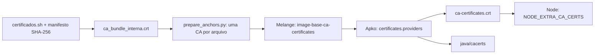

# Composição, confiança e reprodução das imagens

A composição usa três etapas: `certificados.sh` obtém e verifica os arquivos;
Melange empacota as âncoras aprovadas; Apko incorpora essas âncoras aos stores
que as aplicações usam. As raízes públicas continuam vindo do Wolfi.

## Certificados



`make certificates` executa o modo normal do script e prepara
`melange/certificates/`. Não executa `--pin`. A preparação exige validade,
`basicConstraints CA:TRUE`, permissão de assinatura quando `keyUsage` existe,
e produz um arquivo por certificado, nomeado pelo SHA-256 do DER. Rejeita
chaves privadas, CAs MOCK e arquivos que não correspondam ao manifesto.
Revisar os arquivos públicos e o manifesto antes de incorporá-los ao build.

O manifesto de download atual contém CAs **MOCK**. Portanto, o perfil padrão
versionado é `public`, sem âncoras adicionais. A fonte e o manifesto corporativos
reais continuam pendentes de aprovação; nenhuma CA MOCK entra em uma release.
O perfil `test` só é permitido no contrato isolado, sem publicação.

O pacote instala `.crt` individuais em `/usr/local/share/ca-certificates/` e
declara `provides: custom-ca-certificates`. A base declara o mesmo provider.
O [Apko v1.2.43](https://github.com/chainguard-dev/apko/blob/v1.2.43/pkg/build/certificates.go)
acrescenta os certificados ao PEM do sistema e ao truststore Java existente,
em código Go. Não executa os hooks shell de `update-ca-certificates`.
Os marcadores `.sha256` sozinhos não demonstram que uma CA foi incorporada.
Cada arquivo precisa conter exatamente uma CA: esse Apko ignora bundles
com múltiplos certificados no diretório de providers.

`SSL_CERT_FILE` aponta para `/etc/ssl/certs/ca-certificates.crt`.
`NODE_EXTRA_CA_CERTS` aponta para o mesmo arquivo, preservando também as
[raízes próprias do Node](https://nodejs.org/docs/latest-v22.x/api/tls.html#tlsgetcacertificatestype).
Java usa `/etc/ssl/certs/java/cacerts`. O antigo `bundle.pem`, sua cópia da
Mozilla e o nome `bundle-pem-test` saem das imagens.

## Contratos funcionais

O workflow `test-image-composition.yml` constrói imagens temporárias usando
a mesma receita Melange/Apko e uma CA de teste efêmera. Python, Node, Go,
Java e .NET fazem HTTPS usando a confiança **instalada na imagem**, sem montar
PEM, substituir `SSL_CERT_FILE`/`NODE_EXTRA_CA_CERTS` ou configurar um store
Java/.NET no cliente. Um segundo servidor com CA desconhecida deve ser rejeitado.
As imagens de teste e suas chaves não são artifacts de publicação.

Os contratos rodam em amd64 e arm64, distinguindo emulação de execução nativa.
O publicador exige o resultado do gate comum, além do contrato do próprio
candidato e do scan. Os contratos do candidato mantêm o teste suplementar
de CA injetada, identificado como `injected-runtime-ca`; ele não substitui
a prova de integração no build, identificada como `image`.

`tzdata` está na base. Todos os probes exigem `America/Sao_Paulo` com UTC−3
em janeiro de 2026 e UTC−2 em janeiro de 2018. Isso verifica as regras
históricas, além da existência do nome do fuso.

## Camadas e reprodução

`layering.strategy: origin` agrupa pacotes pela origem. O orçamento é medido
com os layouts reais, somando bytes comprimidos e deduplicando pelo digest
das camadas, com `scripts.pipeline.artifacts.measure_layers`.
No Apko fixado, `budget: 10` permite **11 camadas finais**: dez de pacotes e
uma de configuração. A economia depende do catálogo e não é a porcentagem
publicada pelo upstream para seu próprio conjunto de imagens.

Cada build novo resolve `apko.lock.json` e passa esse mesmo arquivo ao build.
A data de Melange e Apko vem do commit, não do relógio do runner. A versão
OCI é `<framework>-<commit12>`; `source`, `revision`, `vendor` e `created`
também ficam no índice e nos manifests. `licenses: NOASSERTION` registra que
este repositório ainda não declara uma licença de distribuição; as licenças
dos pacotes continuam no SPDX. Não presumir que todas as dependências são MPL.

```bash
make oci FRAMEWORK=python3-13
make oci FRAMEWORK=python3-13 LOCKFILE=/caminho/apko.lock.json
make build FRAMEWORK=python3-13  # carrega o OCI local, sem outro build
```

Para replay, restaurar o commit/configuração, o lock, os APKs Melange e sua
chave pública nos mesmos caminhos. O lock fixa versões e checksums; não
garante que o Wolfi conservará para sempre os APKs na origem. Builds diários
resolvem um lock novo para incorporar correções. Publicação e promoção
continuam copiando o digest validado, sem reconstrução.

## SBOM e evidência

Os três SPDX originais descrevem o índice, amd64 e arm64. A validação confere
o digest descrito por cada documento e registra seu SHA-256 em
`validated-index.json`. Alteração, ausência ou troca entre plataformas
bloqueia a publicação antes das chamadas autenticadas.

O publicador usa `cosign attest --type spdxjson` para anexar cada documento
ao **seu próprio digest** no ECR. Nenhum SBOM é regenerado nessa etapa.
O artifact `sbom-<framework>-<attempt>` conserva SPDX e locks por 30 dias;
o repositório Melange também passa a 30 dias. O OCI para retry continua com
3 dias. As attestations no registry acompanham o digest publicado.

`tool_versions.py` registra a versão semântica e a saída completa das
ferramentas, incluindo o Melange que compilou o pacote. O banner ASCII
deixa de aparecer como se fosse a versão efetiva do Apko.

## Evidência local de 11/09/2026

[Resultados completos](evidence/image-composition-2026-09-11.json): 195 testes
unitários, 24 de integração e 14 do executor compartilhado; lints aprovados.
Os cinco runtimes passaram nos testes de CA instalada/TLS/timezone nas duas
arquiteturas. Python reproduziu os mesmos manifests e os três SPDX byte a byte.

Oito imagens Java/Node, 16 manifests (amd64 + arm64), mesmos pacotes e data:

| Estratégia | Camadas por manifest | MiB únicos comprimidos | Redução frente à camada única |
| --- | ---: | ---: | ---: |
| Sem layering | 1 | 1.168,8 | — |
| Origin, budget 1 | 2 | 1.169,7 | −0,1% |
| Origin, budget 5 | 6 | 855,8 | 26,8% |
| Origin, budget 10 | 11 | 825,3 | 29,4% |

O orçamento 10 economiza mais 30,5 MiB que o orçamento 5 nesse conjunto;
é o valor adotado. A medição soma as duas arquiteturas, não é o download
de um único nó. Os testes locais antecedem o commit da mudança; o JSON
registra essa origem. O aceite de publicação das attestations no ECR
continua exigindo a execução autenticada depois da revisão/merge.

## Limites preservados

UID/GID numérico 10000, `/app` com dono 10000, `/tmp`, banco APK para o scanner,
arquiteturas declaradas uma vez e ausência de `wolfi-base` permanecem.
As contas comuns ficam em dois perfis, preservando `spring` no Java e
`appuser` nos demais frameworks. Cada framework continua declarativo.

Os JREs mantêm os pacotes corrigidos atuais. Não trocamos por uma variante
`-jre-base` atrasada nem pelo entrypoint Java que exige bash/openssl.
Reduzir X11/fontes depende de uma variante upstream atualizada e validada.
