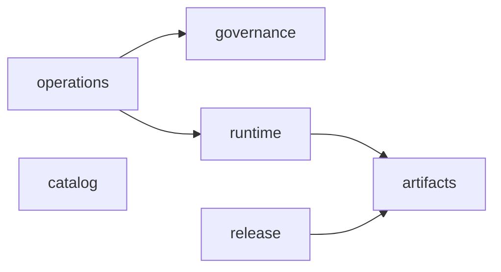

# Arquitetura do repositório

O produto deste repositório são imagens base distroless. A estrutura separa
composição das imagens, regras de automação, políticas, orquestração e testes.
Os diretórios consumidos pelo contrato Apko (`frameworks/`, `distroless/`,
`melange/` e `tests/runtime/`) mantêm seus caminhos públicos.

## Mapa de responsabilidades

| Área | Responsabilidade |
| --- | --- |
| `distroless/` | Base comum herdada por todas as imagens |
| `frameworks/` | Catálogo declarativo de runtimes e variantes de build `-dev` |
| `melange/` | Receita do pacote adicional de certificados; chaves e pacotes locais são ignorados pelo Git |
| `scripts/certificates/` | Aquisição, verificação e pins do bundle corporativo |
| `scripts/pipeline/catalog/` | Validação de framework, soak e digest antes de operações privilegiadas |
| `scripts/pipeline/artifacts/` | Índices OCI, referências por digest e execução de scans |
| `scripts/pipeline/runtime/` | Contratos funcionais das imagens e readiness com limite de tempo |
| `scripts/pipeline/release/` | Seleção de candidatos, publicação, promoção e evidência de CVEs |
| `scripts/pipeline/operations/` | Saúde, tempos, resumos e versões efetivas das ferramentas |
| `scripts/pipeline/governance/` | Hardening, pins, cache e contratos com workflows compartilhados |
| `policies/operations/` | Limites, donos, retenção e exceções operacionais |
| `policies/release/` | Quarentena de digests retirados de stable |
| `.github/workflows/` | Gatilhos, permissões, concorrência e composição dos jobs |
| `.github/scripts/` | Seis adaptadores temporários exigidos pelo executor publicado |
| `tests/unit/pipeline/` | Testes por domínio, sem Docker, AWS, sockets ou acesso à rede |
| `tests/integration/` | Certificados, servidor TLS real, adaptadores e contrato com o checkout compartilhado |
| `tests/runtime/` | Probes e projetos mínimos executados nas imagens candidatas reais |
| `docs/` | Arquitetura, decisões, runbooks e evidências revisadas |
| `troubleshooting/` | Toolkit de diagnóstico com ciclo de vida separado das imagens base |

O bundle corporativo de `scripts/certificates/` e a receita Mozilla em
`melange/` têm fontes e contratos diferentes. A reorganização não conecta
silenciosamente um ao outro nem altera a composição das imagens.

## Dependências entre domínios

Os módulos são pacotes Python regulares, executados a partir da raiz:

```sh
python3 -B -m scripts.pipeline.governance.pin_inventory lint
```

Imports usam nomes qualificados. Domínios não importam testes nem adaptadores.
As dependências permitidas são verificadas no gate unitário:



`catalog`, `artifacts` e `governance` não dependem de outros domínios.
`operations` pode consultar o plano de runtime e os contratos de governança.
Imports dentro do próprio domínio são permitidos. Nova dependência exige uma
mudança explícita nesta documentação e no teste de arquitetura.

## Fronteira entre produto e workflows compartilhados

O repositório `alric-containers-reusable-workflows` fornece os executores genéricos
Melange/Apko/scan e runtime. O checkout desses executores é o commit do
**consumidor**, de onde vêm os manifests, scripts e testes.

O `image-base` conserva catálogo, ECR, tags, soak, quarentena, identidade do
assinador e recuperação. O executor compartilhado não recebe comandos livres,
regras de negócio ou credenciais AWS como parte de seu contrato.

Os dois chamadores usam o commit publicado
`0459275b4a2ffbe6e8961041e7b93b41e88ba215`. Actions externas e reusable workflows
exigem SHA completo; imagens de ferramentas usam digest. O CI faz um segundo
checkout exatamente desse commit e verifica conteúdo, inputs, hardening,
retenção e alinhamento do Trivy. Dependabot agrupa as atualizações dos
workflows compartilhados; Renovate acompanha os digests locais.

## Compatibilidade da migração

O executor publicado ainda chama seis paths em `.github/scripts/`:
`validate_inputs.py`, `oci_artifact.py`, `scan_images.py`, `tool_versions.py`,
`report_unfixed_cves.py` e `runtime_images.py`. Esses arquivos apenas delegam
para o pacote canônico. O adaptador de runtime também preserva as funções
`runtime`, `supported` e `project`, importadas pelo workflow publicado.

Testes de integração executam os adaptadores e conferem os paths exigidos pelo
checkout fixado. Só remova um adaptador quando **todos os releases suportados**
usarem o pacote canônico e a integração comprovar a retirada do contrato antigo.
Novos workflows deste produto usam `python3 -m scripts.pipeline...`.

As políticas passaram de `.github/pipeline-health.json` e
`.github/promotion-quarantine.json` para `policies/operations/health.json` e
`policies/release/promotion-quarantine.json`, respectivamente. Consumidores,
runbooks e filtros de CI acompanham os novos paths. Seu conteúdo operacional
foi preservado.

## Verificação e contribuição

[CONTRIBUTING.md](../CONTRIBUTING.md) descreve o ambiente e os comandos.
`make test-unit` é independente de infraestrutura. `make check` acrescenta
integração, actionlint, hardening, pins e política de retenção.
O CI usa os mesmos alvos e preserva os nomes dos checks `test` e
`lint-workflows`; os testes de certificados executam uma única vez.

`CODEOWNERS` cobre os domínios e também arquivos novos pelo dono padrão.
Os testes verificam que mudanças nos insumos movidos continuam cobertas pelos
filtros de build. Evidências geradas ficam em `reports/` (ignorado); somente
evidências selecionadas e revisadas são versionadas em `docs/evidence/` ou
`tests/runtime/`. Evidências históricas conservam seus conteúdos e commits.

## Alcance para produção

Esta estrutura torna revisão, manutenção e validação repetíveis. Ela não
comprova sozinha implantação produtiva. A adoção corporativa ainda depende
dos controles remotos, dos donos efetivos e dos aceites de publicação,
promoção e recuperação descritos na [RFC-013](../RFC-013-Image-Base-Completa-com-Mermaid.md).
Os manifestos de imagem e o toolkit de troubleshooting mantêm seu estado
anterior; esta migração não certifica nem publica novas imagens.

## Referências das decisões

- [GitHub: segurança de Actions](https://docs.github.com/en/actions/reference/security/secure-use):
  permissões mínimas, SHA completo, proteção dos workflows e OIDC.
- [GitHub: CODEOWNERS](https://docs.github.com/en/repositories/managing-your-repositorys-settings-and-features/customizing-your-repository/about-code-owners):
  ownership de arquivos depende de acesso e revisão obrigatória na plataforma.
- [Python: descoberta de testes](https://docs.python.org/3.13/library/unittest.html#test-discovery):
  pacotes importáveis e descoberta com diretório raiz explícito.

A divisão de domínios é uma decisão deste produto, não um padrão obrigatório
prescrito por essas fontes.
